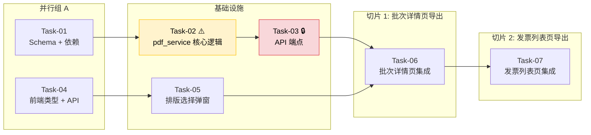

# 发票合并 PDF 导出 — 开发任务计划

## 1. 任务概览

**总任务数**：7 个
**预计总工时**：245 分钟（约 4 小时）
**开发方法**：TDD — 每个任务按 RED → GREEN → REFACTOR 循环执行

**关键标注**：
- 🔒 阻塞任务：被多个任务依赖，建议优先完成
- ⚠️ 风险任务：技术难度高，可能需要额外时间

### 依赖关系图



### 可并行任务组

| 并行组 | 任务 | 说明 |
|--------|------|------|
| A | Task-01 + Task-04 | 后端 Schema 定义和前端类型声明互不依赖，可同时开始 |
| B | Task-06 + Task-07（部分） | 两个页面集成共用同一套弹窗和 API，Task-06 完成后 Task-07 可复用模式，也可在 Task-05 完成后并行开发 |

---

## 2. 开发任务

> 按垂直切片组织。每个阶段对应一个可独立运行和验证的用户行为。切片内部的任务按技术层自然顺序排列。
>
> 每个任务按 TDD 循环执行：RED（根据验证标准写测试）→ GREEN（写最小实现通过测试）→ REFACTOR（重构）

---

### 基础设施：Backend PDF Generation Core

**阶段完成标准**：后端可以接收发票 ID 列表和排版配置，生成合并 PDF 并返回文件下载。可通过 `curl` 或 `TestClient` 独立验证。

---

#### Task-01: 更新请求 Schema、添加 PyMuPDF 依赖

**通俗解释**：定义好前后端约定的数据格式，装上 PDF 处理需要的工具库。完成后，Pydantic 能正确校验用户传来的排版配置。

**做什么**：
1. 修改 `server/app/schemas/export.py`：
   - 将 `PdfExportRequest.layout: str = "portrait"` 改为 `layouts: dict[str, str] = {}`
   - 新增 `BatchPdfExportRequest`，包含 `layouts: dict[str, str] = {}`
   - `layouts` 的 value 使用 `Literal["portrait", "landscape"]` 约束
2. 修改 `server/requirements.txt`（或 `pyproject.toml`）：添加 `PyMuPDF`
3. 安装依赖：`pip install PyMuPDF`

**涉及文件**：
- `server/app/schemas/export.py`
- `server/requirements.txt`

**参考**：技术方案 §4（API 设计）、§7.1（PDF 桥接方案） → AC 输入校验

**依赖**：无

**预估工时**：20 分钟

**验证标准**（TDD RED 阶段直接转化为测试用例）：
- [x] `PdfExportRequest(layouts={"增值税电子发票": "portrait", "高铁票": "landscape"})` 构造成功，`layouts` 字段类型为 `dict[str, str]`
- [x] `PdfExportRequest()` 不传 `layouts` 时，`layouts` 默认值为 `{}`
- [x] `PdfExportRequest(layouts={"xxx": "invalid"})` 触发 Pydantic ValidationError（422）
- [x] `BatchPdfExportRequest(layouts={})` 构造成功
- [x] `import fitz`（PyMuPDF）不报 ImportError
- [x] `pip list | grep PyMuPDF` 确认已安装

---

#### Task-02: 实现 pdf_service.py 核心生成逻辑 ⚠️

**通俗解释**：这是整个功能的心脏——把一堆发票文件拼成一张大 PDF，不同类型的发票分开排列，用户可以分别选择竖着排还是横着排。

**做什么**：
1. 新建 `server/app/services/pdf_service.py`
2. 实现以下函数（参考技术方案 §5.1~§5.5）：

| 函数 | 职责 |
|------|------|
| `generate_invoice_pdf(db, invoices, layouts, upload_dir) -> bytes` | 主流程：分组 → 逐组排版 → 返回 PDF bytes |
| `_load_invoice_image(file_path, upload_dir) -> PIL.Image \| None` | 文件加载：PDF 走 PyPDF2→PyMuPDF→PIL 桥接，图片走 Pillow 直接加载，文件不存在返回 None |
| `_calc_cell_positions(pw, ph, layout) -> list[tuple]` | 计算每个格子的 (x, y, cw, ch) |
| `_fit_inside(img_w, img_h, cell_w, cell_h) -> tuple` | 等比例缩放，返回 (scaled_w, scaled_h) |
| `_draw_placeholder(c, x, y, cw, ch)` | 灰框占位 + "文件不可用"文字 |

3. **主流程逻辑**：
   - 按 `invoice_type` 分组（空值归入 `"其他"`）
   - 每组按 `layouts` 取排版（默认 `"portrait"`）
   - `per_page = 2`（portrait）或 `4`（landscape）
   - 遍历该组发票，每 `per_page` 张为一页，填满或遍历完 `c.showPage()`
   - 最后一组结束后 `c.save()` 返回 `buffer.read()`

4. **PDF 桥接路径**（技术方案 §5.2）：
   ```
   PyPDF2.PdfReader → reader.pages[0] → writer.add_page → writer.write(temp_buffer)
   → fitz.open(stream=temp_buffer) → doc[0].get_pixmap(dpi=200)
   → PIL.Image.frombytes("RGB", ...)
   ```

5. **格子坐标**（技术方案 §5.3）：
   - margin=20pt, gap=12pt
   - portrait: cell_h = (841.89 - 40 - 12) / 2 ≈ 395pt
   - landscape: cell_w ≈ 395pt, cell_h ≈ 272pt

**涉及文件**：
- `server/app/services/pdf_service.py`（新建）

**参考**：技术方案 §5.1~§5.5 → AC-003, AC-004, AC-005, AC-007, AC-009, AC-010, AC-011, AC-013, AC-014, AC-015

**依赖**：Task-01（需要 `PdfExportRequest` 中的 layouts 类型参考，需要 PyMuPDF 已安装）

**预估工时**：60 分钟

**验证标准**（TDD RED 阶段直接转化为测试用例）：

*单元测试 — 辅助函数：*
- [x] `_calc_cell_positions(595.28, 841.89, "portrait")` → 返回 2 个格子的 (x, y, cw, ch)，格子 0（上）y 值 > 格子 1（下）y 值，cw ≈ 555.28
- [x] `_calc_cell_positions(841.89, 595.28, "landscape")` → 返回 4 个格子的 (x, y, cw, ch)，各格子无重叠
- [x] `_fit_inside(1000, 1000, 500, 500)` → `(500.0, 500.0)`（等比缩小）
- [x] `_fit_inside(2000, 1000, 500, 500)` → `(500.0, 250.0)`（宽受限）
- [x] `_fit_inside(1000, 2000, 500, 500)` → `(250.0, 500.0)`（高受限）
- [x] `_draw_placeholder(canvas, 20, 20, 300, 300)` → canvas 上绘制了灰色矩形和文字（验证 canvas 方法调用）

*集成测试 — 主流程（使用真实测试 PDF + 图片文件）：*
- [x] 同类型 2 张 portrait，生成 PDF → `PyPDF2.PdfReader(output)` 可读，页数 = 1，页面尺寸 ≈ A4
- [x] 同类型 3 张 portrait → 页数 = 2（第 1 页满 2 张，第 2 页 1 张）
- [x] 同类型 4 张 landscape → 页数 = 1（4 格全满）
- [x] 同类型 5 张 landscape → 页数 = 2（第 1 页 4 张，第 2 页 1 张）
- [x] 两种类型：type_A × 2 portrait + type_B × 2 landscape → 页数 = 2（第 1 页 A4 纵向含 type_A，第 2 页 A4 横向含 type_B），不同类型不混页
- [x] 单张发票 → 页数 = 1，只有 1 个格子有内容
- [x] 文件不存在的发票 → 对应格子显示灰框 + "文件不可用"文字，其余发票正常
- [x] 生成的 PDF 不含辅助信息（页眉/页脚/页码）→ 通过人工视觉检查确认（注：自动化验证可用 `fitz` 搜索关键词文本）

---

#### Task-03: 实现两个 PDF 导出 API 端点 🔒

**通俗解释**：给前后端之间搭好桥梁。前端发来要导出的发票编号和排版选择，后端返回一个可直接下载的 PDF 文件。

**做什么**：
1. 修改 `server/app/api/exports.py`，实现已定义的骨架端点：
   - `POST /api/exports/invoice-pdf`：自由勾选导出
   - `POST /api/batches/{batch_id}/export-invoice-pdf`：批次导出

2. **自由勾选端点**逻辑：
   - 接收 `PdfExportRequest`（`invoice_ids` + `layouts`）
   - 校验 `invoice_ids` 非空，空则 400 → `EMPTY_INVOICES`
   - 查询 `Invoice` 表：`Invoice.id.in_(invoice_ids) & Invoice.user_id == current_user.id`
   - 数量校验：`len(result) < len(invoice_ids)` → 404 → `INVOICE_NOT_FOUND`
   - 调用 `generate_invoice_pdf()`，返回 `StreamingResponse(BytesIO(pdf_bytes), media_type="application/pdf", headers={"Content-Disposition": "attachment; filename*=UTF-8''..."})`

3. **批次导出端点**逻辑：
   - 校验 `ReimbursementBatch` 存在且 `user_id == current_user.id`，否则 404
   - 查询 `BatchInvoice`：`source_type == "invoice" & invoice_id IS NOT NULL`
   - 校验结果非空，空则 400 → `EMPTY_BATCH`
   - 提取 `invoice_ids`，查询 `Invoice` 表（同样过滤 `user_id`）
   - 调用 `generate_invoice_pdf()`，返回同上的 `StreamingResponse`

**涉及文件**：
- `server/app/api/exports.py`

**参考**：技术方案 §4（API 设计）、§5.6（替票处理）、§5.7（数据隔离） → AC-008, AC-012, AC-016, AC-017

**依赖**：Task-02（需要 `generate_invoice_pdf`）

**预估工时**：40 分钟

**验证标准**（TDD RED 阶段直接转化为测试用例）：

*自由勾选端点：*
- [x] `TestClient.post("/api/exports/invoice-pdf", json={"invoice_ids": [1, 2], "layouts": {}})` + 有效 token → 200，响应 `content-type` 含 `application/pdf`，`content-disposition` 含 `attachment`
- [x] `POST /api/exports/invoice-pdf` 传入 `{"invoice_ids": [], "layouts": {}}` → 400，`response.json()["detail"]["code"] == "EMPTY_INVOICES"`
- [x] `POST /api/exports/invoice-pdf` 传入不属于当前用户的 `invoice_ids` → 404，`response.json()["detail"]["code"] == "INVOICE_NOT_FOUND"`
- [x] `POST /api/exports/invoice-pdf` 不带 token → 401
- [x] `POST /api/exports/invoice-pdf` 传入 `{"invoice_ids": [1], "layouts": {"xx": "invalid"}}` → 422

*批次导出端点：*
- [x] `TestClient.post("/api/batches/{valid_batch_id}/export-invoice-pdf", json={"layouts": {}})` + 有效 token → 200，PDF 响应
- [x] `POST /api/batches/{non_existent_id}/export-invoice-pdf` → 404
- [x] `POST /api/batches/{other_user_batch_id}/export-invoice-pdf` → 404（用户无权限访问）
- [x] 批次内含 `is_substitute=true` 的发票 → 返回的 PDF 包含该替票发票
- [x] 批次内无发票 → 400，`response.json()["detail"]["code"] == "EMPTY_BATCH"`
- [x] 不带 token → 401

---

### 切片 1：批次详情页导出 PDF

**阶段完成标准**：用户打开批次详情页，点击"导出 PDF"按钮，弹出排版选择弹窗，为每种发票类型选择排版后确认，浏览器自动下载合并 PDF 文件。

---

#### Task-04: 更新前端类型定义 + API 客户端

**通俗解释**：告诉前端代码"发票导出时要传什么数据、收什么数据"，让 TypeScript 能检查类型是否正确。

**做什么**：
1. 修改 `web/src/types/export.ts`：
   - `PdfExportRequest`：`layout: string` → `layouts: Record<string, "portrait" | "landscape">`
   - 新增 `BatchPdfExportRequest`：`{ layouts: Record<string, "portrait" | "landscape"> }`
2. 修改 `web/src/api/exports.ts`：
   - 新增 `exportBatchInvoicePdf(batchId: number, data: BatchPdfExportRequest): Promise<Blob>` 方法
   - 使用 `responseType: "blob"` 接收二进制 PDF 数据
   - 参考已有的 `exportBatchExcel` 方法模式

**涉及文件**：
- `web/src/types/export.ts`
- `web/src/api/exports.ts`

**参考**：技术方案 §4（API 设计）、§6（代码改动清单） → AC 类型安全

**依赖**：无（可并行于 Task-01）

**预估工时**：20 分钟

**验证标准**（TDD RED 阶段直接转化为测试用例）：
- [x] `PdfExportRequest` 类型包含 `invoice_ids: number[]` 和 `layouts: Record<string, "portrait" | "landscape">`
- [x] 构造 `{ invoice_ids: [1, 2], layouts: { "增值税电子发票": "portrait" } }` 通过 TypeScript 类型检查
- [x] `BatchPdfExportRequest` 类型包含 `layouts` 字段
- [x] `exportBatchInvoicePdf(1, { layouts: {} })` 方法存在，返回类型为 `Promise<Blob>`

---

#### Task-05: 创建 PdfExportSettings 排版选择弹窗组件

**通俗解释**：用户点击"导出 PDF"后弹出的设置窗口。里面按发票类型分组展示，每种类型可以选择竖排或横排，还有一个"一键全部设成竖排/横排"的快捷按钮。

**做什么**：
1. 新建 `web/src/components/exports/PdfExportSettings.tsx`
2. 组件设计：

| 元素 | 说明 |
|------|------|
| Modal 容器 | 使用已有的 `Modal` 组件，尺寸 `md` 或 `lg` |
| 标题 | "导出 PDF 设置" |
| 类型分组列表 | 按 `invoice_type` 分组，每组一行：类型名称 + 数量徽章 + 排版下拉（portrait/landscape） |
| 快捷操作栏 | "统一设为纵向" + "统一设为横向" 两个按钮 |
| 底部按钮 | "取消"（关闭弹窗）+ "确认导出"（调用 API，加载状态防重复） |

3. **Props 设计**：
   - `open: boolean` — 控制弹窗显示
   - `onClose: () => void` — 关闭回调
   - `invoices: Invoice[]` — 发票列表（用于按类型分组统计）
   - `onExport: (layouts: Record<string, "portrait" | "landscape">) => Promise<void>` — 确认导出回调

4. **交互逻辑**：
   - 从 `invoices` 中提取唯一的 `invoice_type`，计数
   - 每种类型默认排版为 `"portrait"`
   - "统一设置"按钮一键修改所有类型的排版值
   - "确认导出"时调用 `onExport(layouts)`，按钮变 loading 状态
   - 导出完成后关闭弹窗

5. **样式**：参考已有 Modal 组件风格，排版下拉使用项目已有的 Select 组件

**涉及文件**：
- `web/src/components/exports/PdfExportSettings.tsx`（新建）

**参考**：技术方案 §4.1（核心流程）、§4.3（交互规则）、§6 → AC-018, AC-019

**依赖**：Task-04（需要更新后的类型 `PdfExportRequest`）

**预估工时**：50 分钟

**验证标准**（TDD RED 阶段直接转化为测试用例）：

*组件渲染：*
- [x] 传入 3 种类型各 2 张的 `invoices` → 弹窗内容区域展示 3 行（每种类型一行）
- [x] 每行显示：类型名称、数量（如 "2 张"）、排版下拉（默认值 "纵向（一页2张）"）
- [x] "统一设为纵向"按钮点击 → 所有下拉框值变为 `"portrait"`
- [x] "统一设为横向"按钮点击 → 所有下拉框值变为 `"landscape"`
- [x] 单独修改某类型的下拉为 `"landscape"` → 该行下拉值更新，其他行不变

*交互行为：*
- [x] `open=false` → 弹窗不渲染
- [x] `open=true` → 弹窗渲染
- [x] 点击"取消" → 调用 `onClose`
- [x] 点击"确认导出" → 调用 `onExport`，传入 `{ typeA: "portrait", typeB: "landscape", ... }`
- [x] 确认导出调用期间 → 按钮显示 loading 状态，不可重复点击
- [x] `onExport` resolve 后 → 弹窗关闭

*边界情况：*
- [x] 传入空 `invoices` 数组 → 弹窗内容显示"无发票可导出"
- [x] 所有发票类型相同（只有 1 种）→ 显示 1 行，不显示"统一设置"按钮

---

#### Task-06: 集成到批次详情页，端到端打通

**通俗解释**：在批次详情页加上"导出 PDF"按钮，用户点一下就能走通整个流程——选排版、导出、下载文件。

**做什么**：
1. 修改 `web/src/pages/BatchDetailPage.tsx`：
   - 新增"导出 PDF"按钮（已有 `Download` 图标引用，可复用）
   - 按钮放在已有的"导出 Excel"按钮旁边
   - 批次无发票时按钮置灰（`disabled`）
2. 集成 `PdfExportSettings` 弹窗：
   - 点击按钮 → 打开弹窗，传入批次关联的发票列表
   - `onExport` 回调：调用 `exportBatchInvoicePdf(batchId, { layouts })`，将返回的 Blob 触发下载
3. 文件下载逻辑：
   - 创建临时 URL：`URL.createObjectURL(blob)`
   - 创建隐藏 `<a>` 标签，设置 `href` 和 `download` 属性
   - 触发点击下载，然后 `URL.revokeObjectURL`
   - 文件名格式：`发票合并_{时间戳}.pdf`

**涉及文件**：
- `web/src/pages/BatchDetailPage.tsx`

**参考**：技术方案 §4.2（批次导出 API）、§4.3（交互规则） → AC-001, AC-002

**依赖**：Task-03（后端 API 就绪）、Task-05（弹窗组件就绪）

**预估工时**：25 分钟

**验证标准**（TDD RED 阶段直接转化为测试用例）：

*UI 元素：*
- [x] 批次详情页出现"导出 PDF"按钮，位于"导出 Excel"按钮附近
- [x] 点击"导出 PDF" → 打开排版选择弹窗
- [x] 弹窗中显示该批次关联的发票类型及数量（含替票发票）

*端到端流程（手动验收 + vitest 集成测试）：*
- [x] 批次有发票时，点击"导出 PDF" → 打开排版选择弹窗
- [x] 选择排版后点击"确认导出" → API 调用成功 → 浏览器触发文件下载
- [x] 下载的文件为 PDF 格式，可用 PDF 阅读器打开

---

### 切片 2：发票列表页自由勾选导出

**阶段完成标准**：用户在发票列表页勾选多张发票，点击"导出 PDF"，选择排版后下载合并 PDF。

---

#### Task-07: 集成到发票列表页，支持勾选导出

**通俗解释**：在发票列表页加上导出入口，用户勾选几张发票后点"导出 PDF"，其余流程和批次详情页一样。

**做什么**：
1. 修改 `web/src/pages/InvoicesPage.tsx`：
   - 新增"导出 PDF"按钮，放在勾选操作区域（与已有的批量操作按钮同级）
   - 无发票被选中时按钮 `disabled`
   - 点击按钮 → 打开 `PdfExportSettings` 弹窗，传入已勾选的发票列表
   - `onExport` 回调：调用 `exportInvoicePdf({ invoice_ids, layouts })`
2. 文件下载逻辑与 Task-06 一致，可抽取公共下载工具函数
3. 导出完成后可选择性清空勾选状态

**涉及文件**：
- `web/src/pages/InvoicesPage.tsx`

**参考**：技术方案 §4.1（自由勾选导出 API）、§4.3（交互规则） → AC-006, AC-008

**依赖**：Task-03（后端 API 就绪）、Task-05（弹窗组件就绪）、Task-06（可复用下载模式）

**预估工时**：30 分钟

**验证标准**（TDD RED 阶段直接转化为测试用例）：

*UI 元素：*
- [x] 发票列表页出现"导出 PDF"按钮，在勾选操作区域
- [x] 无发票被选中时按钮不显示
- [x] 勾选 1 张以上发票后，按钮显示且可点击

*端到端流程（手动验收 + vitest 集成测试）：*
- [x] 勾选 3 张发票，点击"导出 PDF" → 打开排版选择弹窗
- [x] 弹窗中只显示已勾选的发票类型及数量
- [x] 选择排版后确认 → API 调用成功 → 浏览器触发文件下载

*边界情况：*
- [x] 勾选后取消全部勾选 → 按钮隐藏
- [x] 不勾选直接点击"导出 PDF" → 按钮不显示

---

## 3. AC 覆盖总表

> 最终检查：每条 AC 是否都有任务承接。

| AC 编号 | 验收标准概述 | 承接任务 | 验证方式 |
|---------|-------------|---------|---------|
| AC-001 | 批次详情页统一纵向排版导出 | Task-06 | 端到端测试：批次含 2 种类型各 2 张，全部选纵向 → 验证 PDF 页数和排版 |
| AC-002 | 批次详情页不同类型不同排版 | Task-06 | 端到端测试：增值税横向 + 滴滴纵向 → 验证 PDF 两页不同排版 |
| AC-003 | 同类型发票集中排放 | Task-02 | 单元测试：两种类型混合输入 → 验证 generate_invoice_pdf 输出中同类型连续 |
| AC-004 | 不足满页留空处理 | Task-02 | 单元测试：单张发票 → 验证 PDF 只有 1 个格子有内容 |
| AC-005 | PDF 原样输出无辅助信息 | Task-02 | 视觉检查：导出 PDF 无页眉/页码/标注 |
| AC-006 | 发票列表页自由勾选导出 | Task-07 | 端到端测试：勾选 3 张 → 导出 PDF 只含 3 张 |
| AC-007 | PDF/图片发票统一处理 | Task-02 | 单元测试：传入 PDF+JPG 混合 → 两种格式均正确渲染 |
| AC-008 | 导出空批次/空选择 | Task-03, Task-07 | Task-03：API 返回 400；Task-07：按钮置灰 |
| AC-009 | 导出单张发票 | Task-02 | 单元测试：1 张发票 → 1 页，1 格有内容 |
| AC-010 | 导出大量发票（50 张） | Task-02 | 单元测试：50 张 × landscape → 13 页，最后一页 2 格 |
| AC-011 | 发票文件不存在 | Task-02 | 单元测试：file_path 指向不存在文件 → 灰框占位 |
| AC-012 | 未登录访问导出接口 | Task-03 | API 测试：无 token → 401 |
| AC-013 | 按类型分组排放 ← BR-001 | Task-02 | 单元测试：3 种类型 → 输出中每种类型连续，不跨类型混页 |
| AC-014 | 排版容量上限 ← BR-002 | Task-02 | 单元测试：portrait 每页 ≤ 2 张，landscape 每页 ≤ 4 张 |
| AC-015 | 不足满页留空 ← BR-003 | Task-02 | 同 AC-004 |
| AC-016 | 数据隔离 ← BR-006 | Task-03 | API 测试：查询不同用户发票 → 数量校验拦截 |
| AC-017 | 批次导出含替票 ← BR-007 | Task-03 | API 测试：批次含 is_substitute=true 发票 → 导出包含 |
| AC-018 | 不同类型分别选择不同排版 | Task-05 | 组件测试：弹窗内每种类型独立选择排版 |
| AC-019 | 按类型设定不同排版 ← BR-008 | Task-02, Task-05 | Task-05 传 layouts 字典，Task-02 逐类型处理不同排版 |

---

## 4. 完成定义

> 所有任务完成后，功能整体交付前的最终确认。

- [ ] 所有 7 个任务的验证标准（测试用例）通过
- [ ] AC 覆盖总表中每条 AC 的验证方式已执行并通过
- [ ] 后端 `pytest server/tests/` 中与 pdf_service 和 exports API 相关的测试全部通过
- [ ] 前端 `npx vitest run` 中与 PdfExportSettings、BatchDetailPage、InvoicesPage 相关的测试全部通过
- [ ] 手动验收：在批次详情页完成一次完整的"选择排版 → 导出 → 打开 PDF"流程
- [ ] 手动验收：在发票列表页勾选 3 张发票完成同样的导出流程
- [ ] 手动验收：模拟某张发票文件缺失，验证 PDF 中该位置显示"文件不可用"占位
- [ ] 手动验收：导出的 PDF 在常见 PDF 阅读器（Chrome/Edge/Adobe Reader）中正常显示
- [ ] `ruff check` + `mypy` 后端代码通过
- [ ] `npx tsc --noEmit` 前端代码通过