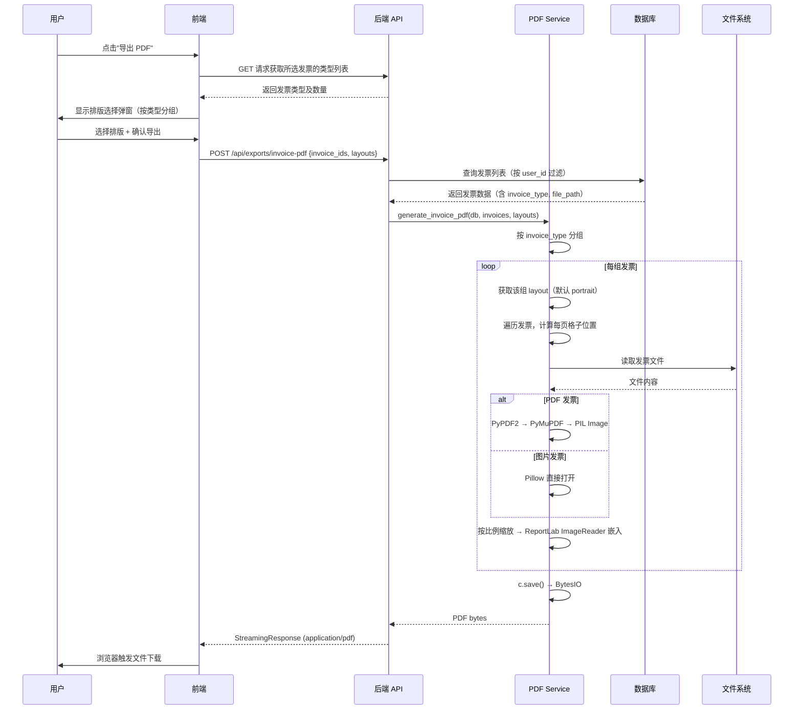

# 发票合并 PDF 导出 — 技术设计文档

## 1. 设计概要

**功能描述**：用户选择多张发票，按发票类型分组，为每组独立选择排版（A4 纵向/横向），后端生成合并 PDF 文件供下载。

**影响范围**：
- 后端新增：`server/app/services/pdf_service.py`（核心 PDF 生成逻辑）
- 后端修改：`server/app/api/exports.py`（新增 API 端点）、`server/app/schemas/export.py`（新增请求 Schema）
- 前端新增：`web/src/components/exports/PdfExportSettings.tsx`（排版选择弹窗）
- 前端修改：`web/src/pages/BatchDetailPage.tsx`、`web/src/pages/InvoicesPage.tsx`（添加导出入口）
- 前端修改：`web/src/api/exports.ts`（新增批次导出 API 方法）
- 前端修改：`web/src/types/export.ts`（更新请求类型定义）

**技术难点**：
- PDF 发票页面提取后缩放到 A4 格子中，保持比例不变形
- ReportLab 与 PyPDF2 不直接互通，需要 PyMuPDF(fitz) 将 PDF 页面渲染为 PIL Image 后桥接
- 按类型分组 + 逐类型不同排版的排列算法

**外部依赖**：新增 `PyMuPDF`（fitz），`reportlab`、`PyPDF2`、`Pillow` 已有

---

## 2. 架构概览

### 模块交互

```
前端导出弹窗                         后端
┌──────────────┐    POST /api/exports/invoice-pdf       ┌──────────────────┐
│ PdfExport     │ ──── {invoice_ids, layouts} ──────→   │ exports.py       │
│ Settings.tsx  │                                        │ (API 路由)        │
│              │ ←─── StreamingResponse(PDF bytes) ──── │                  │
│ 选择排版      │                                        └────────┬─────────┘
│ 确认导出      │                                                 │
└──────────────┘                                                 ▼
                                                        ┌──────────────────┐
                                                        │ pdf_service.py   │
                                                        │                  │
                                                        │ 1. 查询发票       │
                                                        │ 2. 按 type 分组   │
                                                        │ 3. 逐组按排版排列 │
                                                        │ 4. ReportLab 渲染 │
                                                        │ 5. 返回 bytes     │
                                                        └────────┬─────────┘
                                                                 │
                                                  ┌──────────────┴──────────────┐
                                                  ▼                             ▼
                                         ┌──────────────┐           ┌──────────────────┐
                                         │ Invoice 表    │           │ 文件系统          │
                                         │ (查询发票信息) │           │ (读取 PDF/图片)   │
                                         └──────────────┘           └──────────────────┘
```

### 时序图



---

## 3. 数据库设计

无需新增表或修改现有表结构。所有数据来源为已有表：

| 表 | 使用的字段 | 用途 |
|----|-----------|------|
| `invoices` | `id`, `invoice_type`, `file_path`, `user_id` | 发票查询 + 类型分组 + 数据隔离 |
| `batch_invoices` | `batch_id`, `invoice_id`, `is_substitute` | 批次关联发票 + 替票识别 |
| `reimbursement_batches` | `id`, `user_id` | 批次权限校验 |

---

## 4. API 设计

### `POST /api/exports/invoice-pdf` → AC-001~AC-007, AC-009~AC-016, AC-018~AC-019

**描述**：自由勾选方式导出 PDF

**鉴权**：`get_current_user`

**Request Body**：
```json
{
  "invoice_ids": [1, 2, 3, 4, 5],
  "layouts": {
    "增值税电子发票": "portrait",
    "高铁票": "landscape",
    "滴滴打车": "portrait"
  }
}
```

| 字段 | 类型 | 必填 | 说明 |
|------|------|------|------|
| `invoice_ids` | `list[int]` | 是 | 至少包含 1 个元素，每个元素 > 0 |
| `layouts` | `dict[str, str]` | 否 | key=发票类型名，value=`"portrait"` 或 `"landscape"`。未指定的类型默认 `"portrait"` |

**Response（成功）**：
- Status: `200 OK`
- Media-Type: `application/pdf`
- Headers: `Content-Disposition: attachment; filename*=UTF-8''发票合并_20260521.pdf`
- Body: PDF bytes

**异常响应**：

| 场景 | 状态码 | 响应 | 对应 AC |
|------|--------|------|---------|
| `invoice_ids` 为空 | 400 | `{"code": "EMPTY_INVOICES", "message": "请选择要导出的发票"}` | AC-008 |
| 部分发票不属于当前用户 | 404 | `{"code": "INVOICE_NOT_FOUND", "message": "部分发票不存在或无权访问"}` | AC-012, AC-016 |
| `layouts` 包含无效值 | 422 | Pydantic 自动校验 | — |
| 未登录 | 401 | `{"code": "INVALID_TOKEN", "message": "无效的登录凭证"}` | AC-012 |

---

### `POST /api/batches/{batch_id}/export-invoice-pdf` → AC-001~AC-005, AC-008, AC-017

**描述**：批次关联发票导出 PDF → AC-001~AC-005, AC-008, AC-017

**鉴权**：`get_current_user`

**Request Body**：
```json
{
  "layouts": {
    "增值税电子发票": "portrait",
    "高铁票": "landscape"
  }
}
```

| 字段 | 类型 | 必填 | 说明 |
|------|------|------|------|
| `layouts` | `dict[str, str]` | 否 | 同自由勾选接口 |

**Response（成功）**：同 `POST /api/exports/invoice-pdf`

**异常响应**：

| 场景 | 状态码 | 响应 | 对应 AC |
|------|--------|------|---------|
| 批次不存在 | 404 | `{"code": "BATCH_NOT_FOUND", "message": "批次不存在"}` | — |
| 批次内无发票 | 400 | `{"code": "EMPTY_BATCH", "message": "该批次暂无发票可导出"}` | AC-008 |
| 批次不属于当前用户 | 404 | `{"code": "BATCH_NOT_FOUND", "message": "批次不存在"}` | AC-016 |

**说明**：
- 先验证 `ReimbursementBatch.user_id == current_user.id`
- 查询 `batch_invoices` 中 `source_type == "invoice"` 且 `invoice_id IS NOT NULL` 的记录
- 无论 `is_substitute` 是否为 `true`，所有关联的发票都导出 → AC-017
- 手动行（`source_type == "manual"`）不导出

---

## 5. 核心逻辑

### 5.1 合并 PDF 生成主流程 → 全部 AC

**函数签名**：

```python
def generate_invoice_pdf(
    db: Session,
    invoices: list[Invoice],
    layouts: dict[str, str],
    upload_dir: Path
) -> bytes:
```

**处理流程**：

1. 按 `invoice_type` 分组（`invoice_type` 为空的归入 `"其他"`）
2. 遍历每组：
   a. 获取该组的 `layout`（从 `layouts` 字典取，未指定默认 `"portrait"`）
   b. 每页发票数：`per_page = 2 if layout == "portrait" else 4`
   c. 遍历该组发票，每 `per_page` 张为一页
   d. 每张发票读取文件 → 缩放到格子 → 放到对应位置
   e. 每页填满或遍历完毕 → `c.showPage()` 开始新页
   f. 最后一页不满则对应位置留空
3. `c.save()` → 返回 `bytes`

**伪代码**：

```python
from io import BytesIO
from reportlab.lib.pagesizes import A4, landscape as A4_landscape
from reportlab.pdfgen import canvas
from reportlab.lib.utils import ImageReader

def generate_invoice_pdf(db, invoices, layouts, upload_dir):
    # 1. 按 invoice_type 分组
    groups: dict[str, list[Invoice]] = {}
    for inv in invoices:
        t = inv.invoice_type or "其他"
        groups.setdefault(t, []).append(inv)

    # 2. 按组顺序生成页面
    buffer = BytesIO()
    c = canvas.Canvas(buffer, pagesize=A4)

    for inv_type, inv_list in groups.items():
        layout = layouts.get(inv_type, "portrait")
        per_page = 2 if layout == "portrait" else 4
        page_size = A4 if layout == "portrait" else A4_landscape
        c.setPageSize(page_size)

        pw, ph = page_size

        cell_positions = _calc_cell_positions(pw, ph, layout)

        for i, inv in enumerate(inv_list):
            pos_in_page = i % per_page

            if pos_in_page == 0 and i > 0:
                c.showPage()
                c.setPageSize(page_size)

            x, y, cw, ch = cell_positions[pos_in_page]

            img = _load_invoice_image(inv.file_path, upload_dir)  # 可能为 None

            if img is None:
                _draw_placeholder(c, x, y, cw, ch)
            else:
                scaled_w, scaled_h = _fit_inside(img.width, img.height, cw, ch)
                cx = x + (cw - scaled_w) / 2
                cy = y + (ch - scaled_h) / 2
                c.drawImage(ImageReader(img), cx, cy, scaled_w, scaled_h)
                img.close()

        # 该组最后一页不满 — 已自然留空，仅需 showPage
        c.showPage()

    c.save()
    buffer.seek(0)
    return buffer.read()
```

### 5.2 发票文件渲染逻辑 → AC-007, AC-011

**PDF 发票处理**（PyPDF2 + PyMuPDF 桥接）：

```
1. PyPDF2.PdfReader 打开文件，获取第 1 页
2. 将第 1 页写入临时 BytesIO，作为单页 PDF
3. PyMuPDF (fitz) 打开该单页 PDF，渲染为 PIL Image（RGB）
4. 返回 PIL Image 对象，由 ReportLab ImageReader 嵌入
```

**关键代码路径**：
```
PyPDF2.PdfReader(file_path)
  → reader.pages[0]
  → writer.add_page(page)
  → writer.write(temp_buffer)
  → fitz.open(stream=temp_buffer)  # PyMuPDF
  → doc[0].get_pixmap(dpi=200)
  → PIL.Image.frombytes("RGB", ...)  # 缩放后由 ReportLab 嵌入
```

**图片发票处理**（Pillow）：
```
1. PIL.Image.open(file_path)
2. 保持宽高比，缩放适配到格子内
3. 返回 PIL Image 对象
```

### 5.3 格子位置计算公式 → AC-001~AC-005, AC-009, AC-010, AC-014, AC-015

**参数**：
- 页边距：`margin = 20pt`（四周）
- 格子间距：`gap = 12pt`（格子之间的空隙）

**A4 portrait (595.28 × 841.89 pt)，2 格上下排列**：

```
┌─────────────────────────────┐  ← margin_top = 20pt
│                             │
│     发票 1                   │  cell_h = (ph - 40 - 12) / 2 ≈ 395pt
│     (cx1, cy1)               │
│                             │
│········ gap = 12pt ·········│
│                             │
│     发票 2                   │
│     (cx2, cy2)               │
│                             │
└─────────────────────────────┘  ← margin_bottom = 20pt
```

```python
cell_w = pw - 2 * margin   # = 595.28 - 40 = 555.28
cell_h = (ph - 2 * margin - gap * (rows - 1)) / rows  # = (841.89 - 40 - 12) / 2 ≈ 394.95
# 格子 0（上）: x=margin, y=margin + cell_h + gap
# 格子 1（下）: x=margin, y=margin
```

**A4 landscape (841.89 × 595.28 pt)，4 格 2×2 排列**：

```
┌──────────────┬──────────────┐  ← margin_top = 20pt
│   发票 1      │   发票 2      │
│   (左上)      │   (右上)      │
│              │              │
│······ gap ···│······ gap ···│
│              │              │
│   发票 3      │   发票 4      │
│   (左下)      │   (右下)      │
│              │              │
└──────────────┴──────────────┘  ← margin_bottom = 20pt
```

```python
cell_w = (pw - 2 * margin - gap * (cols - 1)) / cols  # = (841.89 - 40 - 12) / 2 ≈ 394.95
cell_h = (ph - 2 * margin - gap * (rows - 1)) / rows  # = (595.28 - 40 - 12) / 2 ≈ 271.64
# 格子 0（左上）: x=margin, y=margin + cell_h + gap
# 格子 1（右上）: x=margin + cell_w + gap, y=margin + cell_h + gap
# 格子 2（左下）: x=margin, y=margin
# 格子 3（右下）: x=margin + cell_w + gap, y=margin
```

### 5.4 发票缩放 → AC-007, AC-005

```python
def _fit_inside(img_w, img_h, cell_w, cell_h):
    scale = min(cell_w / img_w, cell_h / img_h)
    return img_w * scale, img_h * scale
```

发票在格子内居中放置，不裁剪、不拉伸。

### 5.5 文件不存在占位处理 → AC-011

当发票记录存在但 `file_path` 指向的文件在磁盘上已被删除或无法读取时：

1. 在格子位置绘制浅灰色矩形（`fillColor="#E5E7EB"`）
2. 矩形内居中绘制文字 "文件不可用"（`fillColor="#9CA3AF"`，字号 12pt）
3. 不影响其余发票的正常导出，继续处理后续发票

### 5.6 替票发票处理 → AC-017

从批次导出时，查询逻辑：
```python
batch_invoices = db.query(BatchInvoice).filter(
    BatchInvoice.batch_id == batch_id,
    BatchInvoice.source_type == "invoice",
    BatchInvoice.invoice_id.isnot(None)
).all()
invoice_ids = [bi.invoice_id for bi in batch_invoices]
```

无论 `is_substitute` 字段是否为 `true`，只要 `invoice_id` 非空就导出。

### 5.7 数据隔离 → AC-016

```python
invoices = db.query(Invoice).filter(
    Invoice.id.in_(invoice_ids),
    Invoice.user_id == user_id
).all()

if len(invoices) < len(invoice_ids):
    raise HTTPException(404, detail={"code": "INVOICE_NOT_FOUND"})
```

如果查询结果数量少于请求的 ID 数量，说明有发票不属于当前用户或不存在，直接返回 404。

---

## 6. 现有代码改动

| 模块 / 文件 | 改动内容 | 原因 | 对应 AC |
|-------------|---------|------|---------|
| `server/app/services/pdf_service.py` | **新建**：实现核心 PDF 生成逻辑（约 200 行） | 核心功能 | 全部 AC |
| `server/app/api/exports.py` | 实现 `POST /invoice-pdf`（自由勾选）和 `POST /batches/{batch_id}/export-invoice-pdf`（批次导出），`StreamingResponse` 返回 | 新增接口 | 全部 AC |
| `server/app/schemas/export.py` | `PdfExportRequest`：`layout` → `layouts: dict[str, str]`；新增 `BatchPdfExportRequest` | 支持按类型独立排版 | AC-018, AC-019 |
| `server/requirements.txt` | 添加 `PyMuPDF` | PDF → PIL Image 桥接 | AC-007 |
| `web/src/components/exports/PdfExportSettings.tsx` | **新建**：排版选择弹窗组件，按类型分组 + 排版下拉 + 统一设置按钮 + 确认导出 | 前端交互 | AC-001~AC-006, AC-018 |
| `web/src/pages/BatchDetailPage.tsx` | 新增"导出 PDF"按钮（`Download` 图标已有引用），点击打开 `PdfExportSettings` 弹窗 | 批次详情页入口 | AC-001~AC-005 |
| `web/src/pages/InvoicesPage.tsx` | 新增"导出 PDF"按钮（勾选模式），集成弹窗 | 发票列表页入口 | AC-006 |
| `web/src/api/exports.ts` | 新增 `exportBatchInvoicePdf` 方法（POST blob） | 批次导出 API 调用 | — |
| `web/src/types/export.ts` | `PdfExportRequest.layout` → `layouts`；新增 `BatchPdfExportRequest` 类型 | 类型安全 | — |
| `server/app/api/router.py` | 如需新增批次导出的独立路由注册（批次导出端点挂在 `batches.py` 或 `exports.py` 均可，推荐挂在 `exports.py` 统一管理） | 路由注册 | — |

---

## 7. 技术决策

### 7.1 PDF 页面桥接方案

**背景**：PDF 格式发票需要通过 PyPDF2 提取页面内容，嵌入到 ReportLab 新生成的合并 PDF 中。ReportLab 不直接支持嵌入 PDF 页面，需要中间图像格式桥接。

**选项**：
- **A（选定）**：`PyPDF2 提取页面 → PyMuPDF(fitz) 渲染为 PIL Image → ReportLab ImageReader`。PyPDF2 提取 PDF 页面，PyMuPDF 负责高保真渲染为图像，Pillow 做缩放，最终由 ReportLab 嵌入。三者各司其职，渲染质量可控。
- **B**：直接用 PyMuPDF(fitz) 替代 ReportLab + PyPDF2，一个库全搞定。缺点：偏离技术栈文档规划（选用 ReportLab 做 A4 画布布局），且 PyMuPDF AGPL 许可证在部分场景有约束。

**结论**：选 A。ReportLab 保持为 A4 画布布局的主力，PyPDF2 + PyMuPDF 负责 PDF 发票的提取和渲染桥接。

### 7.2 排版映射传递方案

**背景**：用户在前端为每种发票类型选择排版，后端需要此信息生成 PDF。

**选项**：
- **A（选定）**：前端传递 `{invoice_type: layout}` 字典。后端负责分组和排版，前端只传选择结果。职责清晰，不重复逻辑。
- **B**：前端预分组，传 `[{invoice_type, invoice_ids[], layout}]` 数组。前端和后端都做了分组，逻辑重复。

**结论**：选 A。

### 7.3 文件不存在处理方案

**背景**：发票记录存在但硬盘文件被删除时，导出的 PDF 如何处理。

**选项**：
- **A（选定）**：该位置绘制浅灰占位框 + "文件不可用"文字，其余发票正常导出。用户至少能看到哪些发票缺失。
- **B**：直接跳过该发票，后面的发票往前补位。
- **C**：整个导出失败，返回错误提示。

**结论**：选 A。健壮性好，用户能感知缺失同时不影响整体导出。

### 7.4 格子间距方案

**背景**：多张发票在同一页时，格子之间的间距如何处理。

**选项**：
- **A（选定）**：发票占满格子，格子间留 12pt 间距。视觉上不粘连，打印后裁剪方便。
- **B**：发票完全占满格子，不留间距。
- **C**：每个格子内的发票内容四周再留 10pt 内边距。

**结论**：选 A。12pt 间距足够视觉分离，且保证发票内容最大展示。

---

## 8. 安全与性能

**输入校验**：
- `invoice_ids`：非空列表，每个元素为 > 0 的整数（Pydantic 校验）
- `layouts`：key 为 `str`，value 仅允许 `Literal["portrait", "landscape"]`（Pydantic `constr` + 手动校验）
- 批次导出时校验 `ReimbursementBatch.user_id == current_user.id`

**数据隔离**：
- 所有发票查询必须带 `user_id` 过滤条件
- 未登录请求由 `get_current_user` 依赖拦截 → AC-012

**性能考量**：
- 生成过程全程在内存中（`BytesIO`），不落临时文件
- 50 张以内发票导出预计 1-5 秒，无需异步处理
- 100+ 张发票可后续考虑异步 + 进度提示优化
- 每张 PDF 发票的 PyMuPDF 渲染约 200-500ms（取决于原始 PDF 页数）

---

## 9. AC 覆盖总表

| AC 编号 | 验收标准概述 | 实现位置 |
|---------|-------------|---------|
| AC-001 | 批次详情页导出 PDF — 统一纵向排版 | API 4.2 + 核心逻辑 5.1（分组排版） |
| AC-002 | 批次详情页导出 — 不同类型不同排版 | API 4.2 + 核心逻辑 5.1（按类型独立排版） |
| AC-003 | 同类型发票集中排放 | 核心逻辑 5.1（`invoice_type` 分组） |
| AC-004 | 单种类型不足满页留空处理 | 核心逻辑 5.1（最后不满页自然留空） |
| AC-005 | PDF 原样输出无辅助信息 | 核心逻辑 5.1（不添加页眉/页码/标注） |
| AC-006 | 发票列表页自由勾选导出 | API 4.1 + 前端 `InvoicesPage.tsx` |
| AC-007 | PDF/图片发票统一处理 | 核心逻辑 5.2（PyPDF2+PyMuPDF 桥接 + Pillow） |
| AC-008 | 导出空批次/空选择 | API 异常响应（400） |
| AC-009 | 导出单张发票 | 核心逻辑 5.1（单张流程自然处理） |
| AC-010 | 导出大量发票（50 张） | 核心逻辑 5.1（循环分页 + 取整） |
| AC-011 | 发票文件不存在 | 核心逻辑 5.5（灰色占位框） |
| AC-012 | 未登录访问导出接口 | `get_current_user` 依赖 |
| AC-013 | 按类型分组排放 ← BR-001 | 核心逻辑 5.1（按 `invoice_type` 分组） |
| AC-014 | 排版容量上限 ← BR-002 | 核心逻辑 5.1（`per_page = 2/4`） |
| AC-015 | 不足满页留空 ← BR-003 | 核心逻辑 5.1（最后一页不满自然留空） |
| AC-016 | 数据隔离 ← BR-006 | 核心逻辑 5.7（`user_id` 过滤 + 数量校验） |
| AC-017 | 批次导出含替票 ← BR-007 | 核心逻辑 5.6（不过滤 `is_substitute`） |
| AC-018 | 不同类型分别选择不同排版 | 前端 `PdfExportSettings.tsx` + 核心逻辑 5.1 |
| AC-019 | 按类型设定不同排版 ← BR-008 | 核心逻辑 5.1（`layouts` 参数逐类型处理） |

---

## 附录：变更记录

| 日期 | 变更内容 | 原因 |
|------|---------|------|
| 2026-05-21 | 初始版本 | — |
| 2026-05-21 | 确认技术决策：PyPDF2+PyMuPDF 桥接、灰框占位、12pt 格子间距；更新格子坐标计算、依赖列表、AC 覆盖表 | 设计决策确认 |