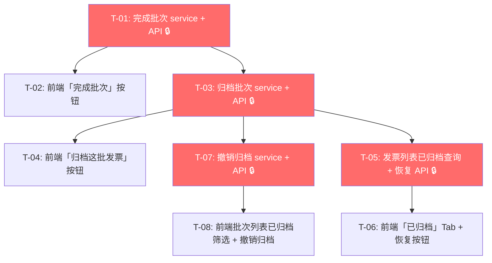

# 发票归档系统 — 开发任务计划

## 1. 任务概览

**总任务数**：8 个
**预计总工时**：250 分钟（约 4 小时）
**开发方法**：TDD — 每个任务按 RED → GREEN → REFACTOR 循环执行

**关键标注**：
- 🔒 阻塞任务：被多个任务依赖，建议优先完成
- ⚠️ 风险任务：涉及批次详情页不同类型状态切换、锁定态与只读态的判断逻辑

### 依赖关系图

### 可并行任务组

| 并行组 | 任务 | 说明 |
|--------|------|------|
| P1 | T-01（service + API）, T-05（已归档查询 + 恢复 API）| 两者针对不同模型（batch vs invoice），可并行编码 |
| P2 | T-02（完成批次按钮）, T-06（已归档 Tab）| 前端独立区块，可并行编码 |
| P3 | T-04（归档按钮）, T-08（批次列表筛选 + 撤销归档）| 前端独立区块，可并行编码 |

---

## 2. 开发任务

> 按垂直切片组织。每个阶段对应一个可独立运行和验证的用户行为。切片内部的任务按技术层自然顺序排列。
>
> 每个任务按 TDD 循环执行：RED（根据验证标准写测试）→ GREEN（写最小实现通过测试）→ REFACTOR（重构）

---

### 阶段 1：完成批次

**阶段完成标准**：用户在批次详情页点击"完成批次"→ 批次状态变为 completed → 所有编辑操作被锁定（不可增删发票、不可修改台账），仅导出台账仍可用。

---

#### T-01: 完成批次 service + API 🔒

**通俗解释**：后端有了"把批次标记为已完成"的能力——点一下按钮，批次就正式锁定不能再改了。同时给已有的编辑接口加了一道锁：批次变成 completed 后再调用编辑接口会被拒绝。

**做什么**：
1. 在 `services/batch_service.py` 实现 `complete_batch(db, user_id, batch_id)`：
   - 校验批次存在且 `user_id` 匹配，否则抛 404
   - 校验 `batch.status == "draft"`，否则抛 400
   - `batch.status = "completed"`，`db.commit()`
   - 返回 `BatchResponse`
2. 在 `services/batch_service.py` 的 `update_batch()` 增加 draft 状态校验
3. 在 `services/batch_service.py` 的 `add_invoices()` 增加 draft 状态校验
4. 在 `services/batch_service.py` 的 `remove_invoice()` 增加 draft 状态校验
5. 在 `services/batch_service.py` 的 `update_batch_invoice()` 增加 draft 状态校验
6. 在 `api/batches.py` 新增 `PUT /batches/{batch_id}/complete` 路由

**涉及文件**：`server/app/services/batch_service.py`、`server/app/api/batches.py`

**参考**：技术方案 §5.1（完成批次逻辑）、§5.6（现有操作状态校验） → AC-001, AC-014

**依赖**：无

**预估工时**：35 分钟

**验证标准**（TDD RED 阶段直接转化为测试用例）：
- [ ] `complete_batch(batch_id=1)` 批次 status=draft → 成功，batch.status="completed"
- [ ] `complete_batch(batch_id=1)` 批次 status=completed → 400，"只有草稿状态的批次才能完成"
- [ ] `complete_batch(batch_id=1)` 批次 status=archived → 400
- [ ] batch_id 不存在 → 404
- [ ] `update_batch(batch_id=1)` 批次 status=completed → 400，"只有草稿状态的批次才能修改"
- [ ] `add_invoices(batch_id=1, invoice_ids=[2])` 批次 status=completed → 400
- [ ] `remove_invoice(batch_id=1, invoice_id=2)` 批次 status=completed → 400
- [ ] `update_batch_invoice(batch_id=1, invoice_id=2)` 批次 status=completed → 400
- [ ] d`raft 状态的 `update_batch`/`add_invoices`/`remove_invoice`/`update_batch_invoice` 全部正常执行（回归测试，确保新增校验不影响正常流程）
- [ ] `PUT /api/batches/1/complete` → 200，返回 batch 含 `status: "completed"`
- [ ] `PUT /api/batches/1/complete` 批次不属于当前用户 → 404
- [ ] `PUT /api/batches/1/complete` 不传 token → 401

---

#### T-02: 前端"完成批次"按钮 + 确认弹窗 + 锁定态

**通俗解释**：批次详情页上多了一个"完成批次"按钮，点击后会弹出确认框问"确定完成吗"，确认后批次就锁住了——所有能编辑的地方都变成了只读。

**做什么**：
1. 在 `api/batches.ts` 新增 `complete(batchId: number)` 方法
2. 在 `stores/batchStore.ts` 新增 `completeBatch(id)` action（成功后刷新当前批次数据 + 批次列表）
3. 修改 `pages/BatchDetailPage.tsx`：
   - 在页面顶部（或操作栏区域），当 `batch.status === "draft"` 时渲染"完成批次"按钮
   - 点击按钮 → 弹出确认弹窗："完成批次后无法再修改台账和发票，确定完成吗？"
   - 确认后调用 `batchStore.completeBatch(id)`，成功后页面切换为只读模式
4. 在 `BatchDetailPage` 中添加锁定状态控制：
   - 当 `status === "completed"` 时：所有编辑操作的按钮/表单置灰，增删发票按钮隐藏，台账行编辑按钮隐藏，批次基本信息编辑隐藏
   - 导出按钮始终可用（无论什么状态）

**涉及文件**：`web/src/api/batches.ts`、`web/src/stores/batchStore.ts`、`web/src/pages/BatchDetailPage.tsx`

**参考**：技术方案 §7.5（BatchDetailPage 操作按钮） → AC-001, AC-014

**依赖**：T-01

**预估工时**：30 分钟

**验证标准**（TDD RED 阶段直接转化为测试用例）：
- [ ] BatchDetailPage 渲染且 `batch.status === "draft"` → 页面上可见"完成批次"按钮
- [ ] BatchDetailPage 渲染且 `batch.status === "completed"` → "完成批次"按钮消失，所有编辑操作置灰/隐藏
- [ ] BatchDetailPage 渲染且 `batch.status === "archived"` → 不显示"完成批次"按钮
- [ ] 点击"完成批次"按钮 → 弹出确认弹窗，含"确定"和"取消"按钮
- [ ] 弹出弹窗时点击"取消" → 弹窗关闭，批次状态不变
- [ ] 弹出弹窗时点击"确定" → 调用 `batchesApi.complete(id)`，成功后面板切换为只读态
- [ ] 批次变为 completed 后 → 添加发票/移除发票按钮隐藏，台账数量/垫款金额/备注不可编辑（或编辑状态不可点击）
- [ ] 批次变为 completed 后 → "导出 Excel"按钮仍然可见且可点击
- [ ] `batchesApi.complete(id)` 返回失败 → 页面展示错误提示，批次状态不变

---

### 阶段 2：归档批次

**阶段完成标准**：用户在已完成批次详情页点击"归档这批发票"→ 弹出确认提示 → 确认后批次内所有发票被归档，批次变为"已归档"状态。

---

#### T-03: 归档批次 service + API 🔒

**通俗解释**：后端有了"把一批发票全部归档"的能力——用户确认后，批次内的所有发票都会被标记为"已归档"，不再出现在"已入库"列表中。

**做什么**：
1. 在 `services/batch_service.py` 实现 `archive_batch(db, user_id, batch_id)`：
   - 校验批次存在且 `user_id` 匹配，否则抛 404
   - 校验 `batch.status == "completed"`，否则抛 400
   - 查询批次关联发票（`BatchInvoice`），获取 `invoice_ids`
   - 若 `invoice_ids` 为空，抛 400："该批次无发票，无需归档"
   - 批量更新 `Invoice.status = "archived"`（仅更新仍为 confirmed 的发票）
   - `batch.status = "archived"`
   - `db.commit()`
   - 返回 `{"archived": true, "archived_invoice_count": count, "batch_status": "archived"}`
2. 在 `schemas/batch.py` 新增 `ArchiveBatchResponse` Pydantic 模型
3. 在 `api/batches.py` 新增 `POST /batches/{batch_id}/archive` 路由

**涉及文件**：`server/app/services/batch_service.py`、`server/app/api/batches.py`、`server/app/schemas/batch.py`

**参考**：技术方案 §5.2（归档批次逻辑） → AC-002, AC-003, AC-009, AC-014

**依赖**：T-01

**预估工时**：25 分钟

**验证标准**（TDD RED 阶段直接转化为测试用例）：
- [ ] `archive_batch(batch_id=1)` 批次 status=completed，关联 5 张发票 → 成功，返回 `archived_invoice_count=5`，批次 status="archived"
- [ ] 归档后查询 5 张发票的 status → 全部为 "archived"
- [ ] `archive_batch(batch_id=1)` 批次 status=draft → 400，"只有已完成状态的批次才能归档"
- [ ] `archive_batch(batch_id=1)` 批次 status=archived → 400
- [ ] `archive_batch(batch_id=1)` 批次已 completed 但无关联发票 → 400，"该批次无发票，无需归档"
- [ ] batch_id 不存在 → 404
- [ ] `POST /api/batches/1/archive` → 200，返回 `{"archived": true, "archived_invoice_count": 5, "batch_status": "archived"}`
- [ ] `POST /api/batches/1/archive` 批次不属于当前用户 → 404
- [ ] `POST /api/batches/1/archive` 不传 token → 401

---

#### T-04: 前端"归档这批发票"按钮 + 确认弹窗

**通俗解释**：已完成批次的详情页上多了一个"归档这批发票"按钮，点击后会弹出确认框告诉你有多少张发票会被归档。确认后批次就归档了。

**做什么**：
1. 在 `api/batches.ts` 新增 `archive(batchId: number)` 方法
2. 在 `stores/batchStore.ts` 新增 `archiveBatch(id)` action
3. 修改 `pages/BatchDetailPage.tsx`：
   - 当 `batch.status === "completed"` 时，在页面顶部渲染"归档这批发票"按钮
   - 点击按钮 → 弹出确认弹窗："归档后，该批次的 {N} 张发票将从已入库移至归档区，您仍可在「已归档」视图中查看和管理它们。确定归档吗？"
   - 确认后调用 `batchStore.archiveBatch(id)`，成功后显示成功提示
   - 若批次内发票数为 0，按钮置灰，提示"该批次无发票，无需归档"
4. 归档成功后，页面可以做一个小动画/提示过渡（或直接关闭定位到批次列表）

**涉及文件**：`web/src/api/batches.ts`、`web/src/stores/batchStore.ts`、`web/src/pages/BatchDetailPage.tsx`

**参考**：技术方案 §7.5（BatchDetailPage 操作按钮）、§4.3（确认弹窗内容） → AC-002, AC-003, AC-009

**依赖**：T-03

**预估工时**：25 分钟

**验证标准**（TDD RED 阶段直接转化为测试用例）：
- [ ] BatchDetailPage 渲染且 `batch.status === "completed"` → 可见"归档这批发票"按钮
- [ ] BatchDetailPage 渲染且 `batch.status === "draft"` → 不显示"归档这批发票"按钮
- [ ] BatchDetailPage 渲染且 `batch.status === "archived"` → 不显示"归档这批发票"按钮
- [ ] 点击"归档这批发票"按钮 → 弹出确认弹窗，文案含"该批次的 {N} 张发票"
- [ ] 批次内发票数为 0 → 按钮置灰显示，hover 提示"该批次无发票，无需归档"
- [ ] 确认弹窗点击"取消" → 弹窗关闭，状态不变
- [ ] 确认弹窗点击"确定" → 调用 `batchesApi.archive(id)`，成功后提示"归档成功"
- [ ] `batchesApi.archive(id)` 返回失败 → 展示后端返回的错误信息

---

### 阶段 3：已归档发票视图

**阶段完成标准**：发票管理页新增"已归档" Tab，可以看到所有已归档的发票；每张发票的详情为只读模式；可以单张恢复；已归档发票不会出现在"全部" Tab 和发票选择器中。

---

#### T-05: 发票列表支持已归档查询 + 单张恢复 service + API 🔒

**通俗解释**：后端现在能查询已归档的发票了——前端切换到"已归档" Tab 时就能拿到数据。同时给每张归档发票加了一个"恢复"功能——恢复后发票就回到"已入库"了。

**做什么**：
1. 在 `services/invoice_service.py` 的 `list_invoices()` 中：
   - 当 `state=None`（"全部"）时，追加 `Invoice.status != "archived"` 过滤条件
   - 当 `state="archived"` 时，使用 `Invoice.status == "archived"` 过滤
2. 在 `services/invoice_service.py` 新增 `restore_archived_invoice(db, user_id, invoice_id)`：
   - 校验发票存在且 `user_id` 匹配，否则抛 404
   - 校验 `invoice.status == "archived"`，否则抛 400
   - `invoice.status = "confirmed"`，`db.commit()`
   - 返回更新后的 `Invoice` ORM 对象
3. 在 `api/invoices.py` 新增 `POST /invoices/{invoice_id}/restore-from-archive` 路由
4. 验证 `list_available_invoices()` 无需额外修改：已有 `Invoice.status == "confirmed"` 条件，archived 状态自然被排除

**涉及文件**：`server/app/services/invoice_service.py`、`server/app/api/invoices.py`

**参考**：技术方案 §5.5（列表查询变更）、§5.4（单张恢复逻辑） → AC-004, AC-006, AC-016, AC-017

**依赖**：无（与 T-01 可并行，两者操作不同模型）

**预估工时**：30 分钟

**验证标准**（TDD RED 阶段直接转化为测试用例）：
- [ ] `list_invoices(state=None)` 用户有 3 张 confirmed 发票 + 2 张 archived 发票 → 只返回 3 张（不包含 archived）
- [ ] `list_invoices(state="confirmed")` 用户有 5 张 confirmed 发票 + 2 张 archived 发票 → 只返回 5 张 confirmed
- [ ] `list_invoices(state="archived")` 用户有 2 张 archived 发票 → 返回这 2 张
- [ ] `list_invoices(state="archived")` 无归档发票 → 返回空列表
- [ ] `restore_archived_invoice(invoice_id=1)` 发票 status=archived → 成功，invoice.status 变为 "confirmed"
- [ ] `restore_archived_invoice(invoice_id=1)` 发票 status=confirmed → 400，"只有已归档状态的发票才能恢复"
- [ ] `restore_archived_invoice(invoice_id=1)` 发票不存在 → 404
- [ ] `POST /api/invoices/1/restore-from-archive` → 200，返回 invoice 含 `status: "confirmed"`
- [ ] `POST /api/invoices/1/restore-from-archive` 发票不属于当前用户 → 404

---

#### T-06: 前端"已归档" Tab + 空状态 + 只读详情 + 恢复按钮

**通俗解释**：发票管理页的 Tab 栏多了"已归档"这个新页签，点进去可以看到所有归档的发票。每张发票都是只读的，不能编辑，但可以点"恢复"让它回到"已入库"。

**做什么**：
1. 修改 `types/invoice.ts`：在 `InvoiceStatus` 类型中加入 `'archived'`
2. 修改 `lib/constants.ts`：
   - `STATUS_LABELS` 新增 `archived: '已归档'`
   - `STATUS_COLORS` 新增 `archived: 'gray'`（灰色）
   - `INVOICE_TABS` 新增一项 `{ key: 'archived', label: '已归档', state: 'archived' }`
3. 修改 `api/invoices.ts`：新增 `restoreFromArchive(id: number)` 方法
4. 修改 `stores/invoiceStore.ts`：
   - `fetchInvoices` 中处理 `activeTab === 'archived'` 时传入 `state: 'archived'`
   - 新增 `restoreArchivedInvoice(id)` action（调用 API → 刷新列表）
5. 修改 `components/invoices/InvoiceDetailModal.tsx`：
   - 当 `invoice.status === "archived"` 时：所有表单字段置灰只读，不显示"保存"/"确认入库"/"删除"按钮
   - 在底部操作区显示"恢复"按钮（仅 archived 状态可见）
   - 点击"恢复" → 确认弹窗 → 调用 `invoiceStore.restoreArchivedInvoice(id)` → 成功后关闭弹窗刷新列表
6. 修改 `components/invoices/InvoiceCard.tsx`：展示 `archived` 状态标签（灰色）
7. `components/invoices/InvoiceTabs.tsx`：无需修改（从 `INVOICE_TABS` 常量自动渲染）
8. `pages/InvoicesPage.tsx`：已归档 Tab 切换时，`state=archived` 自然传入后端

**涉及文件**：`web/src/types/invoice.ts`、`web/src/lib/constants.ts`、`web/src/api/invoices.ts`、`web/src/stores/invoiceStore.ts`、`web/src/components/invoices/InvoiceDetailModal.tsx`、`web/src/components/invoices/InvoiceCard.tsx`

**参考**：技术方案 §7.1~§7.5（前端变更详情） → AC-004, AC-006, AC-011, AC-012, AC-016, AC-017

**依赖**：T-05

**预估工时**：40 分钟

**验证标准**（TDD RED 阶段直接转化为测试用例）：
- [ ] INVOICE_TABS 中 key="archived" 的项存在，label="已归档"
- [ ] InvoicesPage 切换到"已归档" Tab → store 中 activeTab 变为 "archived"，fetchInvoices 传入 state="archived"
- [ ] "已归档" Tab 且有归档发票 → 列表正常展示，每张发票状态标签显示灰色"已归档"
- [ ] "已归档" Tab 但无归档发票 → 展示空状态："暂无归档发票，完成报销批次后归档即可查看"
- [ ] 点击已归档发票 → InvoiceDetailModal 打开，所有字段只读，无保存/确认/删除按钮
- [ ] InvoiceDetailModal 中查看已归档发票 → 左侧文件预览正常显示
- [ ] InvoiceDetailModal 中点击"恢复"按钮 → 弹出确认弹窗
- [ ] 确认恢复 → 调用 `invoicesApi.restoreFromArchive(id)`，成功后关闭弹窗
- [ ] 恢复后的发票从"已归档" Tab 消失，出现在"已入库" Tab
- [ ] 点击"已入库" Tab → 确认恢复的发票出现在列表中
- [ ] "全部" Tab → 不显示任何已归档发票

---

### 阶段 4：已归档批次管理与撤销

**阶段完成标准**：批次列表中可筛选出已归档批次；点击已归档批次可查看只读详情页；支持"撤销归档"将整批发票恢复为已入库、批次恢复为已完成；部分发票已单张恢复时不影响其他发票。

---

#### T-07: 撤销归档 service + API + 批次列表状态筛选 🔒

**通俗解释**：后端现在可以把一个归档的批次"撤销"——批次回到已完成状态，里面的发票重新变成已入库。同时批次列表支持按状态筛选了，前端可以只查"已归档"的批次。

**做什么**：
1. 在 `services/batch_service.py` 实现 `unarchive_batch(db, user_id, batch_id)`：
   - 校验批次存在且 `user_id` 匹配，否则抛 404
   - 校验 `batch.status == "archived"`，否则抛 400
   - 查询批次关联发票（`BatchInvoice`），获取 `invoice_ids`
   - 只更新其中 `status == "archived"` 的发票为 `"confirmed"`（已被单张恢复的不受影响）
   - `batch.status = "completed"`
   - `db.commit()`
   - 返回 `{"unarchived": true, "restored_invoice_count": count, "skipped_count": skip, "batch_status": "completed"}`
2. 在 `services/batch_service.py` 的 `list_batches()` 中增加可选参数 `status: str | None`：
   - 当 `status` 传入时，追加 `ReimbursementBatch.status == status` 过滤
3. 在 `schemas/batch.py` 新增 `UnarchiveBatchResponse` Pydantic 模型
4. 在 `api/batches.py`：
   - 新增 `POST /batches/{batch_id}/unarchive` 路由
   - 修改 `GET /batches/` 路由支持可选的 `status` Query 参数

**涉及文件**：`server/app/services/batch_service.py`、`server/app/api/batches.py`、`server/app/schemas/batch.py`

**参考**：技术方案 §5.3（撤销归档逻辑）、§5.5（批次列表状态筛选） → AC-005, AC-007, AC-008, AC-010, AC-013, AC-015

**依赖**：T-03（需要先有归档功能才能撤销）

**预估工时**：30 分钟

**验证标准**（TDD RED 阶段直接转化为测试用例）：
- [ ] `unarchive_batch(batch_id=1)` 批次 status=archived，关联 5 张发票，全部仍为 archived → 成功，`restored_invoice_count=5`，`skipped_count=0`，批次 status="completed"
- [ ] 撤销后查询 5 张发票的 status → 全部为 "confirmed"
- [ ] `unarchive_batch(batch_id=1)` 批次关联 5 张发票，其中 2 张已被单张恢复（confirmed），3 张仍为 archived → `restored_invoice_count=3`，`skipped_count=2`，剩余 2 张保持 confirmed 不变
- [ ] `unarchive_batch(batch_id=1)` 批次 status=draft → 400
- [ ] `unarchive_batch(batch_id=1)` 批次 status=completed → 400
- [ ] batch_id 不存在 → 404
- [ ] `POST /api/batches/1/unarchive` → 200，返回 `{"unarchived": true, "restored_invoice_count": N, "skipped_count": M, "batch_status": "completed"}`
- [ ] `GET /api/batches?status=archived` → 只返回 status=archived 的批次
- [ ] `GET /api/batches?status=completed` → 只返回 status=completed 的批次
- [ ] `GET /api/batches`（不传 status）→ 返回所有状态的批次（回归测试）
- [ ] 所有批次查询保持 `user_id` 过滤（数据隔离）

---

#### T-08: 前端批次列表"已归档"筛选 + 只读详情页 + "撤销归档"按钮

**通俗解释**：批次列表可以切换到"已归档"视图只看到归档的批次；点击已归档批次进入的是只读详情页（所有内容可看不可改），页面顶部有"撤销归档"按钮可以把整批恢复。

**做什么**：
1. 修改 `api/batches.ts`：新增 `archive(batchId)`（已在前端 T-04 实现）、`unarchive(batchId)` 方法
2. 修改 `stores/batchStore.ts`：
   - 新增 `unarchiveBatch(id)` action
   - `fetchBatches` 支持传入 `status` 参数
3. 修改 `pages/BatchesPage.tsx`：
   - 在批次列表筛选区域增加状态筛选：下拉选择框，选项为"全部 / 草稿 / 已完成 / 已归档"
   - 选择"已归档"时，调用 `fetchBatches({ status: 'archived' })`
   - 已归档批次的卡片展示"已归档"标签（灰色）
4. 修改 `pages/BatchDetailPage.tsx`：
   - 当 `batch.status === "archived"` 时：
     - 页面整体为只读模式：批次基本信息不可编辑、增删发票按钮隐藏、台账行不可编辑
     - 在页面顶部显示"撤销归档"按钮
     - 点击"撤销归档" → 弹出确认弹窗："撤销归档后，该批次 {N} 张发票将恢复为已入库状态，批次恢复为已完成。确定撤销吗？"
     - 确认后调用 `batchStore.unarchiveBatch(id)`，成功后页面刷新为 completed 状态（只读模式，因为批次恢复了但仍是 completed）
     - 导出按钮始终可用

**涉及文件**：`web/src/api/batches.ts`、`web/src/stores/batchStore.ts`、`web/src/pages/BatchesPage.tsx`、`web/src/pages/BatchDetailPage.tsx`

**参考**：技术方案 §7.5（批次详情页操作按钮 + 批次列表筛选） → AC-005, AC-007, AC-008, AC-010, AC-013, AC-015

**依赖**：T-07

**预估工时**：35 分钟

**验证标准**（TDD RED 阶段直接转化为测试用例）：
- [ ] BatchesPage 筛选区域有状态下拉框，选项含"全部/草稿/已完成/已归档"
- [ ] 选择"已归档" → 列表刷新，只展示 status=archived 的批次
- [ ] 选择"全部" → 展示所有状态批次
- [ ] 已归档批次卡片显示"已归档"标签（灰色）
- [ ] BatchDetailPage 渲染且 `batch.status === "archived"` → 所有编辑字段置灰只读，增删发票按钮隐藏，台账行不可编辑
- [ ] BatchDetailPage 渲染且 `batch.status === "archived"` → 可见"撤销归档"按钮
- [ ] BatchDetailPage 渲染且 `batch.status === "completed"` → 不显示"撤销归档"按钮
- [ ] 点击"撤销归档" → 弹出确认弹窗，文案含"该批次 {N} 张发票将恢复为已入库状态"
- [ ] 确认弹窗点击"取消" → 弹窗关闭，状态不变
- [ ] 确认弹窗点击"确定" → 调用 `batchesApi.unarchive(id)`，成功后提示"撤销归档成功"
- [ ] 撤销归档后页面刷新 → 批次 status 变为 "completed"，仍然为只读模式（completed 状态不可编辑）
- [ ] 撤销归档后去发票管理页 → "已入库" Tab 包含恢复的发票
- [ ] 如果批次内部分发票已被单张恢复 → 撤销归档只恢复剩余仍为 archived 的发票（验证数字正确）
- [ ] 已归档批次详情页 → "导出 Excel"按钮仍然可见且可点击

---

## 3. AC 覆盖总表

| AC 编号 | 验收标准概述 | 承接任务 | 验证方式 |
|---------|-------------|---------|---------|
| AC-001 | 完成批次 — 锁定编辑 | T-01, T-02 | T-01: draft→completed 成功后，编辑接口返回 400；T-02: completed 态增删/编辑按钮隐藏 |
| AC-002 | 归档批次 — 确认弹窗 | T-04 | T-04: 点击"归档"弹出确认弹窗，文案含发票数量 |
| AC-003 | 归档批次 — 执行成功 | T-03, T-04 | T-03: 归档后发票全部变为 archived；T-04: 前端提示"归档成功" |
| AC-004 | 已归档视图 — 查看归档发票 | T-05, T-06 | T-05: state=archived 返回归档发票；T-06: Tab 切换后正确渲染 |
| AC-005 | 已归档批次 — 只读详情页 | T-07, T-08 | T-07: 无直接关联；T-08: batch.status=archived 时页面只读 |
| AC-006 | 单张恢复归档发票 | T-05, T-06 | T-05: restore 成功后 status=confirmed；T-06: 恢复后发票移到"已入库" |
| AC-007 | 整批撤销归档 | T-07, T-08 | T-07: unarchive 后发票恢复 confirmed；T-08: 前端调用并提示成功 |
| AC-008 | 批次列表 — 已归档筛选 | T-07, T-08 | T-07: GET /batches?status=archived；T-08: 前端下拉筛选 + 标签展示 |
| AC-009 | 归档空批次 — 不允许 | T-03, T-04 | T-03: 无发票返回 400；T-04: 按钮置灰 |
| AC-010 | 撤销归档时部分已单张恢复 | T-07, T-08 | T-07: skipped_count 计算正确；T-08: 撤销后已验证部分恢复不受影响 |
| AC-011 | 已归档 Tab 空状态 | T-06 | T-06: 无归档发票时展示空状态文案 |
| AC-012 | 已归档发票详情 — 只读 | T-06 | T-06: InvoiceDetailModal archived 态所有字段只读 |
| AC-013 | 撤销归档确认弹窗 | T-08 | T-08: 点击"撤销归档"弹出确认弹窗，文案含发票数量 |
| AC-014 | 批次状态流转规则 | T-01, T-03, T-07 | T-01: draft→completed；T-03: completed→archived；T-07: archived→completed |
| AC-015 | 数据隔离 | T-01, T-03, T-05, T-07 | 所有 service 函数校验 `user_id` 匹配 |
| AC-016 | 归档发票不出现在选择器中 | T-05 | T-05: list_available_invoices 已有 confirmed 条件，archived 自然排除 |
| AC-017 | 归档后"已入库"数量更新 | T-05, T-06 | T-05: state=None 排除 archived；T-06: 数量自动正确 |

---

## 4. 完成定义

- [ ] 所有任务的验证标准（测试用例）通过
- [ ] AC 覆盖总表中每条 AC 的验证方式已执行并通过
- [ ] 批次全生命周期手工验证：草稿 → 完成 → 归档 → 查看已归档 Tab → 单张恢复 → 撤销归档
- [ ] "已归档" Tab 空状态/正常数据展示均通过验证
- [ ] 完成批次后所有编辑操作被锁定，导出仍可用
- [ ] 归档后发票不出现"全部" Tab 和发票选择器中
- [ ] 已归档批次详情页全部只读，无任何可编辑元素
- [ ] 撤销归档后部分已单张恢复的发票不受影响
- [ ] 所有错误场景（空批次归档、错误状态操作）返回友好提示

---

## 附录：变更记录

| 日期 | 变更内容 | 原因 |
|------|---------|------|
| 2026-05-21 | 初始版本 | — |