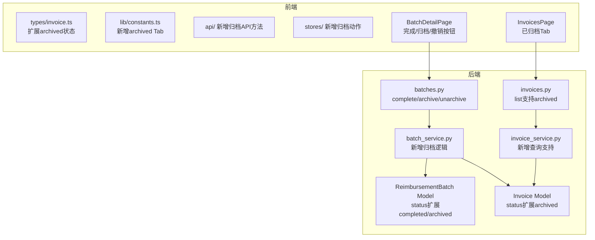

# 发票归档系统 — 技术设计文档

## 1. 设计概要

**功能描述**：为已完成报销批次提供批量归档能力，发票从"已入库"移至"已归档"视图；支持单张恢复和整批撤销归档；批次增加 completed / archived 状态流转。

**影响范围**：

| 层 | 模块 | 改动概要 |
|---|------|---------|
| 后端数据层 | `Invoice` 模型 | 新增 `archived` 状态值（已有 status 字段，字符串值扩展，无需迁移） |
| 后端数据层 | `ReimbursementBatch` 模型 | 新增 `completed`/`archived` 状态值（已有 status 字段，字符串值扩展，无需迁移） |
| 后端 API 层 | `api/batches.py` | 新增 3 个端点：complete、archive、unarchive；现有端点增加状态校验 |
| 后端 API 层 | `api/invoices.py` | 部分端增加 archived 状态处理；现有查询逻辑增加 archived 过滤 |
| 后端 Service 层 | `services/batch_service.py` | 新增 complete/archive/unarchive 业务逻辑；保留现有逻辑不变 |
| 后端 Service 层 | `services/invoice_service.py` | `list_invoices` 支持 `state=archived`；`list_available_invoices` 排除 archived |
| 前端类型 | `types/invoice.ts` | `InvoiceStatus` 扩展 `archived` |
| 前端常量 | `lib/constants.ts` | 新增 archived 的标签/颜色/Tab 定义 |
| 前端 API | `api/invoices.ts` | 新增 `restoreFromArchive` |
| 前端 API | `api/batches.ts` | 新增 `complete`、`archive`、`unarchive` |
| 前端 Store | `stores/invoiceStore.ts` | 新增 archived Tab 数据处理 |
| 前端 Store | `stores/batchStore.ts` | 新增 complete/archive/unarchive actions |
| 前端页面 | `pages/BatchesPage.tsx` | 批次列表增加"已归档"筛选 |
| 前端页面 | `pages/BatchDetailPage.tsx` | 新增完成/归档/撤销归档操作按钮 |
| 前端组件 | `components/invoices/InvoiceTabs.tsx` | 新增"已归档" Tab |
| 前端组件 | `components/invoices/InvoiceCard.tsx` | 新增 archived 状态展示 |

**外部依赖**：无新增

---

## 2. 架构概览



---

## 3. 数据库设计

### 3.1 Invoice 模型 — 状态值扩展

**现状**：`status` 字段为 `String(20)`，取值 `processing`、`pending`、`failed`、`confirmed`

**变更**：新增 `archived` 作为合法状态值。仅新增业务语义，无需 DDL 迁移。

```
已存在的状态值：processing → pending → confirmed
                            → failed ↗
新增状态值：    confirmed → archived（归档时设置）
                archived → confirmed（恢复时设置）
```

→ AC-003, AC-004, AC-006, AC-007, AC-014

### 3.2 ReimbursementBatch 模型 — 状态值扩展

**现状**：`status` 字段为 `String(20)`，默认值 `draft`

**变更**：新增 `completed`、`archived` 作为合法状态值。无需 DDL 迁移。

```
draft ──"完成批次"──→ completed ──"归档"──→ archived
                            ↑                    │
                            │──"撤销归档"─────────┘
```

→ AC-001, AC-003, AC-007, AC-014

### 3.3 归档记录表 — 不新增

**决策**：不新建 `archives` 表。现有 `archives` 表（含 `batch_id`、`archive_path`、`created_at`）是为未来物理文件归档预留的，与本次的"发票状态标记为 archived"无关。本次仅在 `invoices.status` 字段上记录归档状态，通过批次关联查询即可找到"哪些发票因哪个批次而归档"。

---

## 4. API 设计

> 所有接口均需鉴权（`Depends(get_current_user)`），数据隔离通过 `user_id` 实现。
> API 风格遵循项目已有约定：路径小写连字符、Pydantic `response_model`、错误返回 `HTTPException`。

---

### 4.1 `PUT /api/batches/{batch_id}/complete` — 完成批次 → AC-001

**描述**：将批次从 draft 状态标记为 completed，锁定编辑。

**鉴权**：需要登录 + 只能操作自己的批次

**Request**：无 body

**Response（成功 200）**：`BatchResponse`（status=completed）

**异常响应**：

| 场景 | 状态码 | 响应 |
|------|--------|------|
| 批次不存在或不属于当前用户 | 404 | `{"detail": "批次不存在"}` |
| 批次状态不是 draft | 400 | `{"detail": "只有草稿状态的批次才能完成"}` |

---

### 4.2 `POST /api/batches/{batch_id}/archive` — 归档批次 → AC-002, AC-003, AC-009

**描述**：将 completed 批次归档，批次内所有已确认的发票标记为 archived。

**鉴权**：需要登录 + 只能操作自己的批次

**Request**：无 body

**处理流程**：
1. 校验批次存在且 status=completed
2. 校验批次内有关联发票（否则返回 400）
3. 查询批次内所有 `BatchInvoice` 关联的 `Invoice`，将其 status 更新为 `archived`
4. 将批次 status 更新为 `archived`
5. 返回更新后的批次详情

**Response（成功 200）**：
```json
{
  "archived": true,
  "batch_id": 1,
  "archived_invoice_count": 5,
  "batch_status": "archived"
}
```

**异常响应**：

| 场景 | 状态码 | 响应 |
|------|--------|------|
| 批次不存在或不属于当前用户 | 404 | `{"detail": "批次不存在"}` |
| 批次状态不是 completed | 400 | `{"detail": "只有已完成状态的批次才能归档"}` |
| 批次无关联发票 | 400 | `{"detail": "该批次无发票，无需归档"}` |

---

### 4.3 `POST /api/batches/{batch_id}/unarchive` — 撤销归档 → AC-007, AC-010, AC-013

**描述**：将已归档批次撤销归档，批次内仍为 archived 状态的发票恢复为 confirmed，批次回退为 completed。

**鉴权**：需要登录 + 只能操作自己的批次

**Request**：无 body

**处理流程**：
1. 校验批次存在且 status=archived
2. 查询批次内所有 `BatchInvoice` 关联的 `Invoice`，只恢复那些 status 仍为 `archived` 的（已被单张恢复的不再处理）
3. 将批次 status 恢复为 `completed`
4. 返回撤销结果

**Response（成功 200）**：
```json
{
  "unarchived": true,
  "batch_id": 1,
  "restored_invoice_count": 5,
  "skipped_count": 0,
  "batch_status": "completed"
}
```

**异常响应**：

| 场景 | 状态码 | 响应 |
|------|--------|------|
| 批次不存在或不属于当前用户 | 404 | `{"detail": "批次不存在"}` |
| 批次状态不是 archived | 400 | `{"detail": "只有已归档状态的批次才能撤销归档"}` |

---

### 4.4 `POST /api/invoices/{invoice_id}/restore-from-archive` — 单张恢复归档发票 → AC-006

**描述**：将单张 archived 状态的发票恢复为 confirmed 状态。

**鉴权**：需要登录 + 只能操作自己的发票

**Response（成功 200）**：更新后的 `InvoiceResponse`（status=confirmed）

**异常响应**：

| 场景 | 状态码 | 响应 |
|------|--------|------|
| 发票不存在或不属于当前用户 | 404 | `{"detail": "发票不存在"}` |
| 发票状态不是 archived | 400 | `{"detail": "只有已归档状态的发票才能恢复"}` |

---

### 4.5 `GET /api/batches/` — 批次列表支持状态筛选 → AC-008

**变更**：现有 `GET /api/batches/` 增加可选 Query 参数 `status`

**Query 参数**：

| 参数 | 类型 | 必填 | 说明 |
|------|------|------|------|
| status | string | 否 | 按状态筛选，不传返回全部（draft + completed + archived） |

**处理**：当 `status=archived` 时只返回 status=archived 的批次。

---

### 4.6 `GET /api/invoices/` — 发票列表支持 archived 状态 → AC-004, AC-016

**变更**：现有 `GET /api/invoices/` 的 `state` 参数支持 `archived` 值。

**处理**：
- `state=archived`：只返回 status=archived 的发票
- `state` 不传：返回所有非 deleted 的发票（现有逻辑，保持不变）
- `GET /api/invoices/` 的"全部"视图需要**排除 archived**（已归档发票不应该出现在任何活跃 Tab 中）

**具体实现**：在 `list_invoices` 的 `state=None`（"全部"）查询中，额外添加 `Invoice.status != "archived"` 过滤条件。

---

### 4.7 `GET /api/batches/available-invoices` — 可选发票排除已归档 → AC-016

**变更**：现有查询增加 `Invoice.status != "archived"` 条件。

**现状 SQL 逻辑**：
```python
query = db.query(Invoice).filter(
    Invoice.user_id == user_id,
    Invoice.status == "confirmed",
    Invoice.id.notin_(used_ids),
)
```

**变更**：无需改动，因为 `confirmed` 的发票不可能同时是 `archived`。已归档的发票 status 已经变成 `archived`，自然不会被选中。

但需要确保：**已被单张恢复**的发票如果已经被其它批次占用，会被 `used_ids` 排除。这一逻辑保持不变。

---

## 5. 核心逻辑

### 5.1 完成批次 → AC-001

**触发条件**：`PUT /api/batches/{id}/complete`

**处理流程**：
1. 校验批次存在且 `user_id` 匹配
2. 校验 `status == "draft"`（否则返回 400）
3. `batch.status = "completed"`
4. `db.commit()`
5. 返回 `BatchResponse`

```python
def complete_batch(db: Session, user_id: int, batch_id: int) -> BatchResponse:
    batch = db.query(ReimbursementBatch).filter(
        ReimbursementBatch.id == batch_id,
        ReimbursementBatch.user_id == user_id,
    ).first()
    if not batch:
        raise HTTPException(status_code=404, detail="批次不存在")
    if batch.status != "draft":
        raise HTTPException(status_code=400, detail="只有草稿状态的批次才能完成")

    batch.status = "completed"
    db.commit()
    db.refresh(batch)
    return BatchResponse.model_validate(batch)
```

---

### 5.2 归档批次 → AC-002, AC-003, AC-009

**触发条件**：`POST /api/batches/{id}/archive`

**处理流程**：
1. 校验批次存在且 `user_id` 匹配
2. 校验 `status == "completed"`（否则返回 400）
3. 查询批次关联的 `BatchInvoice`，获取关联发票 ID 列表
4. 若发票列表为空，返回 400
5. 将批次内所有关联发票的 `status` 更新为 `archived`
6. 批次 `status = "archived"`
7. `db.commit()`
8. 返回归档结果

```python
def archive_batch(db: Session, user_id: int, batch_id: int) -> dict:
    batch = _get_and_validate_batch(db, batch_id, user_id)
    if batch.status != "completed":
        raise HTTPException(status_code=400, detail="只有已完成状态的批次才能归档")

    batch_invoices = db.query(BatchInvoice).filter(
        BatchInvoice.batch_id == batch_id,
        BatchInvoice.source_type == "invoice",
    ).all()

    invoice_ids = [bi.invoice_id for bi in batch_invoices if bi.invoice_id is not None]
    if not invoice_ids:
        raise HTTPException(status_code=400, detail="该批次无发票，无需归档")

    count = db.query(Invoice).filter(
        Invoice.id.in_(invoice_ids),
        Invoice.status == "confirmed",
    ).update({Invoice.status: "archived"}, synchronize_session=False)

    batch.status = "archived"
    db.commit()

    return {
        "archived": True,
        "batch_id": batch_id,
        "archived_invoice_count": count,
        "batch_status": "archived",
    }
```

---

### 5.3 撤销归档 → AC-007, AC-010, AC-013

**触发条件**：`POST /api/batches/{id}/unarchive`

**处理流程**：
1. 校验批次存在且 `user_id` 匹配
2. 校验 `status == "archived"`（否则返回 400）
3. 查询批次关联的 `BatchInvoice`，获取关联发票 ID 列表
4. 只恢复其中 `status == "archived"` 的发票（已被单张恢复的不受影响）
5. 批次 `status = "completed"`
6. `db.commit()`
7. 返回撤销结果

```python
def unarchive_batch(db: Session, user_id: int, batch_id: int) -> dict:
    batch = _get_and_validate_batch(db, batch_id, user_id)
    if batch.status != "archived":
        raise HTTPException(status_code=400, detail="只有已归档状态的批次才能撤销归档")

    batch_invoices = db.query(BatchInvoice).filter(
        BatchInvoice.batch_id == batch_id,
        BatchInvoice.source_type == "invoice",
    ).all()

    invoice_ids = [bi.invoice_id for bi in batch_invoices if bi.invoice_id is not None]

    restored = 0
    if invoice_ids:
        restored = db.query(Invoice).filter(
            Invoice.id.in_(invoice_ids),
            Invoice.status == "archived",
        ).update({Invoice.status: "confirmed"}, synchronize_session=False)

    batch.status = "completed"
    db.commit()

    return {
        "unarchived": True,
        "batch_id": batch_id,
        "restored_invoice_count": restored,
        "skipped_count": len(invoice_ids) - restored,
        "batch_status": "completed",
    }
```

---

### 5.4 单张恢复归档发票 → AC-006

**触发条件**：`POST /api/invoices/{id}/restore-from-archive`

**处理流程**：
1. 校验发票存在且 `user_id` 匹配
2. 校验 `status == "archived"`（否则返回 400）
3. `invoice.status = "confirmed"`
4. `db.commit()`
5. 返回 `InvoiceResponse`

```python
def restore_archived_invoice(db: Session, user_id: int, invoice_id: int) -> Invoice:
    invoice = db.query(Invoice).filter(
        Invoice.id == invoice_id,
        Invoice.user_id == user_id,
    ).first()
    if not invoice:
        raise HTTPException(status_code=404, detail="发票不存在")
    if invoice.status != "archived":
        raise HTTPException(status_code=400, detail="只有已归档状态的发票才能恢复")

    invoice.status = "confirmed"
    db.commit()
    db.refresh(invoice)
    return invoice
```

---

### 5.5 列表查询变更 → AC-004, AC-008, AC-016

#### `list_invoices` — 排除 archived

在现有的 `list_invoices` 函数中，当 `state=None`（"全部"）时，追加 `Invoice.status != "archived"` 过滤：

```python
query = db.query(Invoice).filter(
    Invoice.user_id == user_id,
    Invoice.deleted_at.is_(None),
    Invoice.status != "archived",  # 新增：全部视图排除已归档
)
```

当 `state="archived"` 时，使用现有状态筛选逻辑：
```python
query = db.query(Invoice).filter(
    Invoice.user_id == user_id,
    Invoice.deleted_at.is_(None),
    Invoice.status == "archived",  # 只返回已归档
)
```

#### `list_batches` — 支持状态筛选

```python
def list_batches(db: Session, user_id: int, status: str | None = None) -> BatchListResponse:
    query = db.query(ReimbursementBatch).filter(
        ReimbursementBatch.user_id == user_id,
    )
    if status:
        query = query.filter(ReimbursementBatch.status == status)

    batches = query.order_by(ReimbursementBatch.created_at.desc()).all()
    # ... 后续逻辑不变
```

---

### 5.6 现有操作增加状态校验

以下现有 API 需要对 draft/completed/archived 状态增加校验：

| 已有 API | 新增校验 | 对应 AC |
|---------|---------|---------|
| `PUT /api/batches/{id}` (更新批次) | 仅 draft 状态下可修改 | AC-001 |
| `DELETE /api/batches/{id}` (删除批次) | 仅 draft 状态下可删除（或允许删任何状态，取决于业务） | — |
| `POST /api/batches/{id}/invoices` (添加发票) | 仅 draft 状态下可添加 | AC-001 |
| `DELETE /api/batches/{id}/invoices/{iid}` (移除发票) | 仅 draft 状态下可移除 | AC-001 |
| `PUT /api/batches/{id}/invoices/{iid}` (编辑台账) | 仅 draft 状态下可编辑 | AC-001 |

**决策**：考虑用户体验，删除批次应该允许在任何状态下执行（包括 completed 和 archived），因为用户可能想清理历史数据。但添加/移除发票和编辑台账应仅限于 draft 状态。

---

## 6. Pydantic Schema 变更

### 6.1 新增响应 Schema

```python
class ArchiveBatchResponse(BaseModel):
    archived: bool
    batch_id: int
    archived_invoice_count: int
    batch_status: str


class UnarchiveBatchResponse(BaseModel):
    unarchived: bool
    batch_id: int
    restored_invoice_count: int
    skipped_count: int
    batch_status: str
```

### 6.2 现有 Schema 变更

无需修改现有 Schema，所有变更通过状态值扩展完成。

---

## 7. 前端变更

### 7.1 类型定义变更

**`types/invoice.ts`** — `InvoiceStatus` 增加 `'archived'`：

```typescript
export type InvoiceStatus = 'processing' | 'pending' | 'failed' | 'confirmed' | 'archived';
```

### 7.2 常量变更

**`lib/constants.ts`** — 新增 archived 相关定义：

```typescript
export const STATUS_LABELS: Record<string, string> = {
  processing: '识别中',
  pending: '待确认',
  failed: '识别失败',
  confirmed: '已入库',
  archived: '已归档',      // 新增
};

export const STATUS_COLORS: Record<string, string> = {
  processing: 'blue',
  pending: 'yellow',
  failed: 'red',
  confirmed: 'green',
  archived: 'gray',        // 新增：灰色
};

export const INVOICE_TABS = [
  { key: 'all', label: '全部' },
  { key: 'processing', label: '识别中', state: 'processing' as const },
  { key: 'pending_failed', label: '待确认', state: 'pending_failed' as const },
  { key: 'confirmed', label: '已入库', state: 'confirmed' as const },
  { key: 'archived', label: '已归档', state: 'archived' as const },  // 新增
] as const;
```

### 7.3 API 层变更

**`api/invoices.ts`** — 新增 `restoreFromArchive`：

```typescript
export const invoicesApi = {
  // ... 现有方法不变

  // POST /api/invoices/{id}/restore-from-archive
  restoreFromArchive: async (id: number): Promise<Invoice> => {
    const r = await apiClient.post(`/invoices/${id}/restore-from-archive`);
    return r.data;
  },
};
```

**`api/batches.ts`** — 新增 `complete`、`archive`、`unarchive`：

```typescript
export const batchesApi = {
  // ... 现有方法不变

  // PUT /api/batches/{id}/complete
  complete: async (id: number): Promise<ReimbursementBatch> => {
    const r = await apiClient.put(`/batches/${id}/complete`);
    return r.data;
  },

  // POST /api/batches/{id}/archive
  archive: async (id: number): Promise<{ archived: boolean; batch_id: number; archived_invoice_count: number; batch_status: string }> => {
    const r = await apiClient.post(`/batches/${id}/archive`);
    return r.data;
  },

  // POST /api/batches/{id}/unarchive
  unarchive: async (id: number): Promise<{ unarchived: boolean; batch_id: number; restored_invoice_count: number; skipped_count: number; batch_status: string }> => {
    const r = await apiClient.post(`/batches/${id}/unarchive`);
    return r.data;
  },
};
```

### 7.4 Store 层变更

**`stores/invoiceStore.ts`** — 新增 archived Tab 支持：

```typescript
// fetchInvoices 方法中新增 archived 分支
fetchInvoices: async () => {
  const { activeTab, currentPage, pageSize, dateFrom, dateTo } = get();
  set({ loading: true, error: null });

  try {
    if (activeTab === 'pending_failed') {
      // ... 现有逻辑不变
    } else {
      const state = activeTab === 'all' ? undefined : activeTab;
      // 注意：当 state=undefined 时，后端会返回所有非 deleted 的发票
      // 后端已排除 archived，所以"全部" Tab 不显示已归档发票
      const res = await invoicesApi.list({
        state,
        page: currentPage,
        page_size: pageSize,
        date_from: dateFrom ?? undefined,
        date_to: dateTo ?? undefined,
      });
      set({
        invoices: res.items,
        total: res.total,
        totalPages: res.total_pages,
        loading: false,
      });
    }
  } catch {
    set({ error: '加载发票列表失败', loading: false });
  }
},

// 新增：恢复归档发票
restoreArchivedInvoice: async (id: number) => {
  await invoicesApi.restoreFromArchive(id);
  get().fetchInvoices();  // 刷新列表（切换到已归档 Tab 会重新加载）
},
```

**`stores/batchStore.ts`** — 新增 complete/archive/unarchive actions：

```typescript
// 新增方法
completeBatch: async (id: number) => {
  set({ error: null });
  try {
    await batchesApi.complete(id);
    await get().fetchBatch(id);
    await get().fetchBatches();
  } catch (err: unknown) {
    const msg = (err as any)?.response?.data?.detail || '完成批次失败';
    set({ error: msg });
    throw err;
  }
},

archiveBatch: async (id: number) => {
  set({ error: null });
  try {
    await batchesApi.archive(id);
    await get().fetchBatch(id);
    await get().fetchBatches();
  } catch (err: unknown) {
    const msg = (err as any)?.response?.data?.detail || '归档批次失败';
    set({ error: msg });
    throw err;
  }
},

unarchiveBatch: async (id: number) => {
  set({ error: null });
  try {
    await batchesApi.unarchive(id);
    await get().fetchBatch(id);
    await get().fetchBatches();
  } catch (err: unknown) {
    const msg = (err as any)?.response?.data?.detail || '撤销归档失败';
    set({ error: msg });
    throw err;
  }
},
```

### 7.5 页面与组件变更

#### BatchDetailPage — 批次详情页操作按钮

根据批次状态动态展示操作按钮：

| 批次状态 | 展示按钮 |
|---------|---------|
| draft | "完成批次" 按钮（已有内容上方），其余操作不变 |
| completed | "归档这批发票" 按钮（确认弹窗），所有编辑操作置灰 |
| archived | "撤销归档" 按钮（确认弹窗），全部只读，仍可导出台账 |

**"完成批次"按钮**：
- 位置：页面顶部信息栏区域
- 文案："完成批次"
- 条件：仅 draft 状态可见
- 效果：调用 `PUT /api/batches/{id}/complete`，成功后页面变为只读模式
- 二次确认：弹出"完成批次后无法再修改台账和发票，确定完成吗？"

**"归档这批发票"按钮**：
- 位置：completed 状态批次页面顶部
- 文案："归档这批发票"
- 条件：仅 completed 状态可见
- 效果：弹出确认弹窗 → 确认后调用 `POST /api/batches/{id}/archive` → 提示"归档成功"

**"撤销归档"按钮**：
- 位置：archived 状态批次页面顶部
- 文案："撤销归档"
- 条件：仅 archived 状态可见
- 效果：弹出确认弹窗 → 确认后调用 `POST /api/batches/{id}/unarchive` → 页面刷新为可编辑/completed 状态

#### InvoicesPage — 已归档 Tab

在现有 Tab 栏新增"已归档" Tab。当切换到该 Tab 时，`state=archived` 参数传至后端，渲染 archived 状态的发票列表。

**展示差异**：
- 状态标签为灰色"已归档"
- 操作按钮只有"查看详情"和"恢复"，无"编辑"/"删除"
- 详情 Modal 为只读模式，仅展示"恢复"按钮

#### BatchesPage — 批次列表筛选

批次列表增加状态筛选项，用户可切换查看：
- "全部"（默认）
- "草稿"
- "已完成"
- "已归档"

筛选通过 URL query 参数 `?status=archived` 传递。

---

## 8. 现有代码改动清单

### 8.1 后端文件变更

| 文件 | 操作 | 改动内容 | 对应 AC |
|------|------|---------|---------|
| `services/batch_service.py` | **追加** | 新增 `complete_batch()`、`archive_batch()`、`unarchive_batch()`；`update_batch`/`add_invoices`/`remove_invoice`/`update_batch_invoice` 增加 draft 状态校验；`list_batches` 支持 status 筛选参数 | AC-001~AC-016 |
| `services/invoice_service.py` | **修改** | `list_invoices` 中 state=None 时排除 archived；state=archived 时返回归档发票；新增 `restore_archived_invoice()` | AC-004, AC-006, AC-016 |
| `api/batches.py` | **追加** | 新增 3 个端点：`PUT /{id}/complete`、`POST /{id}/archive`、`POST /{id}/unarchive`；`GET /` 增加 status query 参数；各修改端点增加状态校验 | AC-001~AC-016 |
| `api/invoices.py` | **修改** | 新增 `POST /{id}/restore-from-archive` 端点 | AC-006 |
| `schemas/batch.py` | **追加** | 新增 `ArchiveBatchResponse`、`UnarchiveBatchResponse` | AC-002~AC-007 |

### 8.2 前端文件变更

| 文件 | 操作 | 改动内容 | 对应 AC |
|------|------|---------|---------|
| `types/invoice.ts` | **修改** | `InvoiceStatus` 增加 `'archived'` | AC-004 |
| `lib/constants.ts` | **修改** | `STATUS_LABELS`/`STATUS_COLORS` 增加 `archived`；`INVOICE_TABS` 新增"已归档" Tab | AC-004, AC-005 |
| `api/invoices.ts` | **追加** | 新增 `restoreFromArchive()` | AC-006 |
| `api/batches.ts` | **追加** | 新增 `complete()`、`archive()`、`unarchive()` | AC-001, AC-002, AC-007 |
| `stores/invoiceStore.ts` | **修改** | `fetchInvoices` 支持 archived 状态传递；新增 `restoreArchivedInvoice` action | AC-004, AC-006 |
| `stores/batchStore.ts` | **追加** | 新增 `completeBatch`、`archiveBatch`、`unarchiveBatch` actions | AC-001, AC-002, AC-007 |
| `components/invoices/InvoiceTabs.tsx` | **修改** | 新增"已归档" Tab 按钮 | AC-004 |
| `pages/BatchDetailPage.tsx` | **修改** | 根据 status 动态展示完成/归档/撤销归档操作按钮，不同状态控制编辑权限 | AC-001, AC-002, AC-005, AC-007 |
| `pages/BatchesPage.tsx` | **修改** | 批次列表增加状态筛选项 | AC-008 |

---

## 9. 技术决策

### 决策 1：状态值扩展 vs 新建字段

**背景**：需要让发票和批次支持"已归档"状态。

**选项**：
- A: **状态值扩展** — 在现有 `status` 字段上扩展新值（`archived`），不新增字段。优势：无需 DDL 迁移，查询逻辑统一；代价：状态枚举不再纯粹（需约定合法值）。
- B: **新建字段** — 新增 `is_archived` 布尔字段。优势：职责清晰；代价：需 DDL 迁移，所有查询需加额外条件。

**结论**：选 **A**。现有 `status` 字段已是 String 类型，SQLite 无枚举约束。新增 `archived` 值与已有模式完全一致。后端代码通过字符串比较保证正确性。

### 决策 2：归档操作的事务边界

**背景**：归档需要同时更新批次状态和批次内所有发票状态。

**选项**：
- A: **单事务提交** — 批次状态更新和发票状态更新在同一个 `commit()` 中。优势：原子性，要么全成功要么全失败。
- B: **两次提交** — 先更新发票，再更新批次状态。优势：部分成功时可重试；代价：数据可能不一致。

**结论**：选 **A**。使用单个 `db.commit()` 包裹所有状态更新操作。若中间出错，`db.rollback()` 保证数据一致性。

### 决策 3：list_invoices 的"全部"视图排除 archived

**背景**：AC-004 要求归档发票只在"已归档" Tab 中展示，不在"全部"和其他 Tab 中出现。

**选项**：
- A: **后端过滤** — 后端 `list_invoices` 的 state=None 查询中自动排除 `Invoice.status != "archived"`。优势：前后端一致，前端无需处理；代价：后端需修改现有查询。
- B: **前端过滤** — 后端返回全部数据，前端在"全部"视图中过滤 archived。优势：后端改动小；代价：数据冗余，分页不准。

**结论**：选 **A**。后端做过滤是最正确的选择，避免数据泄露和不一致。

### 决策 4：现有批次删除操作 vs 归档状态

**背景**：用户能否删除已完成的批次？已归档的批次呢？

**选项**：
- A: **任何状态均可删除** — draft / completed / archived 的批次都允许删除。已归档批次删除后，发票的 archived 状态不受影响（发票仍然归档，但不再有批次关联）。
- B: **仅 draft 可删除** — completed 和 archived 不可删除（必须先撤销归档/回到 draft）。

**结论**：选 **A**。删除批次是对"批次"这个容器本身的清理，不应影响发票的归档状态。这更符合用户直觉：删掉历史批次记录，但发票仍然保持其当前状态。但删除已归档批次时，发票的 archived 状态保持不变（它们只是不再与某个批次关联）。

---

## 10. 安全与性能

**状态校验**：
- 所有批次操作（完成/归档/撤销归档）均校验 `user_id` 归属
- 归档操作校验批次状态为 completed
- 撤销归档操作校验批次状态为 archived
- 单张恢复操作校验发票状态为 archived

**数据隔离**：
- 用户只能归档/恢复自己的发票和批次
- "已归档" Tab 数据已通过后端 user_id 过滤

**性能考量**：
- 归档和撤销归档使用批量 UPDATE（`Invoice.status.in_(ids)`），避免逐条更新
- 单用户场景，数据量小，无性能瓶颈
- 列表查询增加 `Invoice.status != "archived"` 条件，不影响索引使用（已有 status 索引）

---

## 11. AC 覆盖总表

| AC 编号 | 验收标准概述 | 实现位置 |
|---------|-------------|---------|
| **AC-001** | 完成批次 — 锁定编辑 | `batch_service.complete_batch()` + `PUT /batches/{id}/complete` + 各修改端点 draft 校验 |
| **AC-002** | 归档批次 — 确认弹窗 | 前端 BatchDetailPage 确认弹窗 → `batchesApi.archive()` |
| **AC-003** | 归档批次 — 执行成功 | `batch_service.archive_batch()` + `POST /batches/{id}/archive` |
| **AC-004** | 已归档视图 — 查看归档发票 | `invoice_service.list_invoices()` 支持 `state=archived` + 前端"已归档" Tab |
| **AC-005** | 已归档批次 — 只读详情页 | 前端 BatchDetailPage 根据 status=archived 控制编辑态 |
| **AC-006** | 单张恢复归档发票 | `invoice_service.restore_archived_invoice()` + `POST /invoices/{id}/restore-from-archive` |
| **AC-007** | 整批撤销归档 | `batch_service.unarchive_batch()` + `POST /batches/{id}/unarchive` |
| **AC-008** | 批次列表 — 已归档筛选 | `batch_service.list_batches()` status 参数 + 前端筛选 UI |
| **AC-009** | 归档空批次 — 不允许 | `batch_service.archive_batch()` 校验发票数 > 0 |
| **AC-010** | 撤销归档时部分已单张恢复 | `batch_service.unarchive_batch()` 只更新仍为 archived 的发票 |
| **AC-011** | 已归档 Tab 空状态 | 前端 EmptyState 组件展示 |
| **AC-012** | 已归档发票详情 — 只读 | 前端 InvoiceDetailModal 根据 status=archived 控制只读 |
| **AC-013** | 撤销归档确认弹窗 | 前端 BatchDetailPage 确认弹窗 |
| **AC-014** | 批次状态流转规则 | `batch_service` 各函数的状态机校验（draft→completed→archived） |
| **AC-015** | 数据隔离 | 所有查询带 `user_id` 条件 |
| **AC-016** | 归档发票不出现在选择器中 | 已有 `Invoice.status == "confirmed"` 条件，archived 自然排除 |
| **AC-017** | 归档后"已入库"数量更新 | `list_invoices` 的 state=None（"全部"）排除 archived，数量自动正确 |

---

## 附录：变更记录

| 日期 | 变更内容 | 原因 |
|------|---------|------|
| 2026-05-21 | 初始版本 | — |