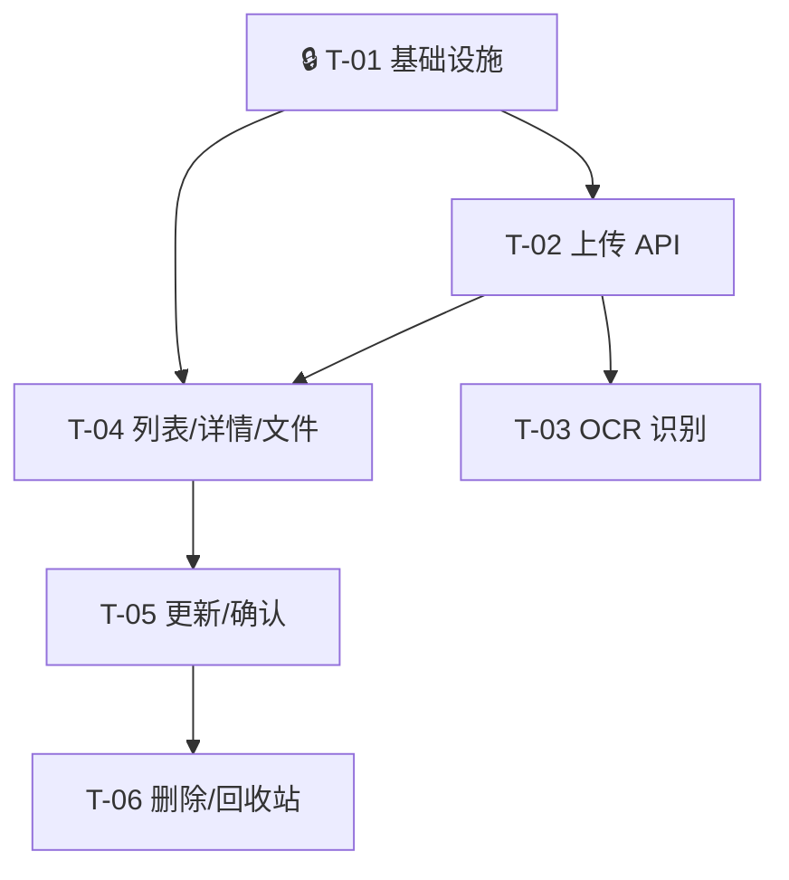

# 发票管理后端 — 任务规划

## 切片划分

按用户行为将 24 条 AC 分为 4 个垂直切片：

| 阶段 | 切片名称 | 用户行为 | 覆盖 AC | 任务数 |
|------|---------|---------|---------|--------|
| 0 | 基础设施 | 技术基础（无用户可见行为） | — | 1 |
| 1 | 上传发票 & OCR 识别 | 用户上传发票 → 系统自动保存 + 异步识别 | AC-001~004, 013~015, 018~019, 021 | 2 |
| 2 | 发票查看与确认 | 用户浏览列表、查看详情、编辑字段、确认入库 | AC-005~008, 012, 016~017, 022~024 | 2 |
| 3 | 删除与回收站 | 用户删除发票（分状态）、查看回收站、恢复发票 | AC-009~011, 020 | 1 |

## 依赖关系

🔒 = 关键路径节点，所有后续任务依赖它

---

## Stage 0: 基础设施

### T-01 🔒 测试基础设施搭建 + Invoice 模型扩展 + Config + Schema

**通俗解释**：为后端测试搭建环境（pytest + TestClient），同时扩展发票数据模型让它能存下所有 OCR 字段和软删除信息。

**依赖**：无

**技术方案章节**：§3（数据模型）、§6（Schema）、§7（Config）

**覆盖 AC**：AC-014（MAX_UPLOAD_SIZE=50），AC-021（file_original_name 字段），AC-022（status 默认值 processing）

**改动文件**：`models/invoice.py`、`schemas/invoice.py`、`config.py`、Alembic 迁移、`tests/conftest.py`（新建）

**任务内容**：

1. 安装后端测试依赖：`pip install pytest httpx`
2. 创建 `server/tests/conftest.py`：提供 `TestClient` + `get_db` override（用临时 SQLite）+ `auth_headers` fixture（自动创建测试用户并登录获取 token）
3. 修改 `Invoice` 模型：
   - 新增 13 个字段：`file_original_name`、`buyer_name`、`invoice_type`、`project_name`、`train_no`、`departure_station`、`arrival_station`、`departure_location`、`arrival_location`、`flight_no`、`departure_city`、`arrival_city`、`deleted_at`
   - `status` 默认值 `"pending"` → `"processing"`
4. 生成 Alembic 迁移脚本，执行迁移
5. 扩展 `InvoiceResponse` Schema（13 个新字段）
6. 扩展 `UpdateInvoiceRequest` Schema（全部可编辑字段）
7. 新增通用 Schema：`UploadFileResult`、`UploadResponse`、`InvoiceListResponse`、`DeleteResponse`
8. 配置变更：`MAX_UPLOAD_SIZE_MB` 10→50，新增 `OCR_MAX_WORKERS=2`、`OCR_TIMEOUT_SECONDS=120`

**验证标准**：

| # | 类型 | 测试验证 |
|---|------|---------|
| 1 | 环境 | `pytest server/tests/ --collect-only` 能发现测试文件 |
| 2 | 模型 | 创建 Invoice 实例 → status 默认为 `"processing"` |
| 3 | 模型 | 创建 Invoice 实例 → `file_original_name` 可读写 |
| 4 | 模型 | 创建 Invoice 实例 → `deleted_at` 默认为 None |
| 5 | 模型 | 创建 Invoice 实例 → 13 个新字段全部可写入 None |
| 6 | Schema | `InvoiceResponse.model_validate(invoice)` 包含所有新字段 |
| 7 | Config | `settings.max_upload_size_mb == 50` |
| 8 | 迁移 | 执行 Alembic upgrade → 新字段存在于 `invoices` 表 |
| 9 | API | `TestClient.get("/api/invoices/")` → 不再 500（旧 schema 不兼容已解决） |

---

## Stage 1: 上传发票 & OCR 识别

### T-02 文件上传 API + 批量校验 + 存储

**通俗解释**：用户选好发票文件点击上传后，系统会逐张检查格式和大小，合格的存到服务器并标记为"处理中"，不合格的明确告诉用户哪里不对。

**依赖**：T-01

**技术方案章节**：§4.1（POST /api/invoices/）、§5.1（上传流程）

**覆盖 AC**：AC-001（单张上传→processing），AC-002（批量上传+跳过失效文件+告知原因），AC-013（拒绝非 jpg/png/pdf），AC-014（拒绝>50MB），AC-015（超20张截断），AC-021（文件命名 uuid_原始名）

**改动文件**：`services/invoice_service.py`（新建）、`api/invoices.py`（重写 POST 端点）、`utils/file_utils.py`（修改命名逻辑）

**任务内容**：

1. 修改 `file_utils.generate_storage_path()` 支持原始文件名：`{user_dir}/{uuid}_{original_filename}`
2. 实现 `invoice_service.py` 中的 `upload_batch(db, user_id, files, upload_dir, max_size) → UploadResponse`
   - 逐文件校验：扩展名白名单、大小 ≤ 50MB
   - 截断到 20 个，记录 `skipped_count`
   - 校验通过：存文件 + INSERT Invoice（state=processing）
   - 返回每个文件的结果（success/fail + error 原因）
3. 实现 `POST /api/invoices/` 端点（multipart form data，`get_current_user` 认证）
4. 实现 `invoice_service.delete_invoice_file(file_path)` 工具函数

**验证标准**：

| # | 类型 | 测试验证 |
|---|------|---------|
| 1 | Happy | 上传 1 张合法 jpg → 200，results[0].success=true，invoice_id 非空，文件存在于磁盘 |
| 2 | Happy | 上传 3 张合法文件 → 200，3 个 success，3 条 Invoice 记录 state="processing" |
| 3 | Happy | 上传后检查文件命名 → 路径包含 `uuid_` 和原始文件名 |
| 4 | Error | 上传 .doc 文件 → 200，results 中该文件 success=false，error="不支持的文件格式" |
| 5 | Error | 上传 >50MB 文件 → 200，results 中该文件 success=false，error="文件大小超过 50MB 限制" |
| 6 | Error | 上传 25 张文件 → 200，skipped_count=5，只处理了 20 张 |
| 7 | Auth | 无 token 上传 → 401 |
| 8 | Mixed | 混合上传（2 合法 + 1 过大 + 1 doc）→ 2 success + 2 fail，每个 error 原因准确 |

---

### T-03 OCR 异步识别 + 字段提取 + ThreadPoolExecutor 集成

**通俗解释**：发票上传后系统自动在后台用 AI 识别发票内容（日期、金额、抬头等），识别完成的自动更新发票状态，失败的通知用户原因。

**依赖**：T-02

**技术方案章节**：§5.2（OCR 流程）、§5.3（字段提取）、§5.5（ThreadPoolExecutor）

**覆盖 AC**：AC-003（OCR 成功→pending+回填字段），AC-004（OCR 失败→failed+原因），AC-018（OCR 异常/超时→failed），AC-019（部分成功→pending，空字段留空）

**改动文件**：`services/ocr_service.py`（新建）、`services/invoice_service.py`（修改：上传后触发 OCR）、`main.py`（初始化/关闭 Executor）

**任务内容**：

1. 实现 `ocr_service.py`：
   - `OcrTaskManager` 类：封装 `ThreadPoolExecutor(max_workers=2)`，支持 `submit_task(invoice_id, file_path, db_session_factory)` 
   - `_run_ocr(invoice_id, file_path, session_factory)`：
     - PIL 加载图片（PDF 先用 pdf2image 转图片）
     - 调用 `PaddleOCR.ocr()` 获取原始文本
     - 超时控制（120 秒）→ 超时标记 `state=failed, ocr_fail_reason="识别超时"`
     - 异常捕获 → 标记 `state=failed, ocr_fail_reason=str(e)`
   - `_extract_fields(ocr_text: str) → dict`：正则提取金额（¥后数字）、日期（yyyy-mm-dd 格式）、发票号码（8-12 位数字串）、销售方名称（名称冒号后的文字）
   - `_update_invoice_result(invoice_id, fields, session_factory)`：
     - 有字段提取 → `state=pending`，回填提取到的字段，`ocr_raw_data` 存全文
     - 无字段提取 → `state=failed`，reason="图片质量过低，无法识别"
2. 修改 `invoice_service.upload_batch()`：创建 invoice 后调用 `task_manager.submit_task(invoice_id, file_path, ...)`
3. 修改 `main.py`：在 `lifespan` 中创建 `OcrTaskManager`，`shutdown` 中等待任务完成

**验证标准**（OCR 测试用 mock，不真的跑 PaddleOCR）：

| # | 类型 | 测试验证 |
|---|------|---------|
| 1 | Happy | mock PaddleOCR 返回带金额和日期的文本 → invoice state=pending，amount 被回填，ocr_raw_data 保留 |
| 2 | Happy | mock PaddleOCR 返回无结构化信息文本 → state=failed，reason 包含"图片质量过低" |
| 3 | Error | mock PaddleOCR 抛出异常 → state=failed，reason 包含异常信息 |
| 4 | Error | OCR 任务超时（sleep > timeout）→ state=failed，reason 包含"超时" |
| 5 | Integ | 上传合法文件后 → invoice state 先为 processing，OCR mock 完成后变为 pending |
| 6 | Integ | 上传后 OCR mock 异常 → 不影响上传请求返回 200，后台标记 failed |

---

## Stage 2: 发票查看与确认

### T-04 发票列表 + 详情 + 文件访问

**通俗解释**：用户打开发票列表页可以按状态筛选、分页查看所有发票，点进去看完整详情（含原始图片/PDF预览），按发票日期排序最新在前。

**依赖**：T-01, T-02

**技术方案章节**：§4.2（GET /api/invoices/）、§4.3（GET /api/invoices/{id}）、§4.9（GET /api/invoices/{id}/file）

**覆盖 AC**：AC-005（详情含原始图片），AC-007（列表默认排序+分页），AC-008（按状态筛选），AC-023（分页参数 20/50/100/200），AC-024（数据隔离 user_id）

**改动文件**：`services/invoice_service.py`（新增 list/detail 方法）、`api/invoices.py`（重写 GET list + GET detail + GET file 端点）

**任务内容**：

1. 实现 `invoice_service.list_invoices(db, user_id, state, page, page_size) → InvoiceListResponse`
   - 排序：`invoice_date DESC NULLS LAST`
   - 状态筛选（可选）：`WHERE status = :state`
   - 排除软删除：`WHERE deleted_at IS NULL`
   - 分页：offset/limit，返回 total + total_pages
2. 实现 `invoice_service.get_invoice(db, user_id, invoice_id) → Invoice`
   - 查询条件：`WHERE id=:id AND user_id=:user_id AND deleted_at IS NULL`
   - 不存在或不属于 → 404
3. 实现 `GET /api/invoices/`（query params: state, page, page_size）→ 验证 page_size ∈ {20,50,100,200}
4. 实现 `GET /api/invoices/{id}` → 返回完整 InvoiceResponse
5. 实现 `GET /api/invoices/{id}/file` → `FileResponse(file_path, media_type=...)`，用户权限校验

**验证标准**：

| # | 类型 | 测试验证 |
|---|------|---------|
| 1 | Happy | 用户 A 上传 3 张发票 → GET /invoices/ → items 长度 3，total=3 |
| 2 | Happy | 创建多张不同日期的发票 → 列表按 invoice_date DESC 排序 |
| 3 | Happy | 列表 page=1,page_size=20 → 返回 items + total + total_pages 正确 |
| 4 | Happy | GET /invoices/{id} → 200，返回完整字段含 file_original_name |
| 5 | Happy | GET /invoices/{id}/file → 200，Content-Type 正确（image/jpeg） |
| 6 | Filter | ?state=processing → 只返回 processing 的发票 |
| 7 | Pagination | ?page_size=100 → 每页 100 条；?page_size=200 → 每页 200 条 |
| 8 | Pagination | ?page_size=15 → 422（非法参数） |
| 9 | Auth | 用户 A 查用户 B 的发票详情 → 404 |
| 10 | Auth | 用户 A 查用户 B 的发票文件 → 404 |
| 11 | Auth | 无 token 查列表 → 401 |
| 12 | Data Isolation | 列表只返回当前用户的发票（不返回其他用户的） |

---

### T-05 发票更新 + 确认入库 + 状态校验

**通俗解释**：用户可以编辑发票的字段（修正 OCR 识别不准的内容），补全日期和金额后确认入库，发票进入"已入库"状态等待报销使用。

**依赖**：T-04

**技术方案章节**：§4.4（PUT /api/invoices/{id}）、§4.5（POST /api/invoices/{id}/confirm）、§5.4（确认入库校验流程）

**覆盖 AC**：AC-006（确认入库→confirmed），AC-012（更新 pending/failed 发票），AC-016（确认时日期为空→拒绝），AC-017（确认时金额≤0→拒绝），AC-022（状态流转合规）

**改动文件**：`services/invoice_service.py`（新增 update/confirm 方法）、`api/invoices.py`（重写 PUT + POST confirm 端点）

**任务内容**：

1. 实现 `invoice_service.update_invoice(db, user_id, invoice_id, data: UpdateInvoiceRequest) → Invoice`
   - 权限校验：`user_id` 必须匹配
   - 状态校验：仅 `pending` 和 `failed` 可更新。`processing` → 400 "OCR 进行中"，`confirmed` → 400 "已入库不可编辑"
   - 部分更新：只更新 data 中非 None 的字段
2. 实现 `invoice_service.confirm_invoice(db, user_id, invoice_id) → Invoice`
   - 状态校验：仅 `pending` 和 `failed` 可确认
   - 日期校验：`invoice_date is None` → 422 "请填写发票日期"
   - 金额校验：`amount is None or amount <= 0` → 422 "金额必须大于 0"
   - 通过 → `state = "confirmed"`, `updated_at = now()`
3. 实现 `PUT /api/invoices/{id}` + `POST /api/invoices/{id}/confirm` 端点

**验证标准**：

| # | 类型 | 测试验证 |
|---|------|---------|
| 1 | Happy | 更新 pending 发票的 amount=100 → 200，返回更新后的 amount=100 |
| 2 | Happy | 更新 failed 发票的 vendor → 200，返回更新后的 vendor |
| 3 | Happy | 确认 pending 发票（date 有值，amount>0）→ 200，state=confirmed |
| 4 | Happy | 确认后 `updated_at` 被更新为当前时间 |
| 5 | Error | 确认时 invoice_date=None → 422，"请填写发票日期" |
| 6 | Error | 确认时 amount=None → 422，"金额必须大于 0" |
| 7 | Error | 确认时 amount=0 → 422，"金额必须大于 0" |
| 8 | Error | 更新 processing 状态的发票 → 400，"OCR 进行中" |
| 9 | Error | 更新 confirmed 状态的发票 → 400，"已入库不可编辑" |
| 10 | Error | 确认 processing 状态的发票 → 400 |
| 11 | Error | 已确认发票重复确认 → 400 |
| 12 | Auth | 无 token 更新 → 401 |
| 13 | Auth | 用户 A 更新用户 B 的发票 → 404 |

---

## Stage 3: 删除与回收站

### T-06 删除（分状态）+ 回收站 + 恢复 + 惰性清理

**通俗解释**：用户删除发票时，未确认的直接删掉，已确认的移到回收站（30 天内可恢复）。上传新发票时系统自动清理超 30 天的已删除记录。

**依赖**：T-05

**技术方案章节**：§4.6（DELETE）、§4.7（GET /trash）、§4.8（POST /restore）、§5.6（30天清理）

**覆盖 AC**：AC-009（处理中/待确认/失败→物理删除），AC-010（已确认→软删除），AC-011（回收站恢复），AC-020（30天自动清理）

**改动文件**：`services/invoice_service.py`（新增 delete/restore/cleanup 方法）、`api/invoices.py`（DELETE + GET /trash + POST /{id}/restore + 清理逻辑）

**任务内容**：

1. 实现 `invoice_service.hard_delete(db, invoice, upload_dir)`：
   - `os.remove(invoice.file_path)` + `db.delete(invoice)`
2. 实现 `invoice_service.soft_delete(db, invoice)`：
   - `invoice.deleted_at = datetime.now()`
3. 实现 `invoice_service.restore_invoice(db, user_id, invoice_id)` → Invoice：
   - 查 `WHERE id=:id AND user_id=:user_id AND deleted_at IS NOT NULL`
   - 30 天校验：`deleted_at > now() - 30 days` → 否则 400 "已超过 30 天恢复期限"
   - `deleted_at = None`, `state = "confirmed"`, `updated_at = now()`
4. 实现 `invoice_service.cleanup_expired(db, upload_dir)`：
   - 查 `WHERE deleted_at IS NOT NULL AND deleted_at <= now() - 30 days`
   - 逐条物理删除（文件+记录）
5. 实现 `DELETE /api/invoices/{id}` + `GET /api/invoices/trash` + `POST /api/invoices/{id}/restore`
6. 在 `upload_batch` 成功后调用 `cleanup_expired()`

**验证标准**：

| # | 类型 | 测试验证 |
|---|------|---------|
| 1 | Happy | 删除 processing 发票 → 200，"type":"hard"，文件不存在，DB 无记录 |
| 2 | Happy | 删除 pending 发票 → 200，"type":"hard"，文件+记录都清除 |
| 3 | Happy | 删除 confirmed 发票 → 200，"type":"soft"，deleted_at 被设置，文件仍存在 |
| 4 | Trash | 软删除后 GET /trash → 200，items 含该发票 |
| 5 | Trash | GET /trash → 不包含未删除的发票 |
| 6 | Restore | 恢复软删除的发票 → 200，deleted_at=null，state=confirmed |
| 7 | Restore | 恢复后 GET /trash → 该发票不再出现 |
| 8 | Restore | 恢复用户 B 的发票 → 404 |
| 9 | Cleanup | 手动设置 deleted_at=31天前 → upload_batch 后过期记录被清理 |
| 10 | Cleanup | 清理时文件也被删除 |
| 11 | Error | 恢复超过 30 天的 → 400，"已超过 30 天恢复期限" |
| 12 | Error | 恢复未删除的发票 → 404 |
| 13 | Auth | 无 token 删除 → 401 |

---

## AC 覆盖总表

| AC | 验收标准 | 覆盖任务 | 状态 |
|----|---------|---------|------|
| AC-001 | 上传单张发票→processing | T-02 | ✅ |
| AC-002 | 批量上传+跳过失效+告知原因 | T-02 | ✅ |
| AC-003 | OCR 成功→pending+字段回填 | T-03 | ✅ |
| AC-004 | OCR 失败→failed+原因 | T-03 | ✅ |
| AC-005 | 查看发票详情+原始文件 | T-04 | ✅ |
| AC-006 | 确认入库→confirmed | T-05 | ✅ |
| AC-007 | 列表排序+分页 | T-04 | ✅ |
| AC-008 | 按状态筛选 | T-04 | ✅ |
| AC-009 | 删除 processing/pending/failed→物理 | T-06 | ✅ |
| AC-010 | 删除 confirmed→软删除 | T-06 | ✅ |
| AC-011 | 回收站+恢复 | T-06 | ✅ |
| AC-012 | 更新字段 | T-05 | ✅ |
| AC-013 | 拒绝非 jpg/png/pdf | T-02 | ✅ |
| AC-014 | 拒绝>50MB | T-01, T-02 | ✅ |
| AC-015 | 超 20 张截断 | T-02 | ✅ |
| AC-016 | 确认时日期为空→拒绝 | T-05 | ✅ |
| AC-017 | 确认时金额≤0→拒绝 | T-05 | ✅ |
| AC-018 | OCR 异常→failed | T-03 | ✅ |
| AC-019 | OCR 部分成功→pending | T-03 | ✅ |
| AC-020 | 30天自动清理 | T-06 | ✅ |
| AC-021 | 文件命名规则 | T-01, T-02 | ✅ |
| AC-022 | 状态流转合规 | T-01, T-05 | ✅ |
| AC-023 | 分页参数 | T-04 | ✅ |
| AC-024 | 数据隔离 | T-04 | ✅ |

---

## 测试统计

| 阶段 | 任务 | 测试用例数 |
|------|------|-----------|
| 0 | T-01 | 15 |
| 1 | T-02 | 9 |
| 1 | T-03 | 6 |
| 2 | T-04 | 12 |
| 2 | T-05 | 13 |
| 3 | T-06 | 13 |
| **合计** | **6 任务** | **68** |

---

## 验证计划

各阶段完成后验证清单：

### Stage 0 完成

- [x] `pytest server/tests/` 能成功运行（含 conftest fixtures）
- [x] 新 Invoice 模型字段可通过 Alembic 迁移生效
- [x] `GET /api/invoices/` 返回 200（不再是 500）

### Stage 1 完成（T-02 + T-03）

- [x] 上传 jpg/png/pdf → 文件存盘、记录创建、state=processing
- [x] 上传非法文件 → 返回明确的 reject 原因
- [x] OCR mock → state 正确流转到 pending 或 failed
- [x] 上传后 OCR 异常不影响 API 返回

### Stage 2 完成（T-04 + T-05）

- [x] 列表排序正确（日期倒序）
- [x] 筛选正常（按状态）
- [x] 分页正确（20/50/100/200）
- [x] 详情可查，文件可下载
- [x] 更新 pending/failed → 成功
- [x] 确认入库校验正确（日期+金额）
- [x] 状态防护（processing 不可编辑/确认）

### Stage 3 完成（T-06）

- [x] 分状态删除正确（硬删除 vs 软删除）
- [x] 回收站可查、可恢复
- [x] 超 30 天无法恢复
- [x] 惰性清理生效

---

## 文档记录

| 文档 | 位置 |
|------|------|
| 需求文档 | `specs/features/发票管理后端.md` |
| 技术方案 | `specs/features/发票管理后端_技术方案.md` |
| 任务规划 | `specs/features/发票管理后端_任务规划.md` |