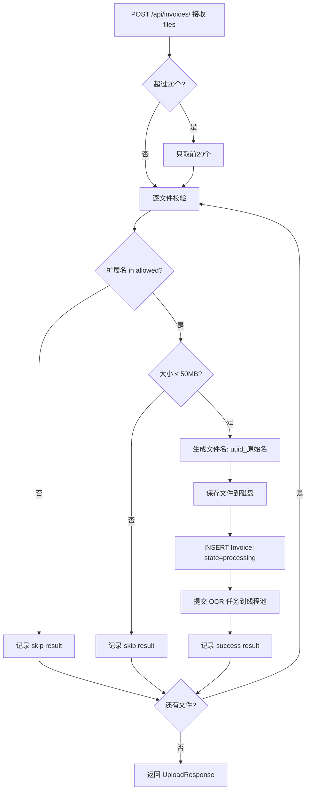
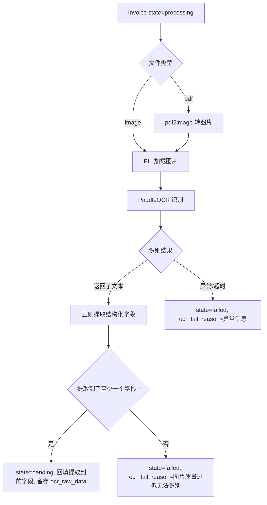

# 发票管理后端 — 技术设计文档

## 1. 设计概要

**功能描述**：实现发票上传、异步 OCR 识别、发票列表/详情/更新、确认入库、删除（含软删除与回收站恢复）的完整后端 API。

**影响范围**：
- 数据层：`Invoice` 模型扩展 + 新增 12 个字段 + Alembic 迁移
- API 层：`invoices.py` 路由完整实现（9 个端点）
- Service 层：`invoice_service.py` + `ocr_service.py` 全部实现
- Schema 层：扩展 `UpdateInvoiceRequest`，新增 `UploadResponse`、`ConfirmResponse`
- 配置层：`max_upload_size_mb` 10 → 50
- 工具层：`file_utils.py` 重命名逻辑调整

**技术难点**：
1. 异步 OCR 的 ThreadPoolExecutor 管理（超时、失败处理）
2. PDF 文件的 OCR（需要先转图片）
3. 批量上传的逐一校验 + 部分成功返回

**外部依赖**：PaddleOCR（已有 `requirements.txt`）、pdf2image（新增，PDF 转图片用于 OCR）。

---

## 2. 架构概览

```
┌─────────────────────────────────────────────────────────────┐
│  API 层 (invoices.py)                                        │
│  POST /upload → GET /list → GET /detail → PUT /update       │
│  → POST /confirm → DELETE → GET /trash → POST /restore      │
│  → GET /file                                                  │
├─────────────────────────────────────────────────────────────┤
│  Service 层                                                   │
│  invoice_service.py         ocr_service.py                    │
│  ├─ upload_batch()          ├─ recognize_invoice()            │
│  ├─ list_invoices()         ├─ extract_fields() (regex)       │
│  ├─ update_invoice()        └─ ThreadPoolExecutor             │
│  ├─ confirm_invoice()                                         │
│  ├─ soft_delete()                                             │
│  └─ hard_delete()                                             │
├─────────────────────────────────────────────────────────────┤
│  数据层 (models + database)                                   │
│  Invoice 模型扩展 (12 新字段 + deleted_at)                     │
│  Alembic 迁移脚本                                              │
└─────────────────────────────────────────────────────────────┘
```

---

## 3. 数据库设计

### 3.1 Invoice 模型变更

**新增 13 个字段 + Status 默认值变更**：

| 字段 | 类型 | 可空 | 默认值 | 索引 | 说明 | 对应 AC |
|------|------|------|--------|------|------|---------|
| `file_original_name` | String(500) | Y | — | — | 原始文件名（展示用） | AC-001, AC-021 |
| `buyer_name` | String(200) | Y | — | — | 购买方名称 | AC-005 |
| `invoice_type` | String(50) | Y | — | — | 发票类型（增值税/高铁/滴滴/飞机等） | AC-005 |
| `project_name` | String(200) | Y | — | — | 项目名称（电子发票） | AC-005 |
| `train_no` | String(20) | Y | — | — | 车次（高铁） | AC-005 |
| `departure_station` | String(100) | Y | — | — | 出发站（高铁） | AC-005 |
| `arrival_station` | String(100) | Y | — | — | 到达站（高铁） | AC-005 |
| `departure_location` | String(200) | Y | — | — | 出发地（滴滴） | AC-005 |
| `arrival_location` | String(200) | Y | — | — | 到达地（滴滴） | AC-005 |
| `flight_no` | String(20) | Y | — | — | 航班号（飞机） | AC-005 |
| `departure_city` | String(100) | Y | — | — | 出发城市（飞机） | AC-005 |
| `arrival_city` | String(100) | Y | — | — | 到达城市（飞机） | AC-005 |
| `deleted_at` | DateTime | Y | — | — | 软删除时间（非空 = 已删除） | AC-010, AC-011, AC-020 |

**Status 变更**：

| 变更项 | 旧值 | 新值 |
|--------|------|------|
| 默认值 | `"pending"` | `"processing"` |
| 可选值 | 无约束 | processing / pending / failed / confirmed |

→ AC-022

### 3.2 Alembic 迁移脚本

生成一条迁移，包含：
1. `ALTER TABLE invoices ADD COLUMN` × 13 个新字段（全部 nullable，向后兼容）
2. `file_path` 的 nullable 保持 False（已有约束不调整）
3. 不修改存量数据（当前无生产数据）

**文件**：`server/alembic/versions/{timestamp}_add_invoice_fields.py`

---

## 4. API 设计

### 4.0 通用约定

所有发票接口（除 `GET /file` 外）需 `get_current_user` 认证，返回的 User ORM 对象中取 `current_user.id` 进行数据隔离。 → AC-024

### 4.1 `POST /api/invoices/` — 上传发票 → AC-001, AC-002, AC-021

**Content-Type**: `multipart/form-data`

**输入**：
```
files: File[] (最多 20 个)
```

**校验逻辑**（逐文件执行）：

```
for each file:
  ├─ 检查扩展名 → 非 jpg/jpeg/png/pdf → 跳过，返回 {filename, success:false, error:"不支持的文件格式"}
  ├─ 检查文件大小 → > 50MB → 跳过，返回 {filename, success:false, error:"文件大小超过 50MB 限制"}
  └─ 校验通过:
       ├─ 存文件: {upload_dir}/{user_id}/{uuid}_{原始文件名}
       ├─ 创建 Invoice 记录: state="processing", file_original_name=原始文件名
       └─ 提交 OCR 任务到 ThreadPoolExecutor
```

超过 20 个文件 → 只处理前 20 个，`skipped_count` 记录超出数量。 → AC-015

**响应 - 200**：
```json
{
  "results": [
    { "filename": "滴滴电子发票.jpg", "success": true, "invoice_id": 1 },
    { "filename": "报告.doc", "success": false, "error": "不支持的文件格式" },
    { "filename": "超大扫描.pdf", "success": false, "error": "文件大小超过 50MB 限制" }
  ],
  "skipped_count": 5
}
```

### 4.2 `GET /api/invoices/` — 发票列表 → AC-007, AC-008, AC-023

**Query 参数**：

| 参数 | 类型 | 默认值 | 说明 |
|------|------|--------|------|
| `state` | string | — | 按状态筛选，不传=全部（排除软删除） |
| `page` | int | 1 | 页码 |
| `page_size` | int | 20 | 每页条数，合法值：20/50/100/200 |

**排序**：`invoice_date DESC`（日期为 null 的排最后）

**响应 - 200**：
```json
{
  "items": [ { ...InvoiceResponse } ],
  "total": 100,
  "page": 1,
  "page_size": 20,
  "total_pages": 5
}
```

### 4.3 `GET /api/invoices/{invoice_id}` — 发票详情 → AC-005

**权限**：当前用户必须是该发票的 `user_id`。

**响应 - 200**：返回完整 `InvoiceResponse`（含所有 25 个字段）。

**异常**：
- 404：发票不存在或不属于当前用户
- 410 Gone：发票已被软删除（`deleted_at` not null）— 提示去回收站查看

### 4.4 `PUT /api/invoices/{invoice_id}` — 更新发票 → AC-012

**权限**：当前用户必须是该发票的 `user_id`。

**状态限制**：仅 `pending` 或 `failed` 状态可更新。`processing`（OCR 进行中）和 `confirmed` 不允许直接编辑。

**输入 Schema** (`UpdateInvoiceRequest` 扩展)：

```python
class UpdateInvoiceRequest(BaseModel):
    invoice_no: str | None = Field(default=None, max_length=50)
    amount: float | None = None
    invoice_date: date | None = None
    category: str | None = Field(default=None, max_length=50)
    vendor: str | None = Field(default=None, max_length=200)
    buyer_name: str | None = Field(default=None, max_length=200)
    invoice_type: str | None = Field(default=None, max_length=50)
    project_name: str | None = Field(default=None, max_length=200)
    train_no: str | None = Field(default=None, max_length=20)
    departure_station: str | None = Field(default=None, max_length=100)
    arrival_station: str | None = Field(default=None, max_length=100)
    departure_location: str | None = Field(default=None, max_length=200)
    arrival_location: str | None = Field(default=None, max_length=200)
    flight_no: str | None = Field(default=None, max_length=20)
    departure_city: str | None = Field(default=None, max_length=100)
    arrival_city: str | None = Field(default=None, max_length=100)
    remark: str | None = Field(default=None, max_length=500)
```

**响应 - 200**：返回更新后的 `InvoiceResponse`。

### 4.5 `POST /api/invoices/{invoice_id}/confirm` — 确认入库 → AC-006, AC-016, AC-017

**权限**：当前用户必须是该发票的 `user_id`。

**状态限制**：仅 `pending` 或 `failed` 状态可确认。

**校验规则**：
- `invoice_date` 必须不为空 → 否则 422 `{"detail": "请填写发票日期"}` → AC-016
- `amount` 必须 > 0 → 否则 422 `{"detail": "金额必须大于 0"}` → AC-017

**处理**：校验通过 → `state = "confirmed"` → 更新 `updated_at`。

**响应 - 200**：返回更新后的 `InvoiceResponse`。

### 4.6 `DELETE /api/invoices/{invoice_id}` — 删除发票 → AC-009, AC-010

**权限**：当前用户必须是该发票的 `user_id`。

**分状态处理**：

```
if state in (processing, pending, failed):
   → 物理删除文件 + 数据库记录     → AC-009
elif state == confirmed:
   → deleted_at = datetime.now()   → AC-010
     文件保留，记录保留
```

**响应 - 200**：
```json
{ "deleted": true, "type": "hard" }
```
或
```json
{ "deleted": true, "type": "soft", "restorable_until": "2026-06-15" }
```

### 4.7 `GET /api/invoices/trash` — 回收站列表 → AC-011

**Query 参数**：`page`, `page_size`（同发票列表）

**返回**：`deleted_at IS NOT NULL AND deleted_at > now() - 30 days` 的发票。

**排序**：`deleted_at DESC`（最近删除的在前）。

**响应 - 200**：同列表分页格式，但 items 中额外包含 `deleted_at` 和 `days_left`（剩余天数）。

### 4.8 `POST /api/invoices/{invoice_id}/restore` — 恢复发票 → AC-011

**权限**：当前用户必须是该发票的 `user_id`。

**限制**：
- `deleted_at` 必须不为空
- `deleted_at` 必须在 30 天内

**处理**：`deleted_at = null`，`state = "confirmed"`，`updated_at = now()`。

**异常**：
- 404：未找到或未删除
- 400：超过 30 天恢复期 `{"detail": "已超过 30 天恢复期限，无法恢复"}`

### 4.9 `GET /api/invoices/{invoice_id}/file` — 获取发票文件 → AC-005

**权限**：当前用户必须是该发票的 `user_id`。

**处理**：读取 `file_path` → `FileResponse(file_path)`。

**Content-Type**：根据扩展名自动设置（jpg → image/jpeg，pdf → application/pdf 等）。

---

## 5. 核心逻辑

### 5.1 上传流程



→ AC-001, AC-002, AC-013, AC-014, AC-015, AC-021

### 5.2 OCR 异步识别流程



**ThreadPoolExecutor 配置**：
- 最大线程数：2（避免 PaddleOCR 抢占过多资源）
- 单任务超时：120 秒
- 超时或异常 → 自动标记 `state=failed` 并记录原因 → AC-018

→ AC-003, AC-004, AC-018, AC-019

### 5.3 OCR 字段提取（正则规则）

从 PaddleOCR 返回的全文文本中，按优先级尝试提取：

| 目标字段 | 提取策略 | 示例 |
|---------|---------|------|
| 金额 | 匹配 ¥/￥/元 前的数字，取最大值（价税合计） | `¥ 156.80` |
| 日期 | 匹配 `\d{4}[-/年]\d{1,2}[-/月]\d{1,2}[日]?` | `2025-06-15` |
| 发票号码 | 匹配 8-12 位连续数字串（常标注"发票号码"） | `No: 251234567890` |
| 销售方名称 | 匹配"名称: xxx" 或 "销售方: xxx" | — |
| 发票类型 | 关键词匹配（增值税/电子/出租/高铁/机票） | — |

→ AC-003, AC-019

**注意**：规则提取不强制，提取不到的不报错，字段留空 → 用户手动补全。

### 5.4 确认入库校验

```mermaid
flowchart TD
    A[POST /invoices/{id}/confirm] --> B{发票状态合法?}
    B -->|processing| B1[403: OCR进行中不可确认]
    B -->|confirmed| B2[400: 已确认,无需重复]
    B -->|pending/failed| C
    C --> D{invoice_date 不为空?}
    D -->|否| D1[422: 请填写发票日期]
    D -->|是| E{amount > 0?}
    E -->|否| E1[422: 金额必须大于0]
    E -->|是| F[state=confirmed, 保存]
```

→ AC-006, AC-016, AC-017

### 5.5 删除策略

```mermaid
flowchart TD
    A[DELETE /invoices/{id}] --> B{发票状态}
    B -->|processing/pending/failed| C[物理删除]
    B -->|confirmed| D[软删除]
    
    C --> C1[os.remove 文件]
    C1 --> C2[db.delete 记录]
    C2 --> C3[返回: hard]
    
    D --> D1[deleted_at=now]
    D1 --> D2[返回: soft + 恢复期限]
```

→ AC-009, AC-010

### 5.6 30 天自动清理 → AC-020

**方案**：不在本 Phase 引入定时任务，改为"惰性清理"策略：

1. **回收站查询时**（`GET /api/invoices/trash`）：只返回 `deleted_at > now() - 30 days` 的记录。超过 30 天的**不在回收站展示**。
2. **上传时顺便清理**：每次上传操作后，顺手执行一次过期清理（删除 `deleted_at ≤ now() - 30 days` 的记录+文件）。低成本，不引入额外基础设施。

### 5.7 文件命名规则

**变更**：现有 `file_utils.generate_storage_path()` 使用 `{user_id}/{uuid}.{ext}` 格式。需要改为 `{user_id}/{uuid}_{原始文件名}`。

修改 `generate_storage_path` 函数，新增 `original_filename` 参数：

```python
def generate_storage_path(upload_dir: Path, user_id: int, original_filename: str) -> str:
    ext = original_filename.rsplit(".", 1)[-1].lower()
    unique_name = f"{uuid.uuid4().hex}_{original_filename}"
    user_dir = upload_dir / str(user_id)
    user_dir.mkdir(parents=True, exist_ok=True)
    return str(user_dir / unique_name)
```

→ AC-021

---

## 6. Pydantic Schema 变更

### 6.1 `InvoiceResponse` 扩展

在原 `InvoiceResponse` 基础上新增 13 个字段 + `file_original_name`：

```python
class InvoiceResponse(BaseModel):
    id: int
    user_id: int
    invoice_no: str | None
    amount: float | None
    invoice_date: date | None
    category: str | None
    vendor: str | None
    buyer_name: str | None
    invoice_type: str | None
    project_name: str | None
    train_no: str | None
    departure_station: str | None
    arrival_station: str | None
    departure_location: str | None
    arrival_location: str | None
    flight_no: str | None
    departure_city: str | None
    arrival_city: str | None
    file_path: str
    file_original_name: str | None
    status: str
    remark: str | None
    ocr_raw_data: dict | None
    created_at: datetime
    updated_at: datetime
    model_config = {"from_attributes": True}
```

### 6.2 新增 Schema

```python
class UploadFileResult(BaseModel):
    filename: str
    success: bool
    invoice_id: int | None = None
    error: str | None = None

class UploadResponse(BaseModel):
    results: list[UploadFileResult]
    skipped_count: int = 0

class InvoiceListResponse(BaseModel):
    items: list[InvoiceResponse]
    total: int
    page: int
    page_size: int
    total_pages: int

class DeleteResponse(BaseModel):
    deleted: bool
    type: str  # "hard" | "soft"
    restorable_until: datetime | None = None  # 仅 soft

class ConfirmResponse(BaseModel):
    success: bool
    invoice: InvoiceResponse
```

### 6.3 `UpdateInvoiceRequest` 扩展

见 4.4 节。

---

## 7. Config 变更

```python
# 变更项
max_upload_size_mb: int = int(os.getenv("MAX_UPLOAD_SIZE_MB", "50"))  # 原 10 → 50

# 新增项
ocr_max_workers: int = int(os.getenv("OCR_MAX_WORKERS", "2"))         # OCR 线程池大小
ocr_timeout_seconds: int = int(os.getenv("OCR_TIMEOUT_SECONDS", "120")) # OCR 单任务超时
```

→ AC-014

---

## 8. 文件变更清单

| 文件 | 操作 | 改动概述 | 对应 AC |
|------|------|---------|---------|
| `server/app/models/invoice.py` | 修改 | 新增 13 个字段 + status 默认值 processing | AC-010, AC-022 |
| `server/app/schemas/invoice.py` | 修改 | 扩展 InvoiceResponse + 新增 5 个 Schema | AC-001, AC-002, AC-005, AC-006, AC-007 |
| `server/app/api/invoices.py` | 重写 | 9 个端点完整实现（原 stub → 完整实现） | AC-001～AC-020 |
| `server/app/services/invoice_service.py` | 新建 | 完整业务逻辑层 | AC-001～AC-020 |
| `server/app/services/ocr_service.py` | 新建 | PaddleOCR + 正则提取 + ThreadPoolExecutor | AC-003, AC-004, AC-018, AC-019 |
| `server/app/config.py` | 修改 | max_upload_size_mb 10→50，新增 OCR 配置 | AC-014, AC-018 |
| `server/app/utils/file_utils.py` | 修改 | generate_storage_path 支持原始文件名 | AC-021 |
| `server/alembic/versions/{ts}_add_invoice_fields.py` | 新建 | Alembic 迁移脚本 | — |
| `server/main.py` | 修改 | 启动时初始化 ThreadPoolExecutor、注册 shutdown 钩子 | AC-018 |
| `server/requirements.txt` | 修改 | 新增 pdf2image（PDF OCR 依赖） | AC-003 |

---

## 9. 技术决策

### 决策 1：异步 OCR 实现 — ThreadPoolExecutor vs BackgroundTasks vs Celery

| 方案 | 优点 | 缺点 |
|------|------|------|
| A: BackgroundTasks | FastAPI 内置，零配置 | 进程重启丢任务，无超时控制，无并发控制 |
| B: ThreadPoolExecutor | 超时控制、并发控制、失败可捕获 | 需自行管理生命周期 |
| C: Celery + Redis | 持久化、重试、监控 | 需额外部署 Redis，过度设计 |

**结论**：选 **B**。使用 `concurrent.futures.ThreadPoolExecutor`，2 个工作线程，120 秒超时。在 `main.py` 的 `lifespan` 中初始化，在 `shutdown` 中等待所有任务完成后关闭。处理量不大（个人使用），不需要 Celery 的重量级基础设施。

### 决策 2：OCR 字段提取 — 纯正则 vs LLM 辅助

| 方案 | 准确率 | 复杂度 | 依赖性 |
|------|--------|--------|--------|
| A: 纯正则 | 中等（50-70%） | 低 | 零外部依赖 |
| B: LLM 提取 | 高（80-95%） | 高 | 需本地部署 LLM 服务 |

**结论**：选 **A（正则 + OCR 全文保留）**。理由：正则能覆盖金额、日期等核心字段；即使提取不全，OCR 全文都在 `ocr_raw_data` 中，用户手动补也不会丢信息。后续可迭代到 B。

### 决策 3：30 天自动清理 — 定时任务 vs 惰性清理

| 方案 | 实时性 | 复杂度 |
|------|--------|--------|
| A: APScheduler 定时任务 | 精确到小时 | 需配置 scheduler |
| B: 惰性清理（查询时过滤 + 上传时清理） | 随操作触发 | 零额外依赖 |

**结论**：选 **B（惰性清理）**。每次上传操作时顺手清理过期软删除记录。回收站查询时只返回 30 天内的。简单且足够。

---

## 10. 安全与性能

**数据隔离**：所有发票查询/更新的 `WHERE` 条件均包含 `user_id = current_user.id`，用户只能操作自己的发票。 → AC-024

**文件安全**：
- 上传时校验扩展名白名单（jpg/jpeg/png/pdf）
- 文件存储路径与公开 URL 隔离，通过 API `GET /api/invoices/{id}/file` 鉴权访问

**上传安全**：
- 单文件 50MB 上限 → AC-014
- 单次 20 个上限 → AC-015
- 文件以 uuid 命名，防止路径穿越攻击

**OCR 资源控制**：
- 线程池最大 2 线程，避免 PaddleOCR 耗尽 CPU
- 单任务 120 秒超时，避免僵尸任务 → AC-018

---

## 11. AC 覆盖总表

| AC 编号 | 验收标准概述 | 实现位置 |
|---------|-------------|---------|
| AC-001 | 上传单张发票 → processing | `invoices.py` + `invoice_service.upload_batch()` |
| AC-002 | 批量上传，无效文件单独跳过+告知 | `invoice_service.upload_batch()` 校验循环 |
| AC-003 | OCR 成功 → pending + 字段回填 | `ocr_service.recognize_invoice()` |
| AC-004 | OCR 完全失败 → failed + 原因 | `ocr_service` 异常捕获 → `_mark_failed()` |
| AC-005 | 查看发票详情 | `invoices.py` GET /{id} + GET /{id}/file |
| AC-006 | 确认入库校验通过 → confirmed | `invoices.py` POST /{id}/confirm + service 校验 |
| AC-007 | 发票列表默认排序分页 | `invoices.py` GET /?page&page_size |
| AC-008 | 按状态筛选 | `invoices.py` GET /?state= |
| AC-009 | 删除 processing/pending/failed → 物理 | `invoice_service.hard_delete()` |
| AC-010 | 删除 confirmed → 软删除 | `invoice_service.soft_delete()` |
| AC-011 | 回收站恢复 | `invoices.py` GET /trash + POST /{id}/restore |
| AC-012 | 更新 pending/failed 发票字段 | `invoices.py` PUT /{id} |
| AC-013 | 拒绝非 jpg/png/pdf | `invoice_service._validate_file()` |
| AC-014 | 拒绝 >50MB | `invoice_service._validate_file()` |
| AC-015 | 超 20 张只处理前 20 | `invoice_service.upload_batch()` 截断逻辑 |
| AC-016 | 确认入库—日期为空拒绝 | `invoice_service.confirm_invoice()` 校验 |
| AC-017 | 确认入库—金额 ≤ 0 拒绝 | `invoice_service.confirm_invoice()` 校验 |
| AC-018 | OCR 服务异常 → failed | `ocr_service` timeout/exception → `_mark_failed()` |
| AC-019 | OCR 部分成功 → pending | `ocr_service` 有字段提取即 pending |
| AC-020 | 软删除 30 天自动清理 | `invoice_service._cleanup_expired()` 惰性清理 |
| AC-021 | 文件命名 uuid_原始名 | `file_utils.generate_storage_path()` |
| AC-022 | 状态流转合规 | `invoice_service` 状态机校验 |
| AC-023 | 分页参数 20/50/100/200 | `invoices.py` query param 校验 |
| AC-024 | 数据隔离 user_id | `invoices.py` + service 所有查询带 user_id |

---

## 附录：变更记录

| 日期 | 变更内容 | 原因 |
|------|---------|------|
| 2026-05-16 | 初始版本 | — |