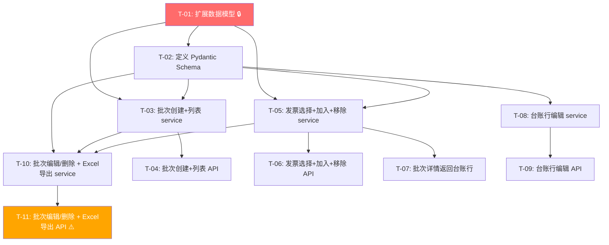

# 报销批次 + 台账导出 — 开发任务计划

## 1. 任务概览

**总任务数**：11 个
**预计总工时**：360 分钟（约 6 小时）
**开发方法**：TDD — 每个任务按 RED → GREEN → REFACTOR 循环执行

**关键标注**：
- 🔒 阻塞任务：被多个任务依赖，建议优先完成
- ⚠️ 风险任务：涉及外部模版文件操作，需要仔细处理样式保留

### 依赖关系图

### 可并行任务组

| 并行组 | 任务 | 说明 |
|--------|------|------|
| P1 | T-03, T-05, T-08 | 三个 service 函数独立实现，互不依赖 |
| P2 | T-04, T-06, T-07, T-09 | 各自依赖的 service 完成后可并行 |
| P3 | T-03 + T-05 → T-10 | 批次编辑/删除（依赖 T-03）和 Excel 导出（依赖 T-05）都完成后 T-10 才可开始 |

---

## 2. 开发任务

> 按垂直切片组织。每个阶段对应一个可独立运行和验证的用户行为（加可选的基础设施层）。切片内部的任务按技术层自然顺序排列。
>
> 每个任务按 TDD 循环执行：RED（根据验证标准写测试）→ GREEN（写最小实现通过测试）→ REFACTOR（重构）

---

### 阶段 0：基础设施 — 数据模型与 Schema

**阶段完成标准**：数据库表结构就绪，所有请求/响应模型定义完整，后续所有切片可在此基础上开发。

---

#### T-01: 扩展数据模型并执行数据库迁移 🔒

**通俗解释**：数据库里多了几个新字段——用户可以有默认报账信息了，批次里可以记录报账日期了，台账行可以存数量、单价和垫款金额了。

**做什么**：
1. 在 `models/user.py` 的 `User` 类中新增 5 个字段：`default_department`(String 100)、`default_reporter`(String 50)、`default_payee`(String 50)、`default_bank_account`(String 30)、`default_bank_name`(String 100)，均为 nullable
2. 在 `models/batch.py` 的 `ReimbursementBatch` 类中新增 `report_date: Mapped[date]`，nullable
3. 在 `models/batch.py` 的 `BatchInvoice` 类中新增 `quantity: Mapped[float]`(default=1.0)、`unit_price: Mapped[float]`(default=0.0)、`advance_amount: Mapped[float]`(default=0.0)
4. 执行数据库迁移（Alembic 或直接 ALTER TABLE，项目使用 SQLite）

**涉及文件**：`server/app/models/user.py`、`server/app/models/batch.py`

**参考**：技术方案 §3（数据库设计） → AC-001, AC-005, AC-006, AC-012, AC-028

**依赖**：无

**预估工时**：30 分钟

**验证标准**（TDD RED 阶段直接转化为测试用例）：
- [ ] `User` 类可实例化并设置 `default_department="产教融合"`，写入数据库后读取字段值正确
- [ ] `ReimbursementBatch` 类可实例化并设置 `report_date=date.today()`，写入数据库后读取字段值正确
- [ ] `BatchInvoice` 类实例化时 `quantity` 默认值为 1.0，`unit_price` 默认值为 0.0，`advance_amount` 默认值为 0.0
- [ ] 数据库 migration 执行后 `sqlite3 .schema users` 包含 `default_department` 等 5 个新列
- [ ] 数据库 migration 执行后 `sqlite3 .schema reimbursement_batches` 包含 `report_date` 列
- [ ] 数据库 migration 执行后 `sqlite3 .schema batch_invoices` 包含 `quantity`、`unit_price`、`advance_amount` 列

---

#### T-02: 定义所有 Pydantic Schema

**通俗解释**：前端和后端之间传递的数据格式全部定义好了——创建批次要传什么字段、批次列表返回什么结构、台账行包含哪些列。

**做什么**：
1. 修改 `schemas/batch.py`：
   - `CreateBatchRequest` 新增 `report_date: date | None`
   - `UpdateBatchRequest` 新增 `report_date: date | None`
   - `BatchInvoiceResponse` 新增 `quantity`、`unit_price`、`advance_amount` 字段
   - 新增 `AddInvoicesRequest`：`invoice_ids: list[int]`（限制 max_length=50）
   - 新增 `BatchListItem`：id, department, period_start, period_end, report_date, reporter, total_amount, status, invoice_count, created_at
   - 新增 `BatchListResponse`：`items: list[BatchListItem]`, `total: int`
   - 新增 `LedgerRowResponse`：id, invoice_id, invoice_date, category, amount, quantity, unit_price, advance_amount, remark, invoice_no, vendor, is_substitute, substitute_for
   - 新增 `AvailableInvoiceItem`：id, invoice_no, amount, invoice_date, category, vendor, file_path, file_original_name
   - 新增 `AvailableInvoiceListResponse`：`items: list[AvailableInvoiceItem]`, `total: int`, `page: int`, `page_size: int`
   - 新增 `UpdateBatchInvoiceRequest`：quantity(float, ge=1), advance_amount(float), remark(str, max_length=500)
   - 新增 `DeleteBatchResponse`：`deleted: bool`, `released_invoice_count: int`
2. 修改 `schemas/user.py`：新增 `UpdateUserDefaultsRequest`（5 个字段，均为 optional）

**涉及文件**：`server/app/schemas/batch.py`、`server/app/schemas/user.py`

**参考**：技术方案 §4（API 设计） → AC-001~AC-030

**依赖**：T-01

**预估工时**：30 分钟

**验证标准**（TDD RED 阶段直接转化为测试用例）：
- [ ] `CreateBatchRequest(department="产教融合", reporter="程瑞")` 构造成功，未传字段为 None
- [ ] `AddInvoicesRequest(invoice_ids=[1,2,3])` 构造成功；传入 51 个 id → pydantic ValidationError
- [ ] `UpdateBatchInvoiceRequest(quantity=0.5)` → pydantic ValidationError（quantity 必须 ≥ 1）
- [ ] `BatchListItem.model_validate(batch_obj)` 可从 ORM 对象成功序列化，`invoice_count` 字段存在
- [ ] `LedgerRowResponse` 包含 `invoice_date`、`category`、`amount` 等发票字段 + `quantity`、`unit_price` 等台账字段
- [ ] `UpdateUserDefaultsRequest(default_department="产教融合", default_payee="程瑞")` 构造成功

---

### 阶段 1：创建和查看批次列表

**阶段完成标准**：用户可以创建一个报销批次（自动填充账号默认值），并在批次列表页看到所有已创建的批次。

---

#### T-03: 实现批次创建和列表查询 service

**通俗解释**：后端有了"新建批次"和"查看所有批次"的业务逻辑——创建时会自动从用户资料里拉默认值，列表会按创建时间倒序排列。

**做什么**：
1. 在 `services/batch_service.py` 实现：
   - `create_batch(db, user_id, data: CreateBatchRequest)`：读取 User 默认值填充未传字段，`report_date` 默认 `date.today()`，创建 `ReimbursementBatch`，返回 `BatchResponse`
   - `list_batches(db, user_id)`：查询当前用户的所有批次，按 `created_at DESC`，统计每个批次的 `invoice_count`（COUNT batch_invoices），返回 `BatchListResponse`

**涉及文件**：`server/app/services/batch_service.py`

**参考**：技术方案 §5.1（默认值填充）、§4（GET/POST /batches/） → AC-001, AC-002, AC-012, AC-021

**依赖**：T-01, T-02

**预估工时**：40 分钟

**验证标准**（TDD RED 阶段直接转化为测试用例）：
- [ ] User 未设置默认值 → `create_batch(department=None, reporter=None)` → 创建的 batch 中 department=None, reporter=None
- [ ] User 设置了 `default_department="产教融合"`、`default_reporter="程瑞"` → `create_batch(department=None, reporter=None)` → batch.department="产教融合", batch.reporter="程瑞"（自动填充）
- [ ] `create_batch(report_date=None)` → batch.report_date = date.today()（默认当天）
- [ ] `create_batch(department="研发部")` → batch.department="研发部"（显式传入覆盖默认值）
- [ ] `list_batches(user_id=1)` → 返回按 created_at DESC 排列的批次列表，每个批次含 invoice_count
- [ ] 用户无批次 → `list_batches()` → `{"items": [], "total": 0}`
- [ ] 用户 A 创建 3 个批次，用户 B 查询 → 返回空列表（数据隔离）

---

#### T-04: 实现批次创建和列表查询 API 路由

**通俗解释**：前端可以调用 `POST /api/batches` 创建批次，调用 `GET /api/batches` 获取批次列表了。

**做什么**：
1. 修改 `api/batches.py`：
   - `POST /`：接收 `CreateBatchRequest`，调用 `batch_service.create_batch()`，返回 201 + `BatchResponse`
   - `GET /`：调用 `batch_service.list_batches()`，返回 200 + `BatchListResponse`
2. 两个端点均通过 `Depends(get_current_user)` + `Depends(get_db)` 鉴权

**涉及文件**：`server/app/api/batches.py`

**参考**：技术方案 §4（POST /batches/、GET /batches/） → AC-001, AC-002, AC-012, AC-021

**依赖**：T-03

**预估工时**：25 分钟

**验证标准**（TDD RED 阶段直接转化为测试用例）：
- [ ] `POST /api/batches` 传入 `{"department": "研发部", "reporter": "张三"}` → 201，返回 batch 含 id
- [ ] `POST /api/batches` 不传 token → 401
- [ ] `GET /api/batches` 已登录 → 200，返回 items 数组
- [ ] `GET /api/batches` 无批次 → 200，`{"items": [], "total": 0}`

---

### 阶段 2：发票选择器 + 加入批次 + 台账预览

**阶段完成标准**：用户打开批次详情可以看到台账预览表格，打开发票选择器搜索并批量勾选发票加入批次，发票加入后台账行自动根据规则初始化（含备注自动填充）。

---

#### T-05: 实现可选发票查询、批量加入发票、移除发票 service

**通俗解释**：后端知道哪些发票可以选（已入库且未被占用），加入批次时自动算好初始数量、单价、垫款金额和备注，移除后发票又能被其他批次选了。

**做什么**：
1. 在 `services/batch_service.py` 实现：
   - `list_available_invoices(db, user_id, keyword, page, page_size)`：查询 status=confirmed 且不在任何 batch_invoices 中的发票；keyword 模糊匹配 invoice_no/vendor/category；分页返回 `AvailableInvoiceListResponse`
   - `add_invoices(db, user_id, batch_id, invoice_ids)`：校验 batch 归属 + 每张发票状态=confirmed 且未被占用；批量创建 BatchInvoice：quantity=1.0, unit_price=invoice.amount, advance_amount=invoice.amount, remark=auto_remark(invoice)；全量回滚（单张失败则全部失败）；更新 batch.total_amount；返回 ledger_rows
   - `remove_invoice(db, user_id, batch_id, invoice_id)`：校验 batch 归属 + 发票在批次中；删除 BatchInvoice 记录；更新 batch.total_amount
   - `_auto_remark(invoice)`：按技术方案 §5.3 规则生成备注
2. 归档已存在的空 `services/reimbursement_service.py`（本次不改，避免混淆）

**涉及文件**：`server/app/services/batch_service.py`

**参考**：技术方案 §5.2（初始值计算）、§5.3（备注自动填充）、§7 决策3（全量回滚） → AC-003, AC-004, AC-008, AC-010, AC-018, AC-019, AC-023, AC-024, AC-025, AC-028

**依赖**：T-01, T-02

**预估工时**：50 分钟

**验证标准**（TDD RED 阶段直接转化为测试用例）：
- [ ] `list_available_invoices()` → 仅返回 status=confirmed 的发票，不返回 processing/pending/failed 状态
- [ ] 发票 A 已在批次 X 中 → `list_available_invoices()` 不包含发票 A
- [ ] `list_available_invoices(keyword="铁路")` → 仅返回 vendor 含"铁路"的发票
- [ ] `add_invoices(invoice_ids=[1,2,3])` → 3 张发票全部成功加入，每张 batch_invoice.quantity=1.0，advance_amount=invoice.amount
- [ ] 发票有 remark="测试备注" → 加入后 batch_invoice.remark="测试备注"（优先使用原备注）
- [ ] 高铁票（无 remark，有 departure_station="合肥", arrival_station="淮南南"）→ remark 自动填充为"合肥→淮南南"
- [ ] 滴滴打车（无 remark，有 departure_location="A地点", arrival_location="B地点"）→ remark="A地点→B地点"
- [ ] 飞机行程单（无 remark，有 departure_city="北京", arrival_city="上海"）→ remark="北京→上海"
- [ ] 无 remark 且无出行信息 → remark=""
- [ ] `add_invoices(invoice_ids=[1,2])`，其中发票 1 已被占用 → 返回 400，发票 2 也未加入（全量回滚）
- [ ] `add_invoices(invoice_ids=[1])` 发票 1 状态=processing → 返回 400
- [ ] `delete_invoice(batch_id, invoice_id)` → BatchInvoice 记录被删除，发票重新出现在可选列表
- [ ] 批量加入 15 张发票 → `db.add_all()` 一次提交，响应时间 < 500ms

---

#### T-06: 实现发票选择器、加入、移除 API 路由

**通俗解释**：前端可以调用接口获取可选发票列表、批量加入发票、从批次移除发票了。

**做什么**：
1. 修改 `api/batches.py`：
   - `GET /available-invoices`：Query 参数 keyword/page/page_size，调用 `list_available_invoices()`，返回 200
   - `POST /{batch_id}/invoices`：接收 `AddInvoicesRequest`，调用 `add_invoices()`，返回 200 + added 数 + ledger_rows
   - `DELETE /{batch_id}/invoices/{invoice_id}`：调用 `remove_invoice()`，返回 200 + `{"removed": true}`
2. 所有端点鉴权 + batch_id 归属校验

**涉及文件**：`server/app/api/batches.py`

**参考**：技术方案 §4（GET /available-invoices、POST /{id}/invoices、DELETE /{id}/invoices/{iid}） → AC-008, AC-010, AC-018, AC-024, AC-025

**依赖**：T-05

**预估工时**：25 分钟

**验证标准**（TDD RED 阶段直接转化为测试用例）：
- [ ] `GET /api/batches/available-invoices?keyword=高铁` → 200，仅返回匹配发票
- [ ] `GET /api/batches/available-invoices` 无可选发票 → 200，`{"items": [], "total": 0}`
- [ ] `POST /api/batches/1/invoices` 传入 `{"invoice_ids": [10, 12]}` → 200，`{"added": 2, "ledger_rows": [...]}`
- [ ] `POST /api/batches/999/invoices` batch 不存在 → 404
- [ ] `DELETE /api/batches/1/invoices/10` → 200，`{"removed": true}`
- [ ] `DELETE /api/batches/1/invoices/99` 发票不在批次中 → 404

---

#### T-07: 扩展批次详情接口返回完整台账行

**通俗解释**：打开批次详情页时，不仅能看到批次信息，还能看到完整的台账预览表格（每张发票一行，含日期/事由/数量/单价/金额/垫款金额/备注）。

**做什么**：
1. 在 `services/batch_service.py` 实现 `get_batch_detail(db, user_id, batch_id)`：
   - 查询 `ReimbursementBatch`（校验归属）
   - 关联查询 `BatchInvoice` + `Invoice`，组装 `LedgerRowResponse` 列表
   - 返回 `BatchDetailResponse`（含 `ledger_rows`）
2. 修改 `api/batches.py` 的 `GET /{batch_id}`：调用 `get_batch_detail()`，返回 200

**涉及文件**：`server/app/services/batch_service.py`、`server/app/api/batches.py`

**参考**：技术方案 §4（GET /batches/{id}）、§7 决策4（一次返回完整详情） → AC-003, AC-004

**依赖**：T-05

**预估工时**：25 分钟

**验证标准**（TDD RED 阶段直接转化为测试用例）：
- [ ] `GET /api/batches/1`（已关联 2 张发票）→ 200，返回 batch 元信息 + `ledger_rows` 数组长度为 2
- [ ] ledger_row 中 `invoice_date`="2026-05-15", `amount`=34.0, `quantity`=1.0, `unit_price`=34.0
- [ ] `GET /api/batches/1`（无发票）→ 200，`ledger_rows`=[]

---

### 阶段 3：台账行编辑

**阶段完成标准**：用户在台账预览表格中可以修改数量（单价自动联动）、修改垫款金额、修改备注，修改只影响台账输出不影响原始发票。

---

#### T-08: 实现台账行编辑 service

**通俗解释**：后端实现了"改数量后单价自动重算"的逻辑——用户改数量为 4，单价自动变成金额÷4；修改垫款金额和备注则直接保存。

**做什么**：
1. 在 `services/batch_service.py` 实现 `update_batch_invoice(db, user_id, batch_id, invoice_id, data: UpdateBatchInvoiceRequest)`：
   - 校验 batch 归属 + 发票在批次中
   - 若 data.quantity 传入：校验 ≥1（<1 抛 400），读取 Invoice.amount，计算 unit_price = round(amount / quantity, 2)，更新 quantity 和 unit_price
   - 若 data.advance_amount 传入：更新 advance_amount（不联动）
   - 若 data.remark 传入：更新 remark
   - 返回更新后的 ledger_row

**涉及文件**：`server/app/services/batch_service.py`

**参考**：技术方案 §5.4（数量→单价联动）、§7 决策2（后端计算单价） → AC-005, AC-006, AC-007, AC-020, AC-027

**依赖**：T-01, T-02

**预估工时**：30 分钟

**验证标准**（TDD RED 阶段直接转化为测试用例）：
- [ ] 发票金额=100.00，quantity=1 → 修改 quantity=4 → unit_price 自动更新为 25.00，金额不变
- [ ] 发票金额=37.00，quantity=1 → 修改 quantity=2 → unit_price=18.50（精确到两位小数）
- [ ] 修改 quantity=0 → 返回 400，"数量不能小于1"
- [ ] 修改 quantity=-1 → 返回 400
- [ ] 修改 advance_amount=80.0 → advance_amount 更新为 80.0，unit_price 不变
- [ ] 首次设置 advance_amount=80 后，再次修改 quantity=5 → advance_amount 保持 80 不变（不联动）
- [ ] 修改 remark="出差交通费" → remark 更新为"出差交通费"
- [ ] 修改不存在的 batch_id 或 invoice_id → 404
- [ ] 修改后去查原始 Invoice 表 → Invoice.amount、Invoice.remark 均未变化（AC-026）

---

#### T-09: 实现台账行编辑 API 路由

**通俗解释**：前端可以调用 `PUT /api/batches/{id}/invoices/{iid}` 来编辑台账行的数量、垫款金额和备注了。

**做什么**：
1. 修改 `api/batches.py`：
   - `PUT /{batch_id}/invoices/{invoice_id}`：接收 `UpdateBatchInvoiceRequest`，调用 `update_batch_invoice()`，返回 200 + ledger_row

**涉及文件**：`server/app/api/batches.py`

**参考**：技术方案 §4（PUT /{id}/invoices/{iid}） → AC-005, AC-006, AC-007, AC-020

**依赖**：T-08

**预估工时**：15 分钟

**验证标准**（TDD RED 阶段直接转化为测试用例）：
- [ ] `PUT /api/batches/1/invoices/10` 传入 `{"quantity": 4}` → 200，返回 `{"quantity": 4.0, "unit_price": 25.0, ...}`
- [ ] `PUT /api/batches/1/invoices/10` 传入 `{"quantity": 0}` → 400，`{"detail": "数量不能小于1"}`
- [ ] `PUT /api/batches/1/invoices/10` 传入 `{"advance_amount": 80, "remark": "出差费"}` → 200，两字段均更新

---

### 阶段 4：编辑/删除批次 + 导出 Excel

**阶段完成标准**：用户可以编辑批次的元信息、删除批次（发票回到可选池）、一键导出符合公司模版的 Excel 台账文件。

---

#### T-10: 实现批次编辑/删除 + Excel 导出 service

**通俗解释**：后端可以更新批次信息、删除批次时自动释放所有关联发票、并能按公司模版生成带公式的 Excel 台账文件。

**做什么**：
1. 在 `services/batch_service.py` 实现：
   - `update_batch(db, user_id, batch_id, data: UpdateBatchRequest)`：校验归属，exclude_unset 更新字段，返回 `BatchResponse`
   - `delete_batch(db, user_id, batch_id)`：校验归属，统计关联发票数，删除所有 `BatchInvoice` + `ReimbursementBatch`，返回 `{"deleted": True, "released_invoice_count": N}`
2. 在 `services/excel_service.py` 实现 `export_batch_excel(db, user_id, batch_id)`：
   - 校验 batch 归属 + 有关联发票（否则抛 400"请先添加发票"）
   - openpyxl 加载 `文件/台账模版.xlsx`，取 Sheet1
   - A2 填充 `报账部门：{dept}  报账期间：{start}-{end}`
   - 第 4 行起逐行写数据（A=日期, B=事由, C=数量, D=单价, E=金额, F=垫款金额, G=备注）
   - 合计行：紧跟最后数据行，F 列写 `=SUM(F4:F{last_row})`
   - 底部 A21：`审核人：{reviewer}  报账人：{reporter}  报账日期：{report_date}  合计金额：{sum}`
   - 底部 A22：`收款人：{payee}  银行卡号：{bank_account}  开户行：{bank_name}`
   - 文件名：`{dept}_{period_start}_{period_end}_台账.xlsx`
   - 保存到 BytesIO，返回 bytes

**涉及文件**：`server/app/services/batch_service.py`、`server/app/services/excel_service.py`

**参考**：技术方案 §5.5（Excel导出）、§5.6（删除批次） → AC-011, AC-013, AC-014, AC-017, AC-022, AC-026, AC-029, AC-030

**依赖**：T-03, T-05

**预估工时**：55 分钟

**验证标准**（TDD RED 阶段直接转化为测试用例）：
- [ ] `update_batch(batch_id, data={"department": "新部门"})` → batch.department 更新为"新部门"
- [ ] `update_batch(batch_id, data={"reviewer": "张经理"})` → batch.reviewer 更新
- [ ] `delete_batch(batch_id)`（关联 5 张发票）→ 返回 `{"deleted": true, "released_invoice_count": 5}`，5 张发票重新出现在可选池
- [ ] 删除批次后 → `list_available_invoices()` 包含被释放的 5 张发票（AC-030）
- [ ] `export_batch_excel(batch_id)` 无发票 → 400，"请先添加发票"
- [ ] `export_batch_excel(batch_id)`（3 张发票）→ 返回 bytes，用 openpyxl 读取验证：
  - A2 = `报账部门：{dept}  报账期间：{start}-{end}`
  - 数据从第 4 行开始，共 3 行（第 4/5/6 行）
  - F4/F5/F6 为垫款金额值
  - 第 7 行 F 列 = `=SUM(F4:F6)`
  - A21 含审核人/报账人/报账日期/合计金额
  - A22 含收款人/银行卡号/开户行
- [ ] 金额为 0 的发票 → 导出的 E 列值为 0.00，正常写入不跳过（AC-022）

---

#### T-11: 实现批次编辑/删除 + Excel 导出 API 路由 ⚠️

**通俗解释**：前端可以调用接口编辑批次、删除批次、下载 Excel 台账文件了。Excel 下载是通过浏览器直接下载的，点击按钮就能拿到文件。

**做什么**：
1. 修改 `api/batches.py`：
   - `PUT /{batch_id}`：接收 `UpdateBatchRequest`，调用 `update_batch()`，返回 200
   - `DELETE /{batch_id}`：调用 `delete_batch()`，返回 200
   - `GET /{batch_id}/export-excel`：调用 `export_batch_excel()`，返回 `StreamingResponse`（media_type="application/vnd.openxmlformats-officedocument.spreadsheetml.sheet"，headers 含 Content-Disposition 下载文件名）

**涉及文件**：`server/app/api/batches.py`

**参考**：技术方案 §4（PUT/DELETE /{id}、GET /{id}/export-excel） → AC-011, AC-013, AC-014, AC-016, AC-017

**依赖**：T-10

**预估工时**：25 分钟

**验证标准**（TDD RED 阶段直接转化为测试用例）：
- [ ] `PUT /api/batches/1` 传入 `{"department": "新部门"}` → 200，返回更新后的 batch
- [ ] `PUT /api/batches/999` → 404
- [ ] `DELETE /api/batches/1` → 200，`{"deleted": true, "released_invoice_count": N}`
- [ ] `DELETE /api/batches/999` → 404
- [ ] `GET /api/batches/1/export-excel` 无发票 → 400，"请先添加发票"
- [ ] `GET /api/batches/1/export-excel` 有发票 → 200，Content-Type 为 xlsx，Content-Disposition 含 `{dept}_{start}_{end}_台账.xlsx`
- [ ] 导出的 Excel 文件大小 > 0 bytes，用 openpyxl 可正常打开

---

## 3. AC 覆盖总表

> 最终检查：每条 AC 是否都有任务承接。这是全文档唯一的 AC 映射汇总。

| AC 编号 | 验收标准概述 | 承接任务 | 验证方式 |
|---------|-------------|---------|---------|
| AC-001 | 创建批次，自动填充默认值 | T-03, T-04 | T-03 验证标准：User默认值自动填充；T-04 验证标准：POST 返回 batch |
| AC-002 | 批次列表展示（按创建时间倒序） | T-03, T-04 | T-03 验证标准：list 按 created_at DESC；T-04 验证标准：GET 返回 items |
| AC-003 | 台账预览表格（7列，初始值正确） | T-05, T-07 | T-07 验证标准：ledger_rows 含完整 7 列数据 |
| AC-004 | 备注自动填充（出行信息拼接/已有remark） | T-05 | T-05 验证标准：4 种备注填充场景测试 |
| AC-005 | 修改数量→单价联动（金额不变） | T-08, T-09 | T-08 验证标准：quantity=4 → unit_price=25.00 |
| AC-006 | 修改垫款金额（独立管理，不联动） | T-08, T-09 | T-08 验证标准：改 advance_amount 后 quantity 变更不覆盖 |
| AC-007 | 修改备注 | T-08, T-09 | T-08 验证标准：remark 更新为"出差交通费" |
| AC-008 | 搜索并批量加入发票 | T-05, T-06 | T-05 验证标准：keyword 过滤 + 批量加入；T-06 验证标准：POST 返回 added |
| AC-009 | 选择器中预览发票原文件 | 复用已有 `GET /api/invoices/{id}/file` | 不在本次任务范围（已有接口，前端直接调用） |
| AC-010 | 从批次移除发票 | T-05, T-06 | T-05 验证标准：删除后发票回到可选池；T-06 验证标准：DELETE 返回 removed |
| AC-011 | 导出台账 Excel | T-10, T-11 | T-10 验证标准：数据行/合计行/底部签名区均正确；T-11 验证标准：StreamingResponse |
| AC-012 | 创建批次时账号默认值填充 | T-01, T-03, T-04 | T-01 验证标准：User 模型有新字段；T-03 验证标准：默认值自动填充逻辑 |
| AC-013 | 导出后批次仍可编辑 | T-10, T-11 | PUT /{id} 无状态锁定——设计保证，验证标准中 PUT 始终返回 200 |
| AC-014 | 删除批次，发票回到可选池 | T-10, T-11 | T-10 验证标准：删除后 released_invoice_count=5，发票重新可选 |
| AC-015 | 移除发票→二次确认 | 前端实现 | 不在后端任务范围（前端确认弹窗后调 DELETE 接口） |
| AC-016 | 删除批次→二次确认 | 前端实现 | 不在后端任务范围（前端确认弹窗后调 DELETE 接口） |
| AC-017 | 空批次不允许导出 | T-10, T-11 | T-10 验证标准：无发票 → 400；T-11 验证标准：GET 返回 400 |
| AC-018 | 所有发票已被占用（空状态） | T-05, T-06 | T-05 验证标准：无可选发票返回空；T-06 验证标准：items=[] |
| AC-019 | 已在本批次的发票不出现在选择器 | T-05 | T-05 验证标准：已在 batch_invoices 的发票被排除 |
| AC-020 | 数量<1→恢复为1（报错） | T-08, T-09 | T-08 验证标准：quantity=0 → 400；T-09 验证标准：PUT 返回 400 |
| AC-021 | 批次列表为空 | T-03, T-04 | T-03 验证标准：空列表；T-04 验证标准：GET 返回 items=[] |
| AC-022 | 金额为0时的台账行处理 | T-10 | T-10 验证标准：金额 0.00 正常写入 Excel |
| AC-023 | 批量加入较多发票（15张）无卡顿 | T-05 | T-05 验证标准：15 张 add_all() 一次提交，<500ms |
| AC-024 | 一张发票只能属于一个批次 | T-05, T-06 | T-05 验证标准：已被占用发票 → 400；T-06 验证标准：POST 返回 400 |
| AC-025 | 只有已入库发票可加入批次 | T-05, T-06 | T-05 验证标准：processing 状态 → 400；T-06 验证标准：POST 返回 400 |
| AC-026 | 批次修改不影响原始发票 | T-08 | T-08 验证标准：改台账行后 Invoice 表无变化 |
| AC-027 | 单价 = 金额 ÷ 数量 | T-08 | T-08 验证标准：37.00÷2=18.50 |
| AC-028 | 垫款金额默认 = 金额 | T-05 | T-05 验证标准：加入时 advance_amount=invoice.amount |
| AC-029 | 合计行对垫款金额求和 | T-10 | T-10 验证标准：F 列合计行 =SUM(F4:F6) |
| AC-030 | 删除批次后发票恢复可选 | T-10 | T-10 验证标准：删除后 list_available 包含被释放发票 |

---

## 4. 完成定义

> 所有任务完成后，功能整体交付前的最终确认。只列出跟这个功能相关的检查项，不要套用通用清单。

- [ ] 所有任务的验证标准（测试用例）通过
- [ ] AC 覆盖总表中每条 AC 的验证方式已执行并通过
- [ ] 数据库迁移脚本在测试环境验证通过（ALTER TABLE 无报错）
- [ ] Excel 导出文件可与 `文件/台账模版.xlsx` 原始模版对比：标题行不变、数据从第 4 行开始、合计行公式正确、底部签名区信息完整
- [ ] 服务启动后 `GET /docs` 可看到 `/api/batches` 下的所有 10 个接口且可正常调用
- [ ] 批次 CRUD 全部经手工测试：创建→加发票→编辑台账行→导出→编辑批次→删除→发票恢复可选