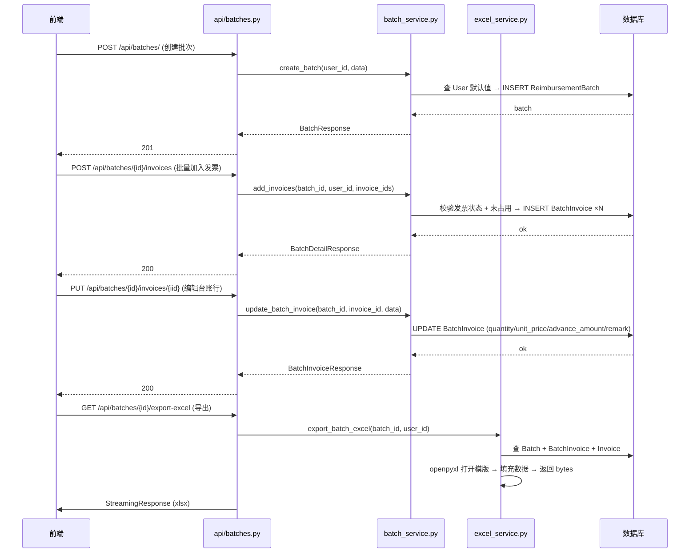

# 报销批次 + 台账导出 — 技术设计文档

## 1. 设计概要

**功能描述**：为已入库发票提供批次管理能力，支持创建批次、添加发票、台账预览编辑、一键导出 Excel 台账。

**影响范围**：批次模块（新增完整实现）、用户模块（模型扩展）、发票模块（查询逻辑扩展）、Excel 服务（新增）

**技术难点**：
- Excel 模版精确填充（保持模版样式、合并单元格布局不变，仅填入数据）
- 台账预览表格的实时计算逻辑（数量→单价联动，垫款金额独立）

**外部依赖**：`openpyxl`（已在 requirements.txt 中，用于读写 Excel 模版）

---

## 2. 架构概览

本次功能跨 3 个层：API 路由层（`api/batches.py`）→ 服务层（`services/batch_service.py`、`services/excel_service.py`）→ 数据层（`models/batch.py`、`models/user.py`）。核心交互链路如下：



## 3. 数据库设计

### 修改现有表

#### `users` — 新增账号默认值字段 → AC-012

**变更内容**：新增 5 个 nullable 字段，存储用户在账号层配置的报销默认值。创建批次时自动读取填充。

| 字段名 | 类型 | 约束 | 说明 |
|--------|------|------|------|
| default_department | VARCHAR(100) | nullable | 默认报账部门 |
| default_reporter | VARCHAR(50) | nullable | 默认报账人 |
| default_payee | VARCHAR(50) | nullable | 默认收款人 |
| default_bank_account | VARCHAR(30) | nullable | 默认银行卡号 |
| default_bank_name | VARCHAR(100) | nullable | 默认开户行 |

```sql
ALTER TABLE users ADD COLUMN default_department VARCHAR(100);
ALTER TABLE users ADD COLUMN default_reporter VARCHAR(50);
ALTER TABLE users ADD COLUMN default_payee VARCHAR(50);
ALTER TABLE users ADD COLUMN default_bank_account VARCHAR(30);
ALTER TABLE users ADD COLUMN default_bank_name VARCHAR(100);
```

**数据迁移**：无需迁移，新增字段均为 nullable。

---

#### `reimbursement_batches` — 新增报账日期字段 → AC-001, AC-012

**变更内容**：新增 `report_date` 字段，与 `period_start`/`period_end`（报账期间）区分开。创建批次时默认当天日期。

| 字段名 | 类型 | 约束 | 说明 |
|--------|------|------|------|
| report_date | DATE | nullable | 报账日期，默认当天 |

```sql
ALTER TABLE reimbursement_batches ADD COLUMN report_date DATE;
```

**数据迁移**：无需迁移。

---

#### `batch_invoices` — 新增台账编辑字段 → AC-005, AC-006, AC-007, AC-028

**变更内容**：新增 `quantity`、`unit_price`、`advance_amount` 三个字段。这些字段仅在批次台账中使用，不影响原始发票数据。

| 字段名 | 类型 | 约束 | 说明 |
|--------|------|------|------|
| quantity | FLOAT | NOT NULL, DEFAULT 1.0 | 数量，≥1，允许小数 → AC-020 |
| unit_price | FLOAT | NOT NULL, DEFAULT 0.0 | 单价 = 金额 ÷ 数量 → BR-005 |
| advance_amount | FLOAT | NOT NULL, DEFAULT 0.0 | 垫款金额，默认=发票金额 → BR-006 |

```sql
ALTER TABLE batch_invoices ADD COLUMN quantity FLOAT NOT NULL DEFAULT 1.0;
ALTER TABLE batch_invoices ADD COLUMN unit_price FLOAT NOT NULL DEFAULT 0.0;
ALTER TABLE batch_invoices ADD COLUMN advance_amount FLOAT NOT NULL DEFAULT 0.0;
```

**数据迁移**：无需迁移。

---

## 4. API 设计

> 所有接口均需鉴权（`Depends(get_current_user)`），数据隔离通过 `user_id` 实现。
> API 风格遵循项目已有约定：路径小写连字符、Pydantic `response_model`、错误返回 `HTTPException`。

---

### `GET /api/batches/`

**描述**：获取当前用户的批次列表 → AC-002

**鉴权**：需要登录

**Request**：无

**Response（成功 200）**：
```json
{
  "items": [
    {
      "id": 1,
      "department": "产教融合",
      "period_start": "2026-01",
      "period_end": "2026-06",
      "report_date": "2026-05-18",
      "reporter": "程瑞",
      "reviewer": null,
      "total_amount": 1234.56,
      "status": "draft",
      "invoice_count": 5,
      "created_at": "2026-05-18T10:00:00"
    }
  ],
  "total": 1
}
```

---

### `POST /api/batches/`

**描述**：创建批次，自动填充账号默认值 → AC-001, AC-012

**鉴权**：需要登录

**Request**：
```json
{
  "department": "产教融合",
  "period_start": "2026-01",
  "period_end": "2026-06",
  "report_date": "2026-05-18",
  "reporter": "程瑞",
  "reviewer": null,
  "payee": "程瑞",
  "bank_account": "6222000000000000",
  "bank_name": "中国工商银行"
}
```

**Response（成功 201）**：
```json
{
  "id": 1,
  "department": "产教融合",
  "period_start": "2026-01",
  "period_end": "2026-06",
  "report_date": "2026-05-18",
  "reporter": "程瑞",
  "reviewer": null,
  "payee": "程瑞",
  "bank_account": "6222000000000000",
  "bank_name": "中国工商银行",
  "total_amount": 0.0,
  "status": "draft",
  "created_at": "2026-05-18T10:00:00",
  "updated_at": "2026-05-18T10:00:00"
}
```

---

### `GET /api/batches/{batch_id}`

**描述**：获取批次详情，包含台账表格数据 → AC-003, AC-004

**鉴权**：需要登录 + 只能查看自己的批次

**Response（成功 200）**：
```json
{
  "id": 1,
  "department": "产教融合",
  "period_start": "2026-01",
  "period_end": "2026-06",
  "report_date": "2026-05-18",
  "reporter": "程瑞",
  "reviewer": null,
  "payee": "程瑞",
  "bank_account": "6222000000000000",
  "bank_name": "中国工商银行",
  "total_amount": 1234.56,
  "status": "draft",
  "created_at": "2026-05-18T10:00:00",
  "updated_at": "2026-05-18T10:00:00",
  "ledger_rows": [
    {
      "id": 1,
      "invoice_id": 10,
      "invoice_date": "2026-05-15",
      "category": "高铁票",
      "amount": 34.00,
      "quantity": 1.0,
      "unit_price": 34.00,
      "advance_amount": 34.00,
      "remark": "合肥→淮南南",
      "invoice_no": "12345678",
      "vendor": "铁路总公司",
      "is_substitute": false,
      "substitute_for": null
    }
  ]
}
```

**异常响应**：

| 场景 | 状态码 | 响应 | 对应 AC |
|------|--------|------|---------|
| 批次不存在或不属于当前用户 | 404 | `{"detail": "批次不存在"}` | — |

---

### `PUT /api/batches/{batch_id}`

**描述**：编辑批次元信息（部门、期间、报账人等） → 关联 AC-013（导出后仍可编辑）

**鉴权**：需要登录 + 只能编辑自己的批次

**Request**：所有字段可选（`exclude_unset`）
```json
{
  "department": "产教融合2",
  "reviewer": "张经理"
}
```

**Response（成功 200）**：`BatchResponse`（同创建返回结构）

**异常响应**：

| 场景 | 状态码 | 响应 | 对应 AC |
|------|--------|------|---------|
| 批次不存在或不属于当前用户 | 404 | `{"detail": "批次不存在"}` | — |

---

### `DELETE /api/batches/{batch_id}`

**描述**：删除批次，关联发票回到可选池 → AC-014, AC-016

**鉴权**：需要登录 + 只能删除自己的批次

**Response（成功 200）**：
```json
{
  "deleted": true,
  "released_invoice_count": 5
}
```

**异常响应**：

| 场景 | 状态码 | 响应 | 对应 AC |
|------|--------|------|---------|
| 批次不存在或不属于当前用户 | 404 | `{"detail": "批次不存在"}` | — |

---

### `GET /api/batches/available-invoices`

**描述**：获取发票选择器的可选发票列表 → AC-008, AC-009, AC-018, AC-019, AC-024, AC-025

**鉴权**：需要登录

**Query 参数**：

| 参数 | 类型 | 必填 | 说明 |
|------|------|------|------|
| keyword | string | 否 | 按发票号码、销售方名称、报销类型搜索 |
| page | int | 否 | 默认 1 |
| page_size | int | 否 | 默认 50 |

**Response（成功 200）**：
```json
{
  "items": [
    {
      "id": 10,
      "invoice_no": "12345678",
      "amount": 34.00,
      "invoice_date": "2026-05-15",
      "category": "高铁票",
      "vendor": "铁路总公司",
      "file_path": "/uploads/1/abc.pdf",
      "file_original_name": "高铁票.pdf"
    }
  ],
  "total": 3,
  "page": 1,
  "page_size": 50
}
```

**异常响应**：

| 场景 | 状态码 | 响应 | 对应 AC |
|------|--------|------|---------|
| 无可选发票 | 200 | `{"items": [], "total": 0}` | AC-018 |

---

### `POST /api/batches/{batch_id}/invoices`

**描述**：批量将发票加入批次 → AC-008

**鉴权**：需要登录 + 只能操作自己的批次

**Request**：
```json
{
  "invoice_ids": [10, 12, 15]
}
```

**Response（成功 200）**：
```json
{
  "added": 3,
  "ledger_rows": [ ... ]
}
```

**异常响应**：

| 场景 | 状态码 | 响应 | 对应 AC |
|------|--------|------|---------|
| 批次不存在或不属于当前用户 | 404 | `{"detail": "批次不存在"}` | — |
| 某发票不是 confirmed 状态 | 400 | `{"detail": "发票#10状态不是已入库"}` | AC-025 |
| 某发票已在其他批次中 | 400 | `{"detail": "发票#10已在其他批次中"}` | AC-024 |

---

### `PUT /api/batches/{batch_id}/invoices/{invoice_id}`

**描述**：编辑台账行数据（数量、单价、垫款金额、备注） → AC-005, AC-006, AC-007

**鉴权**：需要登录 + 只能操作自己的批次

**Request**：
```json
{
  "quantity": 4.0,
  "advance_amount": 80.0,
  "remark": "出差交通费"
}
```

**后端计算**：若传入 `quantity`，后端同步计算 `unit_price = amount ÷ quantity` → AC-005, AC-027

**Response（成功 200）**：
```json
{
  "id": 1,
  "invoice_id": 10,
  "quantity": 4.0,
  "unit_price": 8.50,
  "advance_amount": 80.0,
  "remark": "出差交通费"
}
```

**异常响应**：

| 场景 | 状态码 | 响应 | 对应 AC |
|------|--------|------|---------|
| 发票不在该批次中 | 404 | `{"detail": "发票不在当前批次中"}` | — |
| quantity < 1 | 400 | `{"detail": "数量不能小于1"}` | AC-020 |

---

### `DELETE /api/batches/{batch_id}/invoices/{invoice_id}`

**描述**：从批次移除发票，发票回到可选池 → AC-010, AC-015

**鉴权**：需要登录 + 只能操作自己的批次

**Response（成功 200）**：
```json
{
  "removed": true
}
```

**异常响应**：

| 场景 | 状态码 | 响应 | 对应 AC |
|------|--------|------|---------|
| 发票不在该批次中 | 404 | `{"detail": "发票不在当前批次中"}` | — |

---

### `GET /api/batches/{batch_id}/export-excel`

**描述**：导出台账 Excel 文件 → AC-011, AC-017, AC-029

**鉴权**：需要登录 + 只能导出自己的批次

**Response（成功 200）**：`StreamingResponse`，Content-Type: `application/vnd.openxmlformats-officedocument.spreadsheetml.sheet`

**异常响应**：

| 场景 | 状态码 | 响应 | 对应 AC |
|------|--------|------|---------|
| 批次为空（无发票） | 400 | `{"detail": "请先添加发票"}` | AC-017 |
| 批次不存在或不属于当前用户 | 404 | `{"detail": "批次不存在"}` | — |

---

### `GET /api/auth/me`

**描述**：获取当前登录用户的信息（含账号默认值） → AC-031

**鉴权**：需要登录

**Response（成功 200）**：
```json
{
  "id": 1,
  "username": "chengrui",
  "display_name": "程瑞",
  "default_department": "产教融合",
  "default_reporter": "程瑞",
  "default_payee": "程瑞",
  "default_bank_account": "6222000000000000",
  "default_bank_name": "中国工商银行"
}
```

---

### `PUT /api/auth/me`

**描述**：更新当前用户的账号默认值 → AC-032

**鉴权**：需要登录

**Request**：所有字段可选
```json
{
  "default_department": "产教融合",
  "default_reporter": "程瑞",
  "default_payee": "程瑞",
  "default_bank_account": "6222000000000000",
  "default_bank_name": "中国工商银行"
}
```

**Response（成功 200）**：`UserResponse`（同 GET 返回结构）

---

## 5. 核心逻辑

### 5.1 创建批次时默认值填充 → AC-001, AC-012

**触发条件**：`POST /api/batches/` 时，前端可部分留空。

**处理流程**：
1. 读取当前 User 的 `default_department`、`default_reporter` 等字段
2. 对 Request 中**未传入**的字段，用 User 默认值填充
3. `report_date` 未传入时用 `date.today()`
4. 写入 `ReimbursementBatch` 表

```
if request.department is None: request.department = user.default_department
if request.reporter is None: request.reporter = user.default_reporter
if request.payee is None: request.payee = user.default_payee
if request.bank_account is None: request.bank_account = user.default_bank_account
if request.bank_name is None: request.bank_name = user.default_bank_name
if request.report_date is None: request.report_date = date.today()
```

---

### 5.2 发票加入批次时的初始值计算 → AC-003, AC-004, AC-028

**触发条件**：`POST /api/batches/{id}/invoices` 批量加入发票。

**处理流程**：
1. 校验每张发票：状态 = `confirmed` 且未被任何 `batch_invoices` 引用 → AC-025, AC-024
2. 为每张发票创建 `BatchInvoice` 记录：
   - `quantity` = 1.0
   - `unit_price` = `invoice.amount`（`amount ÷ 1`）
   - `advance_amount` = `invoice.amount` → AC-028
   - `remark` = 按 5.3 节规则自动填充 → AC-004
   - `expense_item` = `invoice.category`
3. 批量 `INSERT` 后，计算并更新 `ReimbursementBatch.total_amount`
4. 返回 `BatchDetailResponse`（含完整台账行）

---

### 5.3 备注自动填充规则 → AC-004

**处理流程**：
1. 若发票已有 `remark` 且非空 → 直接使用
2. 若无 remark，按出行信息拼接：
   - 高铁票（train_no 非空）：`{departure_station}→{arrival_station}`
   - 滴滴打车（departure_location/arrival_location 非空）：`{departure_location}→{arrival_location}`
   - 飞机行程单（flight_no 非空）：`{departure_city}→{arrival_city}`
3. 若均无 → 备注留空

```
def auto_remark(invoice) -> str:
    if invoice.remark:
        return invoice.remark
    if invoice.departure_station and invoice.arrival_station:
        return f"{invoice.departure_station}→{invoice.arrival_station}"
    if invoice.departure_location and invoice.arrival_location:
        return f"{invoice.departure_location}→{invoice.arrival_location}"
    if invoice.departure_city and invoice.arrival_city:
        return f"{invoice.departure_city}→{invoice.arrival_city}"
    return ""
```

---

### 5.4 台账行编辑的数量→单价联动 → AC-005, AC-020, AC-027

**触发条件**：`PUT /api/batches/{id}/invoices/{iid}` 传入 `quantity`。

**处理流程**：
1. 校验 `quantity >= 1`（<1 返回 400）→ AC-020
2. 读取关联发票的 `amount`（不可变）→ BR-003
3. 计算 `unit_price = amount / quantity`，保留 2 位小数 → AC-027
4. 更新 `BatchInvoice.quantity` 和 `BatchInvoice.unit_price`
5. `advance_amount` 不变（独立管理）→ AC-006

---

### 5.5 Excel 导出 → AC-011, AC-029

**触发条件**：`GET /api/batches/{id}/export-excel`

**处理流程**：
1. 校验批次存在且属于当前用户
2. 校验批次有关联发票（否则返回 400）→ AC-017
3. 用 `openpyxl` 加载模版 `文件/台账模版.xlsx`
4. 取 Sheet1，按以下规则填充：
   - **A2**：`报账部门：{department}  报账期间：{period_start}-{period_end}`（合并单元格保持原样）
   - **第 4 行起**：逐行填充每张发票的数据（A=日期, B=事由, C=数量, D=单价, E=金额, F=垫款金额, G=备注）
   - **合计行**：紧跟最后一行数据，F 列写 `=SUM(F4:F{last_row})` → AC-029
   - **底部 A21/A22**：填充审核人/报账人/报账日期/合计金额/收款人/银行卡号/开户行
5. 文件名：`{department}_{period_start}_{period_end}_台账.xlsx`
6. 返回 `StreamingResponse`

**模版填充细节**：

| 模版位置 | 填充内容 | 数据来源 |
|----------|---------|---------|
| A1（标题） | 保持模版原样「图联科技报销台账」 | 不修改 |
| A2 | `报账部门：{dept}  报账期间：{start}-{end}` | batch |
| A4~An（日期列） | `invoice_date.strftime("%Y-%m-%d")` | invoice |
| B4~Bn（事由列） | `category` | invoice |
| C4~Cn（数量列） | `quantity` | batch_invoice |
| D4~Dn（单价列） | `unit_price` | batch_invoice |
| E4~En（金额列） | `amount` | invoice |
| F4~Fn（垫款金额列） | `advance_amount` | batch_invoice |
| G4~Gn（备注列） | `remark` | batch_invoice |
| F{合计行} | `=SUM(F4:F{last_row})` | 公式 → AC-029 |
| A21 | `审核人：{reviewer}  报账人：{reporter}  报账日期：{report_date}  合计金额：{sum}` | batch |
| A22 | `收款人：{payee}  银行卡号：{bank_account}  开户行：{bank_name}` | batch |

---

### 5.6 删除批次 → AC-014, AC-016, AC-030

**触发条件**：`DELETE /api/batches/{batch_id}`

**处理流程**：
1. 校验批次存在且属于当前用户
2. 删除所有关联的 `BatchInvoice` 记录（`delete()` 级联）
3. 删除 `ReimbursementBatch` 记录
4. 返回已释放的发票数量 → AC-030

> 注意：不修改 Invoice 表的任何字段，删除 BatchInvoice 即是"回到可选池"（5.2 的校验逻辑基于是否存在 BatchInvoice 引用）。

---

## 6. 现有代码改动

| 模块 / 文件 | 改动内容 | 原因 | 对应 AC |
|-------------|---------|------|---------|
| `models/user.py` | 新增 5 个字段：`default_department`、`default_reporter`、`default_payee`、`default_bank_account`、`default_bank_name` | 支撑创建批次时的账号默认值填充 | AC-012 |
| `models/batch.py` — `ReimbursementBatch` | 新增 `report_date: date` 字段 | 与 `period_start`/`period_end` 分离，独立管理报账日期 | AC-001 |
| `models/batch.py` — `BatchInvoice` | 新增 `quantity: float`、`unit_price: float`、`advance_amount: float` | 台账预览表格需要可编辑的数量/单价/垫款金额 | AC-005, AC-006 |
| `schemas/batch.py` | 新增/修改：`CreateBatchRequest` 加 `report_date`、`BatchInvoiceRequest` 加 `quantity`/`advance_amount`/`remark`、新增 `AddInvoicesRequest`、`BatchListResponse`、`AvailableInvoiceResponse`、`LedgerRowResponse` | 与新 API 接口对齐 | AC-001~AC-030 |
| `api/batches.py` | 全部 8 个 stub 替换为完整实现 + 新增 `GET /available-invoices` 和 `PUT /{batch_id}/invoices/{invoice_id}` | 需求覆盖 | AC-001~AC-030 |
| `services/batch_service.py` | 从空文件 → 完整实现（create/list/get/update/delete batch, add/remove/update batch_invoice, list available invoices） | 业务逻辑层 | 全部 |
| `services/excel_service.py` | 从空文件 → 实现 `export_batch_excel()` | Excel 模版填充导出 | AC-011, AC-029 |
| `schemas/user.py` | 新增 `UpdateUserDefaultsRequest`（用于账号设置页修改默认值） | 账号默认值的 CRUD | AC-012 |
| `api/router.py` | 无需改动（`batches_router` 已注册） | — | — |

---

## 7. 技术决策

### 决策 1：User 默认值存哪里

**背景**：AC-012 要求账号级别存储报账默认值（部门、报账人、收款人等）。当前 `User` 模型只有基础认证字段。

**选项**：
- A: **扩展 User 模型** — 直接加 5 个 nullable 字段到 `users` 表。优势：查询简单（单表），实现快；代价：User 表字段增多。
- B: **独立 user_settings 表** — 新建一对一关联表。优势：职责分离；代价：查询需 JOIN，项目简单时过度设计。

**结论**：选 A。本项目为 SQLite 单库、用户量小的独立工具，User 表扩展 5 个 nullable 字段是最务实的方案。

---

### 决策 2：前端传单价 vs 后端计算单价

**背景**：AC-005 规定修改数量后单价 = 金额 ÷ 数量。问题：单价是由前端计算后传给后端，还是后端自行计算？

**选项**：
- A: **前端计算** — 前端传 `{quantity: 4, unit_price: 8.50}`。优势：减少后端逻辑；代价：前后端可能不一致，存在精度问题。
- B: **后端计算** — 前端只传 `{quantity: 4}`，后端根据 `amount ÷ quantity` 计算单价。优势：单一可信源，保证精度一致；代价：后端多一步计算。

**结论**：选 B。单价是派生值，不应由客户端决定。后端根据发票金额（不可变）和传入的数量重新计算，忽略前端传入的单价字段（若传了也覆盖）。

---

### 决策 3：批量加入发票的事务策略

**背景**：AC-023 要求支持批量加入发票（可能 15 张以上），若其中一张校验失败（已被占用），其余发票如何处理？

**选项**：
- A: **全量回滚** — 任何一张失败则全部失败，返回错误详情。
- B: **部分成功** — 跳过失败项，返回成功数和失败列表。

**结论**：选 A。发票占用是关键业务约束，部分成功会导致用户搞不清哪些加进去了哪些没加进去。全量回滚让用户排除冲突后重新操作，体验更清晰。

---

### 决策 4：台账预览数据加载策略

**背景**：批次详情页需要同时展示批次元信息和台账表格行。两者查询方式不同。

**结论**：一次 API 请求返回完整 `BatchDetailResponse`（含 `ledger_rows`），而不是分离成两个接口。原因是台账行数量有限（最多几十行），单次查询无性能问题；分离接口会增加前端复杂度。

---

## 8. 安全与性能

**输入校验**：
- `quantity` 必须 ≥ 1.0（后端强制校验，前端也做）→ AC-020
- `invoice_ids` 批量加入时限制单次最多 50 条
- 所有批次操作校验 `user_id` 归属，确保不能跨用户操作

**性能考量**：
- 批量加入发票使用 `db.add_all()` + 单次 `commit()`，避免逐条提交 → AC-023
- Excel 导出时的 openpyxl 操作在内存中完成，不落临时文件
- 可选发票查询加 `LIMIT 50` 分页，避免一次加载海量数据

---

## 9. AC 覆盖总表

| AC 编号 | 验收标准概述 | 实现位置 |
|---------|-------------|---------|
| AC-001 | 创建批次，自动填充默认值 | `POST /api/batches/` + `batch_service.create_batch()` |
| AC-002 | 批次列表展示（部门、期间、发票数量、日期，倒序） | `GET /api/batches/` + `batch_service.list_batches()` |
| AC-003 | 台账预览表格（7列，初始值按规则填充） | `GET /api/batches/{id}` + `batch_service.get_batch_detail()` |
| AC-004 | 备注自动填充（出行信息拼接/已有关注） | 核心逻辑 5.3 + `batch_service.add_invoices()` |
| AC-005 | 修改数量→单价联动（金额不变） | `PUT /{id}/invoices/{iid}` + 核心逻辑 5.4 |
| AC-006 | 修改垫款金额（独立管理，不联动） | `PUT /{id}/invoices/{iid}` + 核心逻辑 5.4 |
| AC-007 | 修改备注 | `PUT /{id}/invoices/{iid}` |
| AC-008 | 搜索并批量加入发票 | `GET /available-invoices` + `POST /{id}/invoices` |
| AC-009 | 选择器中预览发票原文件 | 复用 `GET /api/invoices/{id}/file`（已有接口，选择器前端直接调用） |
| AC-010 | 从批次移除发票 | `DELETE /{id}/invoices/{iid}` + `batch_service.remove_invoice()` |
| AC-011 | 导出台账 Excel | `GET /{id}/export-excel` + 核心逻辑 5.5 |
| AC-012 | 创建批次时账号默认值填充 | `POST /api/batches/` + `User` 模型扩展 + 核心逻辑 5.1 |
| AC-013 | 导出后批次仍可编辑 | 不设锁定状态，`PUT /api/batches/{id}` 始终可用 |
| AC-014 | 删除批次，发票回到可选池 | `DELETE /api/batches/{id}` + 核心逻辑 5.6 |
| AC-015 | 移除发票→二次确认 | 前端实现（确认弹窗调用 `DELETE /{id}/invoices/{iid}`） |
| AC-016 | 删除批次→二次确认 | 前端实现（确认弹窗调用 `DELETE /api/batches/{id}`） |
| AC-017 | 空批次不允许导出 | `GET /{id}/export-excel` 后端校验：关联发票数为 0 → 400 |
| AC-018 | 所有发票已被占用 | `GET /available-invoices` 返回空列表，前端展示空状态提示 |
| AC-019 | 已在本批次的发票不出现在选择器中 | `GET /available-invoices` SQL 过滤：排除已在 batch_invoices 的发票 |
| AC-020 | 数量<1→恢复为1 | `PUT /{id}/invoices/{iid}` 后端 400 + 前端本地校验 |
| AC-021 | 批次列表为空 | 前端展示空状态（后端返回 `{"items": [], "total": 0}`） |
| AC-022 | 金额为0时的台账行处理 | 无特殊处理，正常渲染 0.00 |
| AC-023 | 批量加入较多发票（15张）无卡顿 | `db.add_all()` 批量 INSERT + 前端优化渲染 |
| AC-024 | 一张发票只能属于一个批次 | `POST /{id}/invoices` 校验：发票已在任何 batch_invoices 中 → 400 |
| AC-025 | 只有已入库发票可加入批次 | `POST /{id}/invoices` 校验：`invoice.status != "confirmed"` → 400 |
| AC-026 | 批次修改不影响原始发票 | 架构保证：修改只写 `batch_invoices`，不碰 `invoices` |
| AC-027 | 单价 = 金额 ÷ 数量 | 核心逻辑 5.4：后端计算 `unit_price = invoice.amount / quantity` |
| AC-028 | 垫款金额默认 = 金额 | 核心逻辑 5.2：`advance_amount = invoice.amount` |
| AC-029 | 合计行对垫款金额求和 | 核心逻辑 5.5：Excel F 列 `=SUM(F4:F{last})` |
| AC-030 | 删除批次后发票恢复可选 | 核心逻辑 5.6：DELETE batch_invoices → 发票无引用 → 可选池中可见 |

---

## 附录：变更记录

| 日期 | 变更内容 | 原因 |
|------|---------|------|
| 2026-05-18 | 初始版本 | — |
| 2026-05-19 | CR-001：新增 `GET/PUT /api/auth/me` 接口，用于账号默认值的查看与编辑 | 用户需要独立入口编辑账号默认值 |