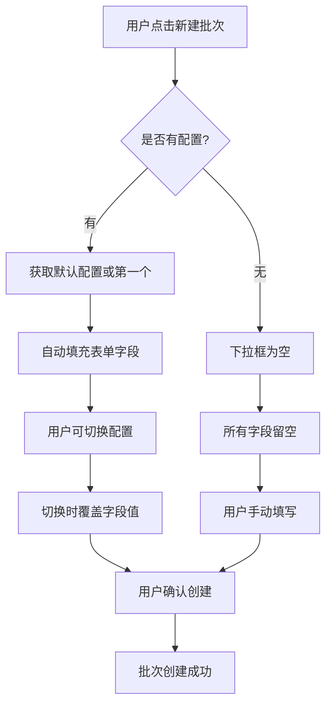
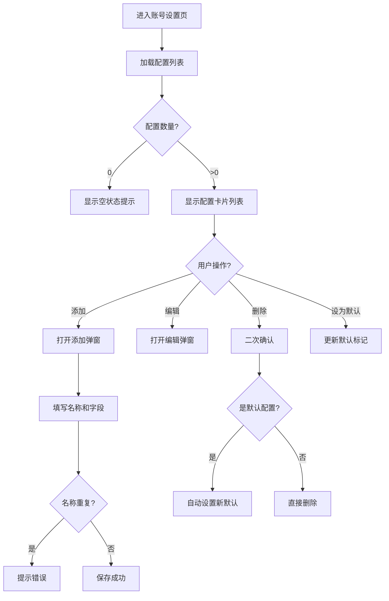

# 报销配置管理 — 技术方案

## 1. 概述

本方案实现"多报销配置管理"功能，用户可添加多个报销配置，新建批次时通过下拉选择快速填充。

**核心改动**：
- 新建 `reimbursement_configs` 表存储多个配置
- 新增配置 CRUD API
- 重构账号设置页面展示配置列表
- 新建批次时下拉选择配置

---

## 2. 数据模型设计

### 2.1 新增表：`reimbursement_configs`

```python
# server/app/models/reimbursement_config.py

class ReimbursementConfig(Base):
    __tablename__ = "reimbursement_configs"

    id: Mapped[int] = mapped_column(Integer, primary_key=True, autoincrement=True)
    user_id: Mapped[int] = mapped_column(Integer, nullable=False, index=True)  # → AC-001, AC-002
    name: Mapped[str] = mapped_column(String(50), nullable=False)  # 配置名称，必填 → AC-009
    department: Mapped[str | None] = mapped_column(String(100), nullable=True)
    reporter: Mapped[str | None] = mapped_column(String(50), nullable=True)
    payee: Mapped[str | None] = mapped_column(String(50), nullable=True)
    bank_account: Mapped[str | None] = mapped_column(String(30), nullable=True)
    bank_name: Mapped[str | None] = mapped_column(String(100), nullable=True)
    is_default: Mapped[bool] = mapped_column(Boolean, default=False)  # 是否默认 → AC-007, AC-016
    created_at: Mapped[datetime] = mapped_column(DateTime, server_default=func.now())
    updated_at: Mapped[datetime] = mapped_column(DateTime, server_default=func.now(), onupdate=func.now())
```

**索引设计**：
- `user_id` 索引：按用户查询配置列表
- `(user_id, name)` 唯一索引：保证同一用户下配置名称唯一 → AC-010, AC-015

### 2.2 数据迁移策略

**保留 User 表原有默认值字段**：
- 兼容性考虑：旧数据仍可读取
- 迁移逻辑：首次使用新功能时，将 User 默认值字段迁移为第一个配置

**迁移脚本**（Alembic）：
```python
# alembic/versions/xxx_add_reimbursement_configs.py

def upgrade():
    # 1. 创建 reimbursement_configs 表
    op.create_table(
        'reimbursement_configs',
        sa.Column('id', sa.Integer(), primary_key=True),
        sa.Column('user_id', sa.Integer(), nullable=False),
        sa.Column('name', sa.String(50), nullable=False),
        sa.Column('department', sa.String(100)),
        sa.Column('reporter', sa.String(50)),
        sa.Column('payee', sa.String(50)),
        sa.Column('bank_account', sa.String(30)),
        sa.Column('bank_name', sa.String(100)),
        sa.Column('is_default', sa.Boolean(), default=False),
        sa.Column('created_at', sa.DateTime(), server_default=sa.func.now()),
        sa.Column('updated_at', sa.DateTime(), server_default=sa.func.now()),
    )
    op.create_index('ix_reimbursement_configs_user_id', 'reimbursement_configs', ['user_id'])
    op.create_unique_constraint('uq_user_config_name', 'reimbursement_configs', ['user_id', 'name'])

    # 2. 迁移现有 User 默认值数据
    connection = op.get_bind()
    users = connection.execute(sa.text("SELECT id, default_department, default_reporter, default_payee, default_bank_account, default_bank_name FROM users"))
    for user in users:
        if any([user.default_department, user.default_reporter, user.default_payee, user.default_bank_account, user.default_bank_name]):
            connection.execute(
                sa.text("""
                    INSERT INTO reimbursement_configs (user_id, name, department, reporter, payee, bank_account, bank_name, is_default)
                    VALUES (:user_id, :name, :department, :reporter, :payee, :bank_account, :bank_name, :is_default)
                """),
                {
                    'user_id': user.id,
                    'name': '默认配置',
                    'department': user.default_department,
                    'reporter': user.default_reporter,
                    'payee': user.default_payee,
                    'bank_account': user.default_bank_account,
                    'bank_name': user.default_bank_name,
                    'is_default': True,
                }
            )
```

---

## 3. API 设计

### 3.1 新增 API 端点

| 端点 | 方法 | 说明 | 对应 AC |
|------|------|------|---------|
| `/api/configs` | GET | 获取当前用户的配置列表 | AC-002 |
| `/api/configs` | POST | 创建新配置 | AC-001, AC-009, AC-010 |
| `/api/configs/{id}` | PUT | 更新配置 | AC-003, AC-014 |
| `/api/configs/{id}` | DELETE | 删除配置 | AC-004, AC-011, AC-012, AC-013 |
| `/api/configs/{id}/set-default` | POST | 设置为默认配置 | AC-007, AC-016 |

### 3.2 Schema 定义

```python
# server/app/schemas/reimbursement_config.py

class CreateConfigRequest(BaseModel):
    name: str = Field(..., min_length=1, max_length=50)  # 必填 → AC-009
    department: str | None = Field(default=None, max_length=100)
    reporter: str | None = Field(default=None, max_length=50)
    payee: str | None = Field(default=None, max_length=50)
    bank_account: str | None = Field(default=None, max_length=30)
    bank_name: str | None = Field(default=None, max_length=100)

class UpdateConfigRequest(BaseModel):
    name: str | None = Field(default=None, min_length=1, max_length=50)
    department: str | None = Field(default=None, max_length=100)
    reporter: str | None = Field(default=None, max_length=50)
    payee: str | None = Field(default=None, max_length=50)
    bank_account: str | None = Field(default=None, max_length=30)
    bank_name: str | None = Field(default=None, max_length=100)

class ConfigResponse(BaseModel):
    id: int
    name: str
    department: str | None
    reporter: str | None
    payee: str | None
    bank_account: str | None
    bank_name: str | None
    is_default: bool
    created_at: datetime
    updated_at: datetime

    model_config = {"from_attributes": True}

class ConfigListResponse(BaseModel):
    items: list[ConfigResponse]
    total: int
```

### 3.3 API 实现要点

**创建配置（POST /api/configs）**：
```python
@router.post("/", response_model=ConfigResponse, status_code=201)
async def create_config(
    data: CreateConfigRequest,
    current_user: User = Depends(get_current_user),
    db: Session = Depends(get_db),
):
    # 1. 检查名称是否重复 → AC-010, AC-015
    existing = db.query(ReimbursementConfig).filter(
        ReimbursementConfig.user_id == current_user.id,
        ReimbursementConfig.name == data.name,
    ).first()
    if existing:
        raise HTTPException(400, detail={"code": "CONFIG_NAME_EXISTS", "message": "配置名称已存在"})
    
    # 2. 如果是用户的第一个配置，自动设为默认 → BR-004
    count = db.query(ReimbursementConfig).filter(ReimbursementConfig.user_id == current_user.id).count()
    is_default = count == 0
    
    # 3. 创建配置
    config = ReimbursementConfig(
        user_id=current_user.id,
        name=data.name,
        department=data.department,
        reporter=data.reporter,
        payee=data.payee,
        bank_account=data.bank_account,
        bank_name=data.bank_name,
        is_default=is_default,
    )
    db.add(config)
    db.commit()
    return config
```

**设置默认配置（POST /api/configs/{id}/set-default）**：
```python
@router.post("/{config_id}/set-default", response_model=ConfigResponse)
async def set_default_config(
    config_id: int,
    current_user: User = Depends(get_current_user),
    db: Session = Depends(get_db),
):
    # 1. 查询目标配置
    config = db.query(ReimbursementConfig).filter(
        ReimbursementConfig.id == config_id,
        ReimbursementConfig.user_id == current_user.id,
    ).first()
    if not config:
        raise HTTPException(404, detail={"code": "CONFIG_NOT_FOUND", "message": "配置不存在"})
    
    # 2. 取消当前默认配置 → AC-016
    db.query(ReimbursementConfig).filter(
        ReimbursementConfig.user_id == current_user.id,
        ReimbursementConfig.is_default == True,
    ).update({"is_default": False})
    
    # 3. 设置新默认
    config.is_default = True
    db.commit()
    return config
```

**删除配置（DELETE /api/configs/{id}）**：
```python
@router.delete("/{config_id}")
async def delete_config(
    config_id: int,
    current_user: User = Depends(get_current_user),
    db: Session = Depends(get_db),
):
    # 1. 查询配置
    config = db.query(ReimbursementConfig).filter(
        ReimbursementConfig.id == config_id,
        ReimbursementConfig.user_id == current_user.id,
    ).first()
    if not config:
        raise HTTPException(404, detail={"code": "CONFIG_NOT_FOUND", "message": "配置不存在"})
    
    # 2. 删除配置（不影响已有批次） → AC-011
    was_default = config.is_default
    db.delete(config)
    
    # 3. 如果删除的是默认配置，自动将第一个设为默认 → AC-013, BR-006
    if was_default:
        first_config = db.query(ReimbursementConfig).filter(
            ReimbursementConfig.user_id == current_user.id,
        ).order_by(ReimbursementConfig.created_at).first()
        if first_config:
            first_config.is_default = True
    
    db.commit()
    return {"deleted": True}
```

---

## 4. 前端设计

### 4.1 类型定义

```typescript
// web/src/types/reimbursementConfig.ts

export interface ReimbursementConfig {
  id: number;
  name: string;
  department: string | null;
  reporter: string | null;
  payee: string | null;
  bank_account: string | null;
  bank_name: string | null;
  is_default: boolean;
  created_at: string;
  updated_at: string;
}

export interface CreateConfigRequest {
  name: string;
  department?: string | null;
  reporter?: string | null;
  payee?: string | null;
  bank_account?: string | null;
  bank_name?: string | null;
}

export interface UpdateConfigRequest {
  name?: string | null;
  department?: string | null;
  reporter?: string | null;
  payee?: string | null;
  bank_account?: string | null;
  bank_name?: string | null;
}

export interface ConfigListResponse {
  items: ReimbursementConfig[];
  total: number;
}
```

### 4.2 API 层

```typescript
// web/src/api/configs.ts

import { apiClient } from './client';
import type { ReimbursementConfig, CreateConfigRequest, UpdateConfigRequest, ConfigListResponse } from '@/types/reimbursementConfig';

export const configsApi = {
  list: async (): Promise<ConfigListResponse> => {
    const r = await apiClient.get('/configs');
    return r.data;
  },

  create: async (data: CreateConfigRequest): Promise<ReimbursementConfig> => {
    const r = await apiClient.post('/configs', data);
    return r.data;
  },

  update: async (id: number, data: UpdateConfigRequest): Promise<ReimbursementConfig> => {
    const r = await apiClient.put(`/configs/${id}`, data);
    return r.data;
  },

  delete: async (id: number): Promise<void> => {
    await apiClient.delete(`/configs/${id}`);
  },

  setDefault: async (id: number): Promise<ReimbursementConfig> => {
    const r = await apiClient.post(`/configs/${id}/set-default`);
    return r.data;
  },
};
```

### 4.3 Store 层

```typescript
// web/src/stores/configStore.ts

import { create } from 'zustand';
import { configsApi } from '@/api/configs';
import type { ReimbursementConfig, CreateConfigRequest, UpdateConfigRequest } from '@/types/reimbursementConfig';

interface ConfigState {
  configs: ReimbursementConfig[];
  loading: boolean;
  error: string | null;
  fetchConfigs: () => Promise<void>;
  createConfig: (data: CreateConfigRequest) => Promise<void>;
  updateConfig: (id: number, data: UpdateConfigRequest) => Promise<void>;
  deleteConfig: (id: number) => Promise<void>;
  setDefaultConfig: (id: number) => Promise<void>;
  clearError: () => void;
}

export const useConfigStore = create<ConfigState>((set, get) => ({
  configs: [],
  loading: false,
  error: null,

  fetchConfigs: async () => {
    set({ loading: true, error: null });
    try {
      const res = await configsApi.list();
      set({ configs: res.items, loading: false });
    } catch (e) {
      set({ error: '获取配置列表失败', loading: false });
    }
  },

  createConfig: async (data) => {
    try {
      await configsApi.create(data);
      await get().fetchConfigs();
    } catch (e: any) {
      const msg = e.response?.data?.message || '创建配置失败';
      set({ error: msg });
      throw e;
    }
  },

  updateConfig: async (id, data) => {
    try {
      await configsApi.update(id, data);
      await get().fetchConfigs();
    } catch (e: any) {
      const msg = e.response?.data?.message || '更新配置失败';
      set({ error: msg });
      throw e;
    }
  },

  deleteConfig: async (id) => {
    try {
      await configsApi.delete(id);
      await get().fetchConfigs();
    } catch (e) {
      set({ error: '删除配置失败' });
      throw e;
    }
  },

  setDefaultConfig: async (id) => {
    try {
      await configsApi.setDefault(id);
      await get().fetchConfigs();
    } catch (e) {
      set({ error: '设置默认配置失败' });
      throw e;
    }
  },

  clearError: () => set({ error: null }),
}));
```

### 4.4 账号设置页面重构

**UserSettingsPage 改动**：
- 移除单一默认值表单
- 展示配置列表（卡片形式）
- 添加"添加配置"按钮
- 每个配置卡片：名称 + 报账人 + 收款人摘要 + 编辑/删除/设为默认按钮

```tsx
// web/src/pages/UserSettingsPage.tsx 核心结构

export function UserSettingsPage() {
  const { configs, loading, fetchConfigs, createConfig, updateConfig, deleteConfig, setDefaultConfig } = useConfigStore();
  const [addModalOpen, setAddModalOpen] = useState(false);
  const [editModalOpen, setEditModalOpen] = useState(false);
  const [editingConfig, setEditingConfig] = useState<ReimbursementConfig | null>(null);

  useEffect(() => { fetchConfigs(); }, [fetchConfigs]);

  return (
    <div>
      <h2>账号设置</h2>
      
      <div className="...">
        <h3>报销配置</h3>
        <p>可添加多个报销配置，新建批次时快速选择填充。</p>
        
        {/* 配置列表 */}
        {configs.map(config => (
          <ConfigCard
            key={config.id}
            config={config}
            onEdit={() => { setEditingConfig(config); setEditModalOpen(true); }}
            onDelete={() => handleDelete(config.id)}
            onSetDefault={() => setDefaultConfig(config.id)}
          />
        ))}
        
        {/* 添加按钮 */}
        <Button onClick={() => setAddModalOpen(true)}>
          <Plus /> 添加配置
        </Button>
      </div>

      {/* 添加配置弹窗 */}
      <ConfigFormModal
        open={addModalOpen}
        onClose={() => setAddModalOpen(false)}
        onSubmit={createConfig}
      />

      {/* 编辑配置弹窗 */}
      <ConfigFormModal
        open={editModalOpen}
        onClose={() => setEditModalOpen(false)}
        initialData={editingConfig}
        onSubmit={(data) => updateConfig(editingConfig!.id, data)}
      />
    </div>
  );
}
```

### 4.5 新建批次页面改动

**BatchesPage 改动**：
- 新增配置下拉选择器
- 选择配置后自动填充字段
- 默认选中默认配置（或第一个）

```tsx
// web/src/pages/BatchesPage.tsx 核心改动

export function BatchesPage() {
  const { configs, fetchConfigs } = useConfigStore();
  const [selectedConfigId, setSelectedConfigId] = useState<number | null>(null);

  useEffect(() => {
    fetchConfigs();
  }, [fetchConfigs]);

  useEffect(() => {
    // 自动选中默认配置 → AC-007, BR-004
    if (configs.length > 0 && selectedConfigId === null) {
      const defaultConfig = configs.find(c => c.is_default) || configs[0];
      setSelectedConfigId(defaultConfig.id);
      applyConfig(defaultConfig);
    }
  }, [configs, selectedConfigId]);

  const applyConfig = (config: ReimbursementConfig) => {
    setForm({
      department: config.department || '',
      reporter: config.reporter || '',
      payee: config.payee || '',
      bank_account: config.bank_account || '',
      bank_name: config.bank_name || '',
      // ... 其他字段保持原逻辑
    });
  };

  const handleConfigChange = (configId: number) => {
    setSelectedConfigId(configId);
    const config = configs.find(c => c.id === configId);
    if (config) applyConfig(config);  // → AC-006
  };

  return (
    <Modal open={createOpen} title="新建报销批次">
      {/* 配置选择器 */}
      <div className="mb-4">
        <label className="...">报销配置</label>
        <select
          value={selectedConfigId || ''}
          onChange={(e) => handleConfigChange(Number(e.target.value))}
          disabled={configs.length === 0}
          className="..."
        >
          {configs.length === 0 ? (
            <option value="">暂无配置，请手动填写</option>
          ) : (
            configs.map(c => (
              <option key={c.id} value={c.id}>
                {c.name} {c.is_default ? '(默认)' : ''}
              </option>
            ))
          )}
        </select>
      </div>

      {/* 原有表单字段 */}
      <Input label="部门" value={form.department} ... />
      ...
    </Modal>
  );
}
```

---

## 5. 核心逻辑流程图

### 5.1 新建批次选择配置流程



### 5.2 配置管理流程



---

## 6. 文件改动清单

### 6.1 后端新增文件

| 文件路径 | 说明 |
|---------|------|
| `server/app/models/reimbursement_config.py` | 配置 ORM 模型 |
| `server/app/schemas/reimbursement_config.py` | 配置 Pydantic schema |
| `server/app/api/configs.py` | 配置 API 路由 |
| `server/app/services/config_service.py` | 配置业务逻辑 |
| `server/alembic/versions/xxx_add_reimbursement_configs.py` | 数据库迁移脚本 |

### 6.2 后端修改文件

| 文件路径 | 改动说明 |
|---------|---------|
| `server/app/api/router.py` | 注册 configs 路由 |
| `server/app/models/__init__.py` | 导入新模型 |

### 6.3 前端新增文件

| 文件路径 | 说明 |
|---------|------|
| `web/src/types/reimbursementConfig.ts` | 配置类型定义 |
| `web/src/api/configs.ts` | 配置 API |
| `web/src/stores/configStore.ts` | 配置状态管理 |
| `web/src/components/settings/ConfigCard.tsx` | 配置卡片组件 |
| `web/src/components/settings/ConfigFormModal.tsx` | 配置表单弹窗 |

### 6.4 前端修改文件

| 文件路径 | 改动说明 |
|---------|---------|
| `web/src/pages/UserSettingsPage.tsx` | 重构为配置列表 |
| `web/src/pages/BatchesPage.tsx` | 新增配置选择器 |

---

## 7. AC 覆盖检查表

| AC | 技术实现 | 状态 |
|----|---------|------|
| AC-001 | POST /api/configs + 前端 ConfigFormModal | ✅ |
| AC-002 | GET /api/configs + UserSettingsPage 配置列表 | ✅ |
| AC-003 | PUT /api/configs/{id} + 编辑弹窗 | ✅ |
| AC-004 | DELETE /api/configs/{id} + 删除确认 | ✅ |
| AC-005 | BatchesPage applyConfig() | ✅ |
| AC-006 | BatchesPage handleConfigChange() | ✅ |
| AC-007 | POST /api/configs/{id}/set-default | ✅ |
| AC-008 | BatchesPage configs.length === 0 时下拉为空 | ✅ |
| AC-009 | CreateConfigRequest name 必填 + 前端校验 | ✅ |
| AC-010 | 后端唯一索引 + 重复检测 | ✅ |
| AC-011 | 删除配置不影响批次（批次数据独立） | ✅ |
| AC-012 | 删除唯一配置后列表为空 | ✅ |
| AC-013 | 删除默认配置自动重设 | ✅ |
| AC-014 | 编辑时名称重复校验 | ✅ |
| AC-015 | 后端 (user_id, name) 唯一约束 | ✅ |
| AC-016 | set-default API 取消旧默认 | ✅ |
| AC-017 | BatchesPage 默认选第一个逻辑 | ✅ |
| AC-018 | 批次数据独立存储（已有设计） | ✅ |

---

## 附录：变更记录

| 日期 | 变更内容 |
|------|---------|
| 2026-06-01 | 初始技术方案 |