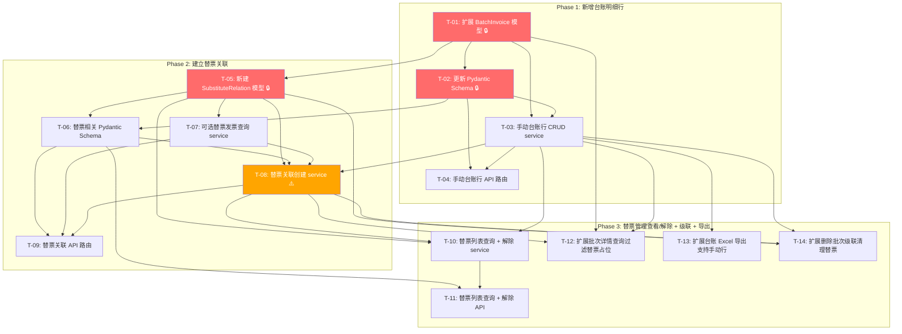

# 替票管理 — 开发任务计划

## 1. 任务概览

**总任务数**：14 个
**预计总工时**：480 分钟（约 8 小时）
**开发方法**：TDD — 每个任务按 RED → GREEN → REFACTOR 循环执行

**关键标注**：
- 🔒 阻塞任务：被多个任务依赖，建议优先完成
- ⚠️ 风险任务：涉及复杂的金额校验和多条记录的原子操作，需要仔细处理事务一致性

### 依赖关系图

### 可并行任务组

| 并行组 | 任务 | 说明 |
|--------|------|------|
| P1 | T-03, T-05 | 两个模型变更完成后，手动行 service 和替票模型可并行 |
| P2 | T-07, T-08 | T-07（可选替票查询）和 T-08（替票创建）部分可并行（但 T-08 聚合逻辑需 T-07 的查询模式参考） |
| P3 | T-11, T-12, T-13, T-14 | Phase 3 的 4 个任务互相无强依赖，可并行开发 |

---

## 2. 开发任务

> 按垂直切片组织。每个阶段对应一个可独立运行和验证的用户行为。切片内部的任务按技术层自然顺序排列（建表 → Schema → Service → API）。
>
> 每个任务按 TDD 循环执行：RED（根据验证标准写测试）→ GREEN（写最小实现通过测试）→ REFACTOR（重构）

---

### 阶段 1：新增台账明细行 ✅

**阶段状态**：已完成（2026-05-19）
**阶段完成标准**：用户在批次详情页的台账表格底部点击"+新增台账行"，填写日期/事由/金额后保存，该行出现在台账预览表格中，可编辑可删除。

**通过测试**：268 tests passed (0 regressions)

---

#### T-01: 扩展 BatchInvoice 模型并执行数据库迁移 🔒

**通俗解释**：数据库里的批次发票关联表现在支持"没有发票的行"了——手动添加的台账行不关联发票，有自己的日期和金额字段。

**做什么**：
1. 在 `models/batch.py` 的 `BatchInvoice` 类中：
   - `invoice_id` 改为 `nullable=True`
   - 新增 `source_type: Mapped[str] = mapped_column(String(20), default="invoice")`（值域: "invoice" | "manual"）
   - 新增 `row_date: Mapped[date | None] = mapped_column(Date, nullable=True)`
   - 新增 `row_amount: Mapped[float | None] = mapped_column(Float, nullable=True)`
2. 执行数据库迁移（Alembic batch mode，SQLite 需要重建表）

**涉及文件**：`server/app/models/batch.py`、`server/alembic/versions/`（新建迁移脚本）

**参考**：技术方案 §3.1（batch_invoices 扩展）→ AC-001, AC-002

**依赖**：无

**预估工时**：30 分钟

**验证标准**（TDD RED 阶段直接转化为测试用例）：
- [ ] `BatchInvoice` 实例化时不传 `invoice_id` → 字段值为 None，写入数据库成功
- [ ] `BatchInvoice(source_type="manual", row_date=date(2025,12,1), row_amount=1000.0)` → 写入后读取，三个字段值正确
- [ ] `BatchInvoice()` 默认值 → `source_type="invoice"`, `row_date=None`, `row_amount=None`
- [ ] 数据库 migration 执行后 `batch_invoices` 表包含 `source_type`、`row_date`、`row_amount` 列
- [ ] 已有数据的 `source_type` 默认值为 `"invoice"`，不影响现有台账查询

---

#### T-02: 更新 Pydantic Schema（手动台账行 + 扩展台账行响应） 🔒

**通俗解释**：前后端之间传递的数据格式更新了——新增手动台账行的请求/响应模型，台账行响应里多了"来源类型"、"手动金额"、"手动日期"字段。

**做什么**：
1. 在 `schemas/batch.py` 中新增：
   - `ManualRowCreateRequest`：
     - `row_date: date | None`（默认 None，后端填充当天）
     - `expense_item: str`（必填，max_length=50）
     - `row_amount: float`（必填，> 0）
     - `quantity: float = 1.0`（≥ 1）
     - `advance_amount: float | None`（默认等于 row_amount）
     - `remark: str | None`
   - `ManualRowResponse`：id, batch_id, source_type, row_date, expense_item, row_amount, quantity, unit_price, advance_amount, remark, is_substitute, substitute_for
   - `ManualRowUpdateRequest`：所有字段 optional（exclude_unset）
   - `ManualRowDeleteResponse`：`deleted: bool`, `released_substitute_count: int`
2. 扩展 `LedgerRowResponse`：
   - 新增 `source_type: str`（"invoice" | "manual"）
   - 新增 `row_amount: float | None`
   - 新增 `row_date: date | None`

**涉及文件**：`server/app/schemas/batch.py`

**参考**：技术方案 §4.1（手动台账行 API）→ AC-001, AC-002, AC-016

**依赖**：T-01

**预估工时**：25 分钟

**验证标准**（TDD RED 阶段直接转化为测试用例）：
- [ ] `ManualRowCreateRequest(expense_item="奖金", row_amount=1000.0)` → 构造成功，quantity 默认 1.0
- [ ] `ManualRowCreateRequest(expense_item="", row_amount=1000.0)` → 不传 expense_item → pydantic ValidationError
- [ ] `ManualRowCreateRequest(expense_item="奖金", row_amount=0)` → pydantic ValidationError（row_amount 必须 > 0）
- [ ] `ManualRowUpdateRequest(row_amount=1200.0)` → 构造成功，其他字段为 None
- [ ] `ManualRowResponse(source_type="manual", row_amount=1000.0)` → 序列化成功，字段完整
- [ ] `LedgerRowResponse` 扩展后兼容旧数据（`source_type="invoice"`, `row_amount=None`, `row_date=None`）→ 序列化无报错

---

#### T-03: 实现手动台账行 CRUD service

**通俗解释**：后端有了"新增/编辑/删除手动台账行"的业务逻辑——新增时会算好单价，编辑时支持联动，删除时如果该行有替票关联也会自动清理。

**做什么**：
1. 在 `services/batch_service.py` 实现：
   - `add_manual_row(db, user_id, batch_id, data: ManualRowCreateRequest)`：
     - 校验 batch 存在且属于当前用户
     - 校验 `data.row_amount > 0`
     - `row_date` 未传默认 `date.today()`
     - 计算 `unit_price = round(row_amount / quantity, 2)`
     - `advance_amount` 未传默认 = `row_amount`
     - INSERT `BatchInvoice`（invoice_id=NULL, source_type="manual"）
     - 返回 `ManualRowResponse`
   - `update_manual_row(db, user_id, batch_id, row_id, data: ManualRowUpdateRequest)`：
     - 校验行存在且 `source_type == "manual"`
     - 若传 `row_amount` → 更新 + 重算 `unit_price`
     - 若传 `quantity` → 校验 ≥1，重算 `unit_price`
     - 若传 `advance_amount` → 直接更新（不联动）
     - 若传 `remark` → 直接更新（保留已有替票后缀）
   - `delete_manual_row(db, user_id, batch_id, row_id)`：
     - 校验行存在且 `source_type == "manual"`
     - 查询该行关联的 `substitute_relations`
     - 对每条 relation → 检查替票发票是否只剩此关联，若是则删除占位 `BatchInvoice`
     - 删除 `substitute_relations` + 手动台账行
     - 返回 `ManualRowDeleteResponse`

**涉及文件**：`server/app/services/batch_service.py`

**参考**：技术方案 §5.1~5.3（手动行 CRUD 核心逻辑）→ AC-001, AC-002, AC-015, AC-016, AC-023, AC-026

**依赖**：T-01, T-02

**预估工时**：45 分钟

**验证标准**（TDD RED 阶段直接转化为测试用例）：
- [ ] `add_manual_row(expense_item="奖金", row_amount=1000.0, quantity=1.0)` → 创建成功，`source_type="manual"`, `invoice_id=None`, `unit_price=1000.00`
- [ ] `add_manual_row(row_amount=1000.0, quantity=4.0)` → `unit_price=250.00`
- [ ] `add_manual_row(advance_amount=None)` → `advance_amount=1000.00`（默认等于 row_amount）
- [ ] `add_manual_row(row_date=None)` → `row_date=date.today()`
- [ ] `add_manual_row(row_amount=0)` → 返回 400，"金额不能为 0 或空"
- [ ] `update_manual_row(row_amount=1200.0)` → 更新成功，`unit_price` 重算为 1200.00（quantity=1）
- [ ] `update_manual_row(quantity=0)` → 返回 400
- [ ] `update_manual_row(advance_amount=80.0)` → 更新成功，再次改 quantity 不影响 advance_amount
- [ ] `delete_manual_row(row_id)` → 行删除，不影响任何 `Invoices` 表数据
- [ ] 手动行有替票关联时 → `delete_manual_row` 自动解除关联，替票发票回到可选池

---

#### T-04: 实现手动台账行 API 路由

**通俗解释**：前端可以调用 `POST/PUT/DELETE /api/batches/{id}/manual-rows` 来增删改手动台账行了。

**做什么**：
1. 修改 `api/batches.py`：
   - `POST /{batch_id}/manual-rows`：接收 `ManualRowCreateRequest`，调用 `add_manual_row()`，返回 201 + `ManualRowResponse`
   - `PUT /{batch_id}/manual-rows/{row_id}`：接收 `ManualRowUpdateRequest`，调用 `update_manual_row()`，返回 200
   - `DELETE /{batch_id}/manual-rows/{row_id}`：调用 `delete_manual_row()`，返回 200 + `ManualRowDeleteResponse`
2. 所有端点鉴权 + batch_id 归属校验

**涉及文件**：`server/app/api/batches.py`

**参考**：技术方案 §4.1（手动台账行 API）→ AC-001, AC-002, AC-016

**依赖**：T-03

**预估工时**：25 分钟

**验证标准**（TDD RED 阶段直接转化为测试用例）：
- [ ] `POST /api/batches/1/manual-rows` 传入 `{"expense_item": "奖金", "row_amount": 1000}` → 201，返回手动行含 id
- [ ] `POST /api/batches/1/manual-rows` 传入 `{"expense_item": "奖金", "row_amount": 0}` → 400，"金额不能为 0 或空"
- [ ] `PUT /api/batches/1/manual-rows/1` 传入 `{"row_amount": 1200}` → 200，返回更新后行
- [ ] `PUT /api/batches/1/manual-rows/1`（该行 source_type="invoice"）→ 400，"只能编辑手动添加的台账行"
- [ ] `DELETE /api/batches/1/manual-rows/1` → 200，`{"deleted": true, "released_substitute_count": 0}`
- [ ] `DELETE /api/batches/1/manual-rows/999` → 404

---

### 阶段 2：建立替票关联 ✅

**阶段状态**：已完成（2026-05-19）
**阶段完成标准**：用户点击"替票管理"→"新建替票关联"，选择替票模式（一对一/一对多/多对一），选择被替换的费用行和替票发票，确认后台账备注自动标注替票信息，替票发票被标记为已占用。

**通过测试**：301 tests passed (0 regressions)

---

#### T-05: 新建 SubstituteRelation 模型并执行数据库迁移 🔒

**通俗解释**：数据库里多了一张"替票关系表"——记录了"哪张发票替了台账中哪个费用行，用的什么模式"。

**做什么**：
1. 新建 `models/substitute.py`：
   - `SubstituteRelation` ORM 模型：
     - `id: int`（PK, autoincrement）
     - `batch_id: int`（NOT NULL, index, FK→reimbursement_batches.id）
     - `substitute_invoice_id: int`（NOT NULL, FK→invoices.id）
     - `target_row_id: int`（NOT NULL, FK→batch_invoices.id, ON DELETE CASCADE）
     - `mode: str`（NOT NULL，值域："one_to_one"/"one_to_many"/"many_to_one"）
     - `created_at: datetime`（server_default=func.now()）
2. 在 `models/__init__.py` 中导入 `SubstituteRelation`
3. 执行数据库迁移（Alembic — CREATE TABLE）

**涉及文件**：`server/app/models/substitute.py`（新建）、`server/app/models/__init__.py`、`server/alembic/versions/`（新建迁移脚本）

**参考**：技术方案 §3.2（substitute_relations 表）→ AC-005, AC-006, AC-007

**依赖**：T-01（确保 batch_invoices 模型已更新）

**预估工时**：25 分钟

**验证标准**（TDD RED 阶段直接转化为测试用例）：
- [ ] `SubstituteRelation(batch_id=1, substitute_invoice_id=10, target_row_id=1, mode="one_to_one")` → 写入数据库成功
- [ ] `mode` 字段写入 "one_to_many"、"many_to_one" → 均可正常读取
- [ ] `target_row_id` 级联删除：删除 batch_invoices 行 → 关联的 substitute_relations 自动删除
- [ ] 数据库 migration 执行后 `sqlite3 .schema substitute_relations` 包含所有字段和索引
- [ ] `idx_sub_relations_batch`、`idx_sub_relations_invoice`、`idx_sub_relations_target` 三个索引已创建

---

#### T-06: 替票相关 Pydantic Schema

**通俗解释**：创建替票关联要传什么、替票发票列表返回什么（含剩余金额）、替票关联列表返回什么——这些数据格式全定义好了。

**做什么**：
1. 在 `schemas/batch.py` 中新增：
   - `SubstituteCreateRequest`：
     - `mode: str`（"one_to_one"/"one_to_many"/"many_to_one"）
     - `substitute_invoice_ids: list[int]`（max_length=20）
     - `target_row_ids: list[int]`（max_length=10）
   - `SubstituteInvoiceItem`：id, invoice_no, amount, invoice_date, category, vendor, file_path, file_original_name, used_as_substitute(float), remaining_amount(float)
   - `SubstituteInvoiceListResponse`：items, total, page, page_size
   - `SubstituteRelationResponse`：id, batch_id, substitute_invoice_id, target_row_id, mode, created_at, substitute_invoice(SubstituteInvoiceItem), target_row(ManualRowResponse)
   - `SubstituteRelationListResponse`：relations: list[SubstituteRelationResponse]
   - `SubstituteCreatedResponse`：relations: list[SubstituteRelationResponse], updated_target_rows: list[ManualRowResponse]

**涉及文件**：`server/app/schemas/batch.py`

**参考**：技术方案 §4.2（替票管理 API）→ AC-004, AC-005, AC-006, AC-007, AC-008

**依赖**：T-02, T-05

**预估工时**：30 分钟

**验证标准**（TDD RED 阶段直接转化为测试用例）：
- [ ] `SubstituteCreateRequest(mode="one_to_one", substitute_invoice_ids=[10], target_row_ids=[1])` → 构造成功
- [ ] `SubstituteCreateRequest(mode="one_to_one", substitute_invoice_ids=[10, 20], target_row_ids=[1])` → pydantic ValidationError（模式参数不匹配）
- [ ] `SubstituteCreateRequest(mode="many_to_one", substitute_invoice_ids=[], target_row_ids=[1])` → pydantic ValidationError（substitute_invoice_ids 不能为空）
- [ ] `SubstituteInvoiceItem(amount=3000, used_as_substitute=1000, remaining_amount=2000)` → 构造成功
- [ ] `SubstituteRelationListResponse` 包含 `relations` 列表，每条含 `mode`、`substitute_invoice`（嵌套对象）、`target_row`（嵌套对象）

---

#### T-07: 实现可选替票发票查询 service

**通俗解释**：开替票选择器时，后端会返回"哪些发票可以作为替票"——只返回已入库且未被占用的发票，每张还告诉你"已经被替了多少，还剩多少可替"。

**做什么**：
1. 在 `services/substitute_service.py`（新建）实现：
   - `list_substitute_invoices(db, user_id, batch_id, keyword=None, page=1, page_size=50)`：
     - 查询 `Invoice`：`status="confirmed"`、`user_id` 匹配
     - 排除已被占用的发票（在任意 `batch_invoices` 中，包括普通引用和替票占位）
     - 对每张发票，聚合查询已替金额：`SELECT COALESCE(SUM(bi.row_amount), 0) FROM substitute_relations sr JOIN batch_invoices bi ON sr.target_row_id = bi.id WHERE sr.substitute_invoice_id = invoice.id`
     - 计算 `remaining_amount = amount - used_as_substitute`
     - keyword 模糊匹配 `invoice_no`、`vendor`
     - 分页返回 `SubstituteInvoiceListResponse`

**涉及文件**：`server/app/services/substitute_service.py`（新建）

**参考**：技术方案 §4.2（GET available-substitute-invoices）、§5.7（剩余金额计算）→ AC-004, AC-011, AC-017, AC-018, AC-019

**依赖**：T-05

**预估工时**：40 分钟

**验证标准**（TDD RED 阶段直接转化为测试用例）：
- [ ] `list_substitute_invoices()` → 仅返回 status=confirmed 的发票，不返回 processing/pending
- [ ] 发票 A 已在任意 batch_invoices 中（被普通占用）→ 不在列表中
- [ ] 发票 B（金额=3000）已被替票使用 1000 → `used_as_substitute=1000.0`, `remaining_amount=2000.0`
- [ ] 发票 C 从未被替票 → `used_as_substitute=0.0`, `remaining_amount=发票金额`
- [ ] `list_substitute_invoices(keyword="咨询")` → 仅返回 vendor 或 invoice_no 含"咨询"的发票
- [ ] 无可选发票 → `{"items": [], "total": 0}`
- [ ] 分页正常：page=1, page_size=5，总发票 12 张 → items 长度 5，total=12

---

#### T-08: 实现替票关联创建 service ⚠️

**通俗解释**：这是替票管理的核心 —— 系统校验金额是否足够、创建替票关系、更新台账备注、标记替票发票已占用，所有操作在一个事务中完成，任何一步失败全部回滚。

**做什么**：
1. 在 `services/substitute_service.py` 实现：
   - `create_substitution(db, user_id, batch_id, data: SubstituteCreateRequest)`：
     - **校验 batch 归属**
     - **校验模式与参数匹配**：
       - `one_to_one`：1 替票 + 1 target
       - `one_to_many`：1 替票 + N targets（N ≥ 1）
       - `many_to_one`：N 替票 + 1 target（N ≥ 1）
     - **校验所有 target_row_ids** 属于当前批次
     - **校验所有 substitute_invoice_ids**：
       - 状态 = "confirmed"
       - 未被占用（batch_invoices 中无记录）
     - **金额校验**：
       - 目标行总金额 = SUM(target_rows 的 row_amount 或关联 invoice.amount)
       - 替票总可用金额 = SUM(每张替票的 amount - 已替总额)
       - 若替票总可用金额 < 目标行总金额 → 400（AC-010, AC-012）
     - **创建替票关联**：FOR EACH (替票, target) 组合：
       - INSERT `substitute_relations`
       - 更新 target `batch_invoices`：`is_substitute=True`, `substitute_for=拼接发票号`, `remark=追加替票信息`
     - **创建占位 batch_invoices**（若该替票发票尚无）：
       - `BatchInvoice(batch_id, invoice_id, source_type="invoice", is_substitute=True)`
     - 全部在事务中 commit（任何异常回滚）

**涉及文件**：`server/app/services/substitute_service.py`

**参考**：技术方案 §5.4（替票关联创建核心逻辑）、§5.6（备注格式）→ AC-005~007, AC-010~013, AC-019~022, AC-024, AC-025

**依赖**：T-03, T-05, T-06

**预估工时**：55 分钟

**验证标准**（TDD RED 阶段直接转化为测试用例）：
- [ ] `create_substitution(mode="one_to_one", substitute_invoice_ids=[10], target_row_ids=[1])` → 成功，返回 relations + updated_target_rows
- [ ] target 行原有 remark="奖金" → 关联后 remark="奖金（替票12345678）"
- [ ] target 行 `is_substitute` 变为 True，`substitute_for` = "替票12345678"
- [ ] 替票发票的占位 `batch_invoices` 被创建（`source_type="invoice"`, `is_substitute=True`）
- [ ] `create_substitution(substitute_invoice_ids=[10], target_row_ids=[1])` 替票金额=500, target 金额=1000 → 400，提示金额不足
- [ ] 发票 A（金额=3000）已替了 2000（剩余 1000），再替 2000 → 400，提示剩余金额不足
- [ ] 发票 A（金额=3000）已替了 1000（剩余 2000），再替 1500 → 成功，剩余 500
- [ ] 替票发票已被其他批次占用 → 400
- [ ] `create_substitution(mode="one_to_one", substitute_invoice_ids=[10, 20], target_row_ids=[1])` → 400，模式参数不匹配
- [ ] target 行不属于该批次 → 400
- [ ] 一对多：1 替票 + 3 targets（金额=1000,1000,500），替票金额=3000 → 成功，3 个 target 均更新备注
- [ ] 多对一：3 替票（金额=400,300,300）+ 1 target（金额=1000）→ 成功，target 备注含 3 个替票号（逗号分隔）
- [ ] 事务回滚：创建过程中某步失败 → 所有 INSERT/UPDATE 均未生效

---

#### T-09: 实现替票关联 API 路由

**通俗解释**：前端可以调用接口获取可选替票发票列表、创建替票关联了。

**做什么**：
1. 修改 `api/batches.py`：
   - `GET /{batch_id}/available-substitute-invoices`：Query 参数 keyword/page/page_size，调用 `list_substitute_invoices()`，返回 200
   - `POST /{batch_id}/substitutions`：接收 `SubstituteCreateRequest`，调用 `create_substitution()`，返回 201 + `SubstituteCreatedResponse`
2. 所有端点鉴权 + batch_id 归属校验

**涉及文件**：`server/app/api/batches.py`

**参考**：技术方案 §4.2（GET available-substitute-invoices、POST substitutions）→ AC-004, AC-005, AC-006, AC-007, AC-010

**依赖**：T-07, T-08

**预估工时**：25 分钟

**验证标准**（TDD RED 阶段直接转化为测试用例）：
- [ ] `GET /api/batches/1/available-substitute-invoices` → 200，返回 items 含 `remaining_amount` 字段
- [ ] `GET /api/batches/1/available-substitute-invoices?keyword=咨询` → 200，仅返回匹配发票
- [ ] `POST /api/batches/1/substitutions` 传入 `{"mode":"one_to_one","substitute_invoice_ids":[10],"target_row_ids":[1]}` → 201，返回 relations + updated_target_rows
- [ ] `POST /api/batches/1/substitutions` 不传 token → 401
- [ ] `POST /api/batches/999/substitutions` batch 不存在或不属于用户 → 404

---

### 阶段 3：替票管理查看/解除 + 级联 + 导出 ✅

**阶段状态**：已完成（2026-05-19）
**阶段完成标准**：用户在替票管理面板中查看所有已建替票关系并可解除；台账详情页正确展示手动行和替票标记（替票占位行不显示）；删除有替票的台账行时自动级联解除；导出台账 Excel 包含手动行和替票备注。

**通过测试**：322 tests passed (0 regressions)

---

#### T-10: 实现替票列表查询 + 解除 service ✅

**通俗解释**：后端可以返回当前批次所有替票关系，也可以解除某个替票关联——解除后会清理备注中的替票信息，替票发票重新可用。

**做什么**：
1. 在 `services/substitute_service.py` 实现：
   - `list_substitutions(db, user_id, batch_id)`：
     - 查询 `substitute_relations` WHERE `batch_id` 匹配
     - JOIN `invoices`（替票发票信息）+ `batch_invoices`（被替换行信息）
     - 返回 `SubstituteRelationListResponse`
   - `remove_substitution(db, user_id, batch_id, sub_id)`：
     - 校验 relation 存在且属于该批次
     - 获取 target_row 和 substitute_invoice
     - 从 target_row.remark 中移除对应替票后缀
     - 若 target_row 再无其他替票关系 → `is_substitute=False`, `substitute_for=None`
     - 删除 `substitute_relations` 记录
     - 检查替票发票是否还有其他替票关系：
       - 若无 → 删除其占位 `batch_invoices`
     - commit

**涉及文件**：`server/app/services/substitute_service.py`

**参考**：技术方案 §5.5（替票关联解除）→ AC-008, AC-014

**依赖**：T-05, T-08（需先有替票数据才能查询/解除）

**预估工时**：40 分钟

**验证标准**（TDD RED 阶段直接转化为测试用例）：
- [ ] `list_substitutions(batch_id=1)`（有 2 个关联）→ 返回 2 条，每条含 `mode`、`substitute_invoice`、`target_row`
- [ ] `list_substitutions(batch_id=1)`（无关联）→ 返回空列表
- [ ] `remove_substitution(sub_id)` → 关联删除，target_row 的 remark 移除替票后缀
- [ ] target_row 有多个替票关联 → 删除一个后 `is_substitute` 仍为 True，`substitute_for` 更新为剩余替票号
- [ ] target_row 只有一个替票关联 → 删除后 `is_substitute=False`, `substitute_for=None`
- [ ] 替票发票只有这一个替票关系 → 删除后占位 `batch_invoices` 被删除
- [ ] 替票发票还有另一个替票关系 → 占位 `batch_invoices` 保留
- [ ] `remove_substitution(sub_id=999)` → 404

---

#### T-11: 实现替票列表查询 + 解除 API 路由 ✅

**通俗解释**：前端可以调用接口查看和解除替票关联了。

**做什么**：
1. 修改 `api/batches.py`：
   - `GET /{batch_id}/substitutions`：调用 `list_substitutions()`，返回 200
   - `DELETE /{batch_id}/substitutions/{sub_id}`：调用 `remove_substitution()`，返回 200 + `{"removed": true}`
2. 所有端点鉴权 + batch_id 归属校验

**涉及文件**：`server/app/api/batches.py`

**参考**：技术方案 §4.2（GET/DELETE substitutions）→ AC-008, AC-014

**依赖**：T-10

**预估工时**：20 分钟

**验证标准**（TDD RED 阶段直接转化为测试用例）：
- [ ] `GET /api/batches/1/substitutions` → 200，返回 relations 列表
- [ ] `GET /api/batches/1/substitutions`（无替票关联）→ 200，`{"relations": []}`
- [ ] `DELETE /api/batches/1/substitutions/1` → 200，`{"removed": true}`
- [ ] `DELETE /api/batches/1/substitutions/999` → 404

---

#### T-12: 扩展批次详情查询——过滤替票占位行 + 返回手动行数据 ✅

**通俗解释**：现在打开批次详情页，台账表格中：替票占位的发票行不会显示，手动添加的台账行正常显示（含替票标记）。

**做什么**：
1. 修改 `services/batch_service.py` 的 `get_batch_detail()`：
   - WHERE 条件新增过滤：排除 `source_type="invoice" AND is_substitute=True` 的行
   - 当 `source_type="manual"` 时：`invoice_id=None`，取 `row_date`、`row_amount`、`expense_item` 填充 `LedgerRowResponse`
   - 当 `source_type="invoice"` 时：走原有逻辑（JOIN Invoice 取发票数据）
2. `LedgerRowResponse` 返回 `source_type`、`row_amount`（手动行）、`row_date`（手动行）

**涉及文件**：`server/app/services/batch_service.py`

**参考**：技术方案 §5.7（台账详情查询扩展）→ AC-003, AC-009

**依赖**：T-01, T-03, T-08（需先有数据才能验证过滤效果）

**预估工时**：30 分钟

**验证标准**（TDD RED 阶段直接转化为测试用例）：
- [ ] 批次有关联发票行（source_type="invoice", is_substitute=False, 2张）+ 替票占位行（source_type="invoice", is_substitute=True, 1张）+ 手动行（source_type="manual", 1条）→ `get_batch_detail` 返回 3 行（排除替票占位行）
- [ ] 手动行的 `source_type="manual"`, `invoice_id=None`, `row_amount=1000.0`, `row_date="2025-12-01"`
- [ ] 手动行有替票关联 → `is_substitute=True`, `substitute_for="替票12345678"`, `remark` 含替票信息
- [ ] 发票行的 `source_type="invoice"`, `invoice_id` 非空, `amount` 来自 Invoice 表
- [ ] 无任何台账行 → `ledger_rows=[]`

---

#### T-13: 扩展台账 Excel 导出——支持手动台账行 ✅

**通俗解释**：导出的台账 Excel 中，手动添加的台账行也正常出现——日期取手动日期、事由取手动事由、金额取手动金额、备注含替票信息。

**做什么**：
1. 修改 `services/excel_service.py` 的 `export_batch_excel()`：
   - 查询台账行时同样过滤替票占位行（`NOT (source_type="invoice" AND is_substitute=True)`）
   - 遍历台账行时按 `source_type` 分支：
     - `"manual"`：日期=row_date, 事由=expense_item, 金额=row_amount, 备注=remark（已含替票信息）
     - `"invoice"`：走原有逻辑（日期=invoice_date, 事由=category, 金额=invoice.amount, 备注=remark）
   - 其他填充逻辑不变（合计行、底部签名区）

**涉及文件**：`server/app/services/excel_service.py`

**参考**：技术方案 §5.8（Excel 导出扩展）→ AC-003

**依赖**：T-03

**预估工时**：30 分钟

**验证标准**（TDD RED 阶段直接转化为测试用例）：
- [ ] 批次有 1 张发票行（金额=34.0）+ 1 条手动行（金额=1000.0）→ 导出 Excel 包含 2 行数据
- [ ] 手动行导出的日期列 = row_date，事由列 = expense_item，金额列 = row_amount
- [ ] 手动行备注列 = remark（含替票信息）
- [ ] 合计行垫款金额 = 所有行（含手动行）的 advance_amount 之和
- [ ] 替票占位行不出现在导出中
- [ ] Excel 文件中手动行与发票行格式一致

---

#### T-14: 扩展删除批次——级联清理替票关系 ✅

**通俗解释**：删除批次时，替票关系也一起清理干净——所有替票发票都回到可选池。

**做什么**：
1. 修改 `services/batch_service.py` 的 `delete_batch()`：
   - 在删除 `batch_invoices` 之前，先删除该批次的所有 `substitute_relations`（或依赖 ON DELETE CASCADE 自动清理）
   - 统计释放的发票数量：`batch_invoices` 中 `source_type="invoice"` 的记录数（含替票占位行）+ `substitute_relations` 中涉及的替票发票数

**涉及文件**：`server/app/services/batch_service.py`

**参考**：技术方案 §5.9（批次删除级联处理）→ AC-015, AC-023

**依赖**：T-03, T-05, T-08

**预估工时**：20 分钟

**验证标准**（TDD RED 阶段直接转化为测试用例）：
- [ ] 批次有 3 张普通发票 + 1 条手动行 + 2 个替票关联（涉及 2 张替票发票）→ 删除批次 → 5 张发票全部回到可选池（3 普通 + 2 替票）
- [ ] `delete_batch` 返回的 `released_invoice_count` 正确统计了所有发票（含替票占位）
- [ ] 删除批次后 `substitute_relations` 表中该批次记录已清理
- [ ] 删除批次后 `list_available_invoices()` 包含所有被释放的发票
- [ ] 删除不存在的批次 → 404

---

## 3. AC 覆盖总表

> 最终检查：每条 AC 是否都有任务承接。这是全文档唯一的 AC 映射汇总。

| AC 编号 | 验收标准概述 | 承接任务 | 验证方式 |
|---------|-------------|---------|---------|
| AC-001 | 新增台账明细行 | T-01, T-02, T-03, T-04 | T-04 验证标准：POST manual-rows → 201，返回手动行 |
| AC-002 | 填写台账明细行并保存（单价自动计算） | T-03, T-04 | T-03 验证标准：row_amount=1000, quantity=1 → unit_price=1000.00 |
| AC-003 | 手动台账行正常导出台账 | T-12, T-13 | T-13 验证标准：手动行数据正确出现在 Excel 中 |
| AC-004 | 替票管理入口 → 获取可选替票发票列表 | T-07, T-09 | T-09 验证标准：GET available-substitute-invoices → 200 |
| AC-005 | 一对一替票关联 | T-08, T-09 | T-08 验证标准：1替票+1target → 成功，备注标注替票信息 |
| AC-006 | 一对多拆分替票关联 | T-08, T-09 | T-08 验证标准：1替票+3targets → 3 个 target 均更新备注 |
| AC-007 | 多对一合并替票关联 | T-08, T-09 | T-08 验证标准：3替票+1target → 备注含 3 个替票号 |
| AC-008 | 替票关联列表展示 | T-10, T-11 | T-11 验证标准：GET substitutions → 返回 relations |
| AC-009 | 台账替票特殊标记 | T-12 | T-12 验证标准：手动行 `is_substitute=True`, `substitute_for` 非空 |
| AC-010 | 替票金额不足时不可确认 | T-08, T-09 | T-08 验证标准：替票500 < target1000 → 400 |
| AC-011 | 替票发票已被占用不可选 | T-07 | T-07 验证标准：已被占用发票不在可选列表中 |
| AC-012 | 替票发票剩余金额不足时显示提示 | T-08 | T-08 验证标准：剩余1000 < 需求2000 → 400 |
| AC-013 | 替票发票按剩余金额可供多笔拆分 | T-08 | T-08 验证标准：剩余2000 够替 1500 → 成功，剩余500 |
| AC-014 | 解除替票关联 → 二次确认 | T-10, T-11 | T-10 验证标准：解除后备注清理，发票回到可选池 |
| AC-015 | 删除有替票关联的台账行 → 自动解除关联 | T-03, T-14 | T-03 验证标准：delete_manual_row 自动解除关联 |
| AC-016 | 新增台账行金额不能为零 | T-02, T-03, T-04 | T-03 验证标准：row_amount=0 → 400 |
| AC-017 | 替票选择器搜索过滤 | T-07, T-09 | T-07 验证标准：keyword="咨询" → 仅返回匹配发票 |
| AC-018 | 无可选替票发票时的空状态 | T-07 | T-07 验证标准：items=[], total=0 |
| AC-019 | 替票发票来源规则（仅 confirmed 且未占用） | T-07 | T-07 验证标准：processing 状态不在列表中 |
| AC-020 | 金额差额不自动处理 | T-08 | T-08 验证标准：创建关联后不调整 target 行金额 |
| AC-021 | 替票发票按剩余金额可用 | T-08 | T-08 验证标准：已替1000（剩余2000）→ 仍可选，剩余2000 |
| AC-022 | 台账备注替票格式 | T-08 | T-08 验证标准：remark="奖金（替票1011, 替票1012）" |
| AC-023 | 新增台账行删除不影响发票 | T-03, T-14 | T-03 验证标准：delete 后 Invoice 表无变化 |
| AC-024 | 替票关联确认后发票标记为已占用 | T-08 | T-08 验证标准：占位 batch_invoices 创建，发票不可再选 |
| AC-025 | 替票仅在同一批次内有效 | T-08 | T-08 验证标准：substitute_relations.batch_id 隔离 |
| AC-026 | 手动台账行可编辑（金额/数量联动） | T-03, T-04 | T-03 验证标准：update row_amount=1200 → unit_price 重算 |

---

## 4. 完成定义

> 所有任务完成后，功能整体交付前的最终确认。

- [ ] 所有 14 个任务的验证标准（测试用例）通过
- [ ] AC 覆盖总表中每条 AC 的验证方式已执行并通过
- [ ] 数据库迁移脚本在测试环境验证通过（ALTER TABLE + CREATE TABLE 无报错）
- [ ] 三种替票模式（一对一/一对多/多对一）均经端到端测试：
  1. 新增手动台账行 → 编辑金额/数量 → 导出 Excel 包含该行
  2. 创建替票关联 → 台账备注正确标注 → 替票发票不可再选
  3. 替票发票按剩余金额拆分 → 多笔费用共享同一张替票发票
  4. 解除替票关联 → 备注清理 → 发票回到可选池
  5. 删除有替票的台账行 → 级联解除并恢复发票
- [ ] 服务启动后 `GET /docs` 可看到 `/api/batches` 下的所有新增接口且可正常调用
- [ ] 台账详情查询过滤替票占位行：替票发票不在台账中显示为独立行
- [ ] Excel 导出包含手动台账行和替票备注，占位行不出现在导出中

---

## 附录：变更记录

| 日期 | 变更内容 | 原因 |
|------|---------|------|
| 2026-05-19 | 初始版本 | — |