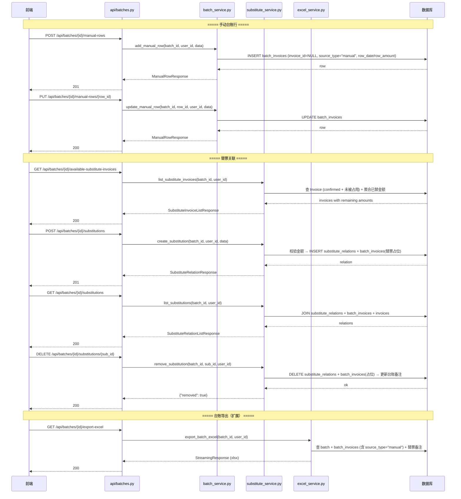

# 替票管理 — 技术设计文档

## 1. 设计概要

**功能描述**：在批次详情页中提供手动添加台账明细行能力，以及三种替票模式（一对一替换/一对多拆分/多对一合并）的完整管理。替票发票按剩余金额可复用于多笔费用，关联后台账备注自动标注替票信息。

**影响范围**：批次模块（`models/batch.py`、`services/batch_service.py`、`schemas/batch.py`、`api/batches.py`）、Excel 导出模块（`services/excel_service.py`）

**技术难点**：
- 替票发票的「隐形占位」机制：发票在 `batch_invoices` 中有记录用于占用标记，但台账查询时不展示
- 替票发票剩余金额的实时计算（SQL 聚合查询）
- 三种替票模式的统一建模（`substitute_relations` 表覆盖所有模式）
- 台账备注自动追加替票信息，且支持多张替票时的逗号分隔

**外部依赖**：无新增依赖。所有操作在现有 SQLAlchemy 2.0 + SQLite 框架内完成。

---

## 2. 架构概览

本次功能在现有批次模块内扩展，跨 4 个层：API 路由层（`api/batches.py` 扩展）→ 服务层（`services/batch_service.py` 扩展 + `services/substitute_service.py` 新增）→ 数据层（`models/batch.py` 扩展 + 新增 `models/substitute.py`）→ Schema 层（`schemas/batch.py` 扩展）。

核心交互链路如下：



---

## 3. 数据库设计

### 3.1 修改现有表

#### `batch_invoices` — 支持手动台账行 + 替票隐形占位 → AC-001, AC-002, AC-005, AC-006, AC-007

**变更内容**：

| 字段名 | 类型 | 约束 | 变更类型 | 说明 |
|--------|------|------|---------|------|
| `invoice_id` | INTEGER | 改为 nullable | **修改** | 手动台账行无发票，`invoice_id=NULL` |
| `source_type` | VARCHAR(20) | NOT NULL, DEFAULT 'invoice' | **新增** | `"invoice"` = 有发票的行, `"manual"` = 手动添加的行 |
| `row_date` | DATE | nullable | **新增** | 手动台账行的日期（发票行从 invoice 取） |
| `row_amount` | FLOAT | nullable | **新增** | 手动台账行的金额（发票行从 invoice 取） |

```sql
-- SQLite ALTER 模拟（实际通过 SQLAlchemy 模型重新定义 + Alembic 迁移）
ALTER TABLE batch_invoices ADD COLUMN source_type VARCHAR(20) NOT NULL DEFAULT 'invoice';
ALTER TABLE batch_invoices ADD COLUMN row_date DATE;
ALTER TABLE batch_invoices ADD COLUMN row_amount FLOAT;
```

**数据迁移**：现有数据均为有发票的行，`source_type` 默认 `"invoice"` 即可，无需迁移。

**注意**：SQLite 中 `invoice_id NOT NULL` 的修改需要重建表（Alembic batch mode），详见迁移脚本。

---

### 3.2 新建表

#### `substitute_relations` — 替票关系表 → AC-005, AC-006, AC-007, AC-008, AC-010~AC-013

| 字段名 | 类型 | 约束 | 说明 |
|--------|------|------|------|
| `id` | INTEGER | PK, autoincrement | |
| `batch_id` | INTEGER | NOT NULL, INDEX | 所属批次（外键关联 `reimbursement_batches.id`） |
| `substitute_invoice_id` | INTEGER | NOT NULL | 替票发票 ID（外键关联 `invoices.id`） |
| `target_row_id` | INTEGER | NOT NULL | 被替换的台账行 ID（外键关联 `batch_invoices.id`） |
| `mode` | VARCHAR(20) | NOT NULL | 替票模式：`"one_to_one"` / `"one_to_many"` / `"many_to_one"` |
| `created_at` | DATETIME | NOT NULL, DEFAULT NOW | 创建时间 |

```sql
CREATE TABLE substitute_relations (
    id INTEGER PRIMARY KEY AUTOINCREMENT,
    batch_id INTEGER NOT NULL,
    substitute_invoice_id INTEGER NOT NULL,
    target_row_id INTEGER NOT NULL,
    mode VARCHAR(20) NOT NULL,
    created_at DATETIME NOT NULL DEFAULT CURRENT_TIMESTAMP,
    FOREIGN KEY (batch_id) REFERENCES reimbursement_batches(id) ON DELETE CASCADE,
    FOREIGN KEY (substitute_invoice_id) REFERENCES invoices(id),
    FOREIGN KEY (target_row_id) REFERENCES batch_invoices(id) ON DELETE CASCADE
);

CREATE INDEX idx_sub_relations_batch ON substitute_relations(batch_id);
CREATE INDEX idx_sub_relations_invoice ON substitute_relations(substitute_invoice_id);
CREATE INDEX idx_sub_relations_target ON substitute_relations(target_row_id);
```

**设计说明**：
- `target_row_id` 指向 `batch_invoices.id`，而非 `invoice_id`，因为被替换行可能是手动台账行（无 invoice_id）
- `mode` 字段记录替票模式，用于前端展示"已有关联列表"（AC-008）
- 单个替票关系为一行记录：一对多时替票发票对应多条（每行一个 target），多对一时多行对应同一个 target
- 剩余金额 = `invoice.amount - SUM(所有关联的 target_row 金额)`，通过 SQL 聚合实时计算，无需额外存储字段

---

### 3.3 数据关系总览

```
reimbursement_batches (1)
    │
    ├── batch_invoices (N)
    │     ├── source_type = "invoice"  → 关联 invoices (invoice_id NOT NULL)
    │     │     ├── is_substitute = False → 普通发票行，台账展示
    │     │     └── is_substitute = True  → 替票占位行，台账不展示（仅用于占用标记）
    │     └── source_type = "manual"   → 无关联发票 (invoice_id NULL)，台账展示
    │
    └── substitute_relations (N)
          ├── substitute_invoice_id → invoices
          └── target_row_id → batch_invoices (被替换行)
```

---

## 4. API 设计

> 所有接口均需鉴权（`Depends(get_current_user)`），数据隔离通过 `user_id` 实现。
> API 风格遵循项目已有约定：路由前缀 `/api/batches`，Pydantic `response_model`，错误返回 `HTTPException`。

---

### 4.1 手动台账行

#### `POST /api/batches/{batch_id}/manual-rows`

**描述**：新增台账明细行 → AC-001, AC-002

**鉴权**：需要登录 + 只能操作自己的批次

**Request**：
```json
{
  "row_date": "2025-12-01",
  "expense_item": "奖金",
  "row_amount": 1000.00,
  "quantity": 1.0,
  "advance_amount": 1000.00,
  "remark": ""
}
```

| 字段 | 类型 | 必填 | 说明 |
|------|------|------|------|
| row_date | date | 否 | 默认当天 |
| expense_item | string | 是 | 事由/费用项目 |
| row_amount | float | 是 | 金额，> 0 → AC-016 |
| quantity | float | 否 | 默认 1.0，≥1 |
| advance_amount | float | 否 | 默认等于 row_amount |
| remark | string | 否 | 备注 |

**Response（成功 201）**：
```json
{
  "id": 1,
  "batch_id": 1,
  "source_type": "manual",
  "row_date": "2025-12-01",
  "expense_item": "奖金",
  "row_amount": 1000.00,
  "quantity": 1.0,
  "unit_price": 1000.00,
  "advance_amount": 1000.00,
  "remark": "",
  "is_substitute": false,
  "substitute_for": null
}
```

**异常响应**：

| 场景 | 状态码 | 响应 | 对应 AC |
|------|--------|------|---------|
| row_amount ≤ 0 或为空 | 400 | `{"detail": "金额不能为 0 或空"}` | AC-016 |

---

#### `PUT /api/batches/{batch_id}/manual-rows/{row_id}`

**描述**：编辑台账明细行 → AC-026

**鉴权**：需要登录 + 只能操作自己的批次

**Request**：所有字段可选（`exclude_unset`）：
```json
{
  "row_amount": 1200.00,
  "quantity": 2.0
}
```

**后端计算**：修改 `quantity` 或 `row_amount` 后，后端重算 `unit_price = row_amount ÷ quantity`。修改 `row_amount` 无需同步替票关联（差额不自动处理 → AC-020）。

**Response（成功 200）**：同创建返回结构

**异常响应**：

| 场景 | 状态码 | 响应 | 备注 |
|------|--------|------|------|
| 台账行不存在或不属于该批次 | 404 | `{"detail": "台账行不存在"}` | — |
| 该行不是手动行 | 400 | `{"detail": "只能编辑手动添加的台账行"}` | 仅 `source_type="manual"` 可编辑 |

---

#### `DELETE /api/batches/{batch_id}/manual-rows/{row_id}`

**描述**：删除台账明细行 → AC-015, AC-023

**鉴权**：需要登录 + 只能操作自己的批次

**处理逻辑**：
1. 校验行存在且属于该批次
2. 校验该行不是 `source_type="invoice"`（有发票的行走原有移除逻辑）
3. 若该行有替票关联 → 删除 `substitute_relations` 中所有关联 + 解除替票发票的占位 `batch_invoices` → AC-015
4. 删除该台账行

**Response（成功 200）**：
```json
{
  "deleted": true,
  "released_substitute_count": 1
}
```

---

### 4.2 替票管理

#### `GET /api/batches/{batch_id}/available-substitute-invoices`

**描述**：获取可选替票发票列表（含每张发票的剩余可替金额） → AC-004, AC-011, AC-018, AC-019

**鉴权**：需要登录 + 只能查自己的批次

**Query 参数**：

| 参数 | 类型 | 必填 | 说明 |
|------|------|------|------|
| keyword | string | 否 | 按发票号、销售方搜索 → AC-017 |
| page | int | 否 | 默认 1 |
| page_size | int | 否 | 默认 50 |

**核心查询逻辑**：
1. 从 `invoices` 中查询 `user_id` 匹配且 `status="confirmed"` 的发票
2. 排除已被占用的发票（`batch_invoices` 中引用过的，包括普通引用和替票占位）
3. 对每张发票，通过 `substitute_relations` 聚合计算已替金额，得出剩余金额

**Response（成功 200）**：
```json
{
  "items": [
    {
      "id": 10,
      "invoice_no": "12345678",
      "amount": 3000.00,
      "invoice_date": "2025-11-15",
      "category": "咨询费",
      "vendor": "某咨询公司",
      "file_path": "/uploads/1/abc.pdf",
      "file_original_name": "咨询费.pdf",
      "used_as_substitute": 1000.00,
      "remaining_amount": 2000.00
    }
  ],
  "total": 3,
  "page": 1,
  "page_size": 50
}
```

| 返回字段 | 说明 |
|----------|------|
| `used_as_substitute` | 该发票已被用作替票的总金额（来自当前批次） |
| `remaining_amount` | `amount - used_as_substitute`，剩余可替金额 |

**异常响应**：

| 场景 | 状态码 | 响应 | 对应 AC |
|------|--------|------|---------|
| 无可选发票 | 200 | `{"items": [], "total": 0}` | AC-018 |

---

#### `POST /api/batches/{batch_id}/substitutions`

**描述**：新建替票关联 → AC-005, AC-006, AC-007, AC-010, AC-012, AC-013, AC-019, AC-020, AC-021, AC-022

**鉴权**：需要登录 + 只能操作自己的批次

**Request**：
```json
{
  "mode": "one_to_one",
  "substitute_invoice_ids": [10],
  "target_row_ids": [1]
}
```

| 字段 | 类型 | 必填 | 说明 |
|------|------|------|------|
| mode | string | 是 | `"one_to_one"` / `"one_to_many"` / `"many_to_one"` |
| substitute_invoice_ids | int[] | 是 | 替票发票 ID 列表（一对一/一对多=1个，多对一=N个） |
| target_row_ids | int[] | 是 | 被替换台账行 ID 列表（一对一/多对一=1个，一对多=N个） |

**处理流程**（详见核心逻辑 5.4）：

**Response（成功 201）**：
```json
{
  "relations": [
    {
      "id": 1,
      "batch_id": 1,
      "substitute_invoice_id": 10,
      "target_row_id": 1,
      "mode": "one_to_one",
      "created_at": "2026-05-19T10:00:00"
    }
  ],
  "updated_target_rows": [
    {
      "id": 1,
      "expense_item": "奖金",
      "row_amount": 1000.00,
      "remark": "奖金（替票12345678）",
      "is_substitute": true,
      "substitute_for": "替票12345678"
    }
  ]
}
```

**异常响应**：

| 场景 | 状态码 | 响应 | 对应 AC |
|------|--------|------|---------|
| 替票发票金额不足 | 400 | `{"detail": "替票发票金额（500.00）不足以替换该费用行（1000.00）"}` | AC-010 |
| 剩余金额不足（已部分使用） | 400 | `{"detail": "该发票剩余金额（1000.00）不足以替换该费用行（2000.00）"}` | AC-012 |
| 发票已被占用 | 400 | `{"detail": "发票#10已被占用"}` | AC-011 |
| 台账行不属于该批次 | 400 | `{"detail": "台账行#1不属于该批次"}` | — |
| 模式与参数不匹配 | 400 | `{"detail": "一对一模式需1张替票+1个目标行"}` | — |

---

#### `GET /api/batches/{batch_id}/substitutions`

**描述**：获取批次内所有替票关联列表 → AC-008

**鉴权**：需要登录 + 只能查自己的批次

**Response（成功 200）**：
```json
{
  "relations": [
    {
      "id": 1,
      "mode": "one_to_one",
      "substitute_invoice": {
        "id": 10,
        "invoice_no": "12345678",
        "amount": 1000.00,
        "category": "交通票"
      },
      "target_row": {
        "id": 1,
        "expense_item": "奖金",
        "row_amount": 1000.00,
        "source_type": "manual"
      },
      "created_at": "2026-05-19T10:00:00"
    }
  ]
}
```

---

#### `DELETE /api/batches/{batch_id}/substitutions/{sub_id}`

**描述**：解除替票关联 → AC-014

**鉴权**：需要登录 + 只能操作自己的批次

**处理逻辑**（详见核心逻辑 5.5）

**Response（成功 200）**：
```json
{
  "removed": true
}
```

---

### 4.3 台账详情（扩展现有接口）

#### `GET /api/batches/{batch_id}` — **扩展**

**变更内容**：`LedgerRowResponse` 扩展字段以支持手动台账行和替票标记。

扩展后的 `LedgerRowResponse`：
```json
{
  "id": 1,
  "source_type": "manual",
  "invoice_id": null,
  "invoice_date": "2025-12-01",
  "category": null,
  "amount": null,
  "row_amount": 1000.00,
  "row_date": "2025-12-01",
  "expense_item": "奖金",
  "quantity": 1.0,
  "unit_price": 1000.00,
  "advance_amount": 1000.00,
  "remark": "奖金（替票12345678）",
  "invoice_no": null,
  "vendor": null,
  "is_substitute": true,
  "substitute_for": "替票12345678"
}
```

**扩展字段**（相比现有）：

| 字段 | 类型 | 说明 |
|------|------|------|
| `source_type` | string | `"invoice"` / `"manual"` → 前端据此区分行类型 |
| `row_amount` | float\|null | 手动行的金额（发票行为 null，继续用 amount 字段） |
| `row_date` | date\|null | 手动行的日期 |

**查询变更**：`WHERE` 条件新增 `source_type != "invoice" OR is_substitute != True`，即排除替票占位行（发票已关联但仅用于占用标记）→ AC-009。

---

### 4.4 Excel 导出（扩展）

#### `GET /api/batches/{batch_id}/export-excel` — **扩展**

**变更内容**：导出时同时包含 `source_type="invoice"`（非替票占位）和 `source_type="manual"` 的台账行。手动台账行导出时：
- 日期列：取 `row_date`
- 事由列：取 `expense_item`（手动行无 `invoice.category`）
- 金额列：取 `row_amount`
- 备注列：取 `remark`（已含替票信息）

→ AC-003

---

## 5. 核心逻辑

### 5.1 手动台账行创建 → AC-001, AC-002, AC-016, AC-026

**触发条件**：`POST /api/batches/{batch_id}/manual-rows`

**处理流程**：
```
1. 校验 batch 存在且属于当前用户
2. 校验 row_amount > 0（AC-016）
3. 计算 unit_price = row_amount ÷ quantity（精度: round( ,2)）
4. advance_amount 未传则默认 = row_amount
5. row_date 未传则默认 = date.today()
6. INSERT batch_invoices:
     invoice_id = NULL
     source_type = "manual"
     expense_item = request.expense_item
     row_date = request.row_date
     row_amount = request.row_amount
     quantity = request.quantity (default 1.0)
     unit_price = 计算值
     advance_amount = request.advance_amount or row_amount
     remark = request.remark or ""
7. 返回 ManualRowResponse
```

**数据隔离**：手动行删除只清 `batch_invoices` 记录，不影响 `invoices` 表（AC-023）。

---

### 5.2 手动台账行编辑 → AC-026

**触发条件**：`PUT /api/batches/{batch_id}/manual-rows/{row_id}`

**处理流程**：
```
1. 校验 row 存在，且 source_type == "manual"
2. 若传入 row_amount：更新 row_amount + 重算 unit_price
3. 若传入 quantity：校验 ≥1，重算 unit_price
4. 若传入 advance_amount：直接更新（不联动）
5. 若传入 remark：直接更新
6. remark 中包含替票信息的部分保持不丢失
```

> 注意：修改 `row_amount` 后不校验替票发票总金额是否仍然满足。差额不自动处理（AC-020）。

---

### 5.3 手动台账行删除 → AC-015, AC-023

**触发条件**：`DELETE /api/batches/{batch_id}/manual-rows/{row_id}`

**处理流程**：
```
1. 校验 row 存在，且 source_type == "manual"
2. 查询该 row 关联的所有 substitute_relations
3. 对每条 relation:
   a. 获取 substitute_invoice_id
   b. 查询该发票的所有其他替票关系（判断是否为最后一条）
   c. 若为最后一条 → 删除该发票的占位 batch_invoices
   d. 删除 substitute_relations 记录
4. 删除手动台账行 batch_invoices
5. commit
```

→ AC-015：删除台账行时替票关联自动解除，发票回到可选池

---

### 5.4 替票关联创建（核心） → AC-005, AC-006, AC-007, AC-010, AC-012, AC-013

**触发条件**：`POST /api/batches/{batch_id}/substitutions`

**处理流程**：

```
1. 校验 batch 存在且属于当前用户

2. 校验模式与参数匹配：
   one_to_one:  1 替票 + 1 target
   one_to_many: 1 替票 + N targets
   many_to_one: N 替票 + 1 target

3. 校验所有 target_row_ids:
   - 该行存在于当前批次
   - source_type 为 "manual" 或 "invoice" 均可

4. 校验所有 substitute_invoice_ids:
   - status = "confirmed"
   - 未被其他批次占用（batch_invoices 中无记录）
   - 在本批次内未被其他替票和普通发票占用

5. 金额校验：
   计算被替换行总金额 = SUM(target_rows.row_amount/amount)
   计算替票总可用金额:
     对每张替票发票:
       已替总额 = SUM(substitute_relations 中该发票关联的 target 行金额)
       剩余金额 = invoice.amount - 已替总额
   若替票总可用金额 < 被替换行总金额 → 400 报错（AC-010, AC-012）

6. 建立替票关联 + 生成备注：
   FOR EACH (替票发票, 被替换行) 组合:
     a. INSERT substitute_relations (mode, substitute_invoice_id, target_row_id)
     b. 更新 target batch_invoices:
        - is_substitute = True
        - substitute_for = 拼接替票发票号（多张用逗号分隔）→ AC-022
        - remark = 原remark + "(替票{发票号1}, 替票{发票号2}, ...)"
     c. 若该替票发票尚无占位 batch_invoices → 创建一条:
        batch_invoices(batch_id, invoice_id, source_type="invoice", is_substitute=True)
        （此条记录不展示在台账中，仅用于标记发票已占用）

7. commit
```

**关键点**：
- 替票发票按**剩余金额**可用（AC-021）：不要求发票金额 ≥ target 金额的独立性，只需总剩余满足
- 一对多拆分：一张替票发票对应 N 条 `substitute_relations` 记录（同一张发票可反复出现在关系中直到金额用完）
- 备注追加逻辑：先读取现有 remark，再追加 `（替票xxx）`。若已有替票信息且新增时，保留已有的替票部分并追加新的 → AC-022

---

### 5.5 替票关联解除 → AC-014

**触发条件**：`DELETE /api/batches/{batch_id}/substitutions/{sub_id}`

**处理流程**：
```
1. 校验 relation 存在且属于该批次
2. 获取 target_row 和 substitute_invoice
3. 从 target_row.remark 中移除对应替票信息
4. 若 target_row 再无其他替票关系 → is_substitute = False, substitute_for = None
5. 删除该 substitute_relations 记录
6. 检查该替票发票是否还有其他替票关系：
   若没有 → 删除其占位 batch_invoices
7. commit
```

→ AC-014：解除关联后发票回到可选池

---

### 5.6 台账备注替票格式 → AC-022

**生成规则**：

| 场景 | 原始备注 | 替票后 |
|------|---------|--------|
| 无备注 | `""` | `"（替票1011）"` |
| 有备注 | `"国际商务微课制作奖金"` | `"国际商务微课制作奖金（替票1011）"` |
| 多张替票 | `"团建费"` | `"团建费（替票1011, 替票1012, 替票1013）"` |
| 已有替票追加 | `"奖金（替票1011）"` | `"奖金（替票1011, 替票1012）"` |

**实现逻辑**：
1. 读取 `batch_invoices.remark`
2. 移除已有的替票后缀（通过正则 `（替票.*）$`）
3. 追加新替票信息：`{原备注}（替票{发票号1}, 替票{发票号2}, ...）`

---

### 5.7 台账详情查询（扩展） → AC-003, AC-009

**触发条件**：`GET /api/batches/{batch_id}`

**变更**：原有查询需扩展 WHERE 条件以过滤替票占位行，并支持手动台账行。

```python
# 原有逻辑（简化）
rows = db.query(BatchInvoice).filter(BatchInvoice.batch_id == batch_id).all()

# 扩展后
rows = db.query(BatchInvoice).filter(
    BatchInvoice.batch_id == batch_id,
    # 排除替票占位行（source_type="invoice" + is_substitute=True）
    ~((BatchInvoice.source_type == "invoice") & (BatchInvoice.is_substitute == True))
).all()
```

**手动行数据填充**：
```python
if bi.source_type == "manual":
    row = LedgerRowResponse(
        source_type="manual",
        invoice_id=None,
        row_date=bi.row_date,
        row_amount=bi.row_amount,
        expense_item=bi.expense_item,
        # ... 其他字段同 bi 的属性
    )
else:
    invoice = db.query(Invoice).filter(Invoice.id == bi.invoice_id).first()
    row = LedgerRowResponse(
        source_type="invoice",
        invoice_id=bi.invoice_id,
        invoice_date=invoice.invoice_date,
        amount=invoice.amount,
        # ... 其他字段同现有
    )
```

→ AC-003：手动台账行与有发票的行在同一个台账表格中展示
→ AC-009：替票行的 `is_substitute=True`，前端据此渲染特殊标记样式

---

### 5.8 Excel 导出扩展 → AC-003

**触发条件**：`GET /api/batches/{batch_id}/export-excel`

**变更**：原有导出逻辑需同时处理手动台账行。

```python
# 原有：只查有发票的行
rows = db.query(BatchInvoice).filter(
    BatchInvoice.batch_id == batch_id
).all()

# 扩展：排除替票占位行，包含手动行
rows = db.query(BatchInvoice).filter(
    BatchInvoice.batch_id == batch_id,
    ~((BatchInvoice.source_type == "invoice") & (BatchInvoice.is_substitute == True))
).all()

for bi in rows:
    if bi.source_type == "manual":
        date_col = bi.row_date
        category_col = bi.expense_item
        amount_col = bi.row_amount
        remark_col = bi.remark
    else:
        invoice = get_invoice(bi.invoice_id)
        date_col = invoice.invoice_date
        category_col = invoice.category
        amount_col = invoice.amount
        remark_col = bi.remark
    # 填充到 Excel 模版...
```

→ AC-003：手动台账行正常出现在导出的台账 Excel 中

---

### 5.9 批次删除时的级联处理

**触发条件**：`DELETE /api/batches/{batch_id}`（已有接口）

**变更**：现有 `delete_batch` 需扩展级联删除。

```python
# 新增：先删除所有 substitute_relations
db.query(SubstituteRelation).filter(
    SubstituteRelation.batch_id == batch_id
).delete()
# 原有：删除 batch_invoices + ReimbursementBatch
db.query(BatchInvoice).filter(BatchInvoice.batch_id == batch_id).delete()
db.delete(batch)
```

由于 `substitute_relations` 表已设置 `ON DELETE CASCADE`（指向 `reimbursement_batches` 和 `batch_invoices`），删除批次时会自动级联清理替票关系，替票占位的 `batch_invoices` 也会被级联删除。

---

## 6. 代码改动清单

| 模块 / 文件 | 改动内容 | 对应 AC |
|-------------|---------|---------|
| `models/batch.py` — `BatchInvoice` | `invoice_id` 改为 nullable；新增 `source_type`（默认 `"invoice"`）、`row_date`、`row_amount` | AC-001, AC-002 |
| `models/substitute.py` | **新文件**：`SubstituteRelation` ORM 模型 | AC-005~007 |
| `schemas/batch.py` | 新增 `ManualRowCreateRequest`、`ManualRowResponse`、`ManualRowUpdateRequest`；扩展 `LedgerRowResponse` 加 `source_type`、`row_amount`、`row_date`；新增 `SubstituteCreateRequest`、`SubstituteRelationResponse`、`SubstituteInvoiceItem`、`SubstituteInvoiceListResponse`、`SubstituteRelationListResponse` | 全部 AC |
| `api/batches.py` | 新增 7 个端点：manual-rows CRUD + substitutions CRUD + available-substitute-invoices；扩展 `get_batch_detail` 返回值 | AC-001~018 |
| `services/batch_service.py` | 新增 `add_manual_row()`、`update_manual_row()`、`delete_manual_row()`；扩展 `get_batch_detail()`、`delete_batch()` | AC-001~003, AC-015, AC-016, AC-023, AC-026 |
| `services/substitute_service.py` | **新文件**：`list_substitute_invoices()`、`create_substitution()`、`list_substitutions()`、`remove_substitution()` | AC-004~014, AC-017~022, AC-024 |
| `services/excel_service.py` | 扩展 `export_batch_excel()`：支持手动台账行导出 | AC-003 |
| `api/router.py` | 无需改动（`batches_router` 已注册） | — |
| `alembic/versions/` | 新增迁移脚本：修改 `batch_invoices` 表 + 创建 `substitute_relations` 表 | — |

---

## 7. 技术决策

### 决策 1：手动台账行 —— 存 batch_invoices 还是独立表

**背景**：手动台账行无发票，需要在台账中和有发票的行统一展示。

**选项**：
- A: **扩展 batch_invoices** — `invoice_id` 改为 nullable，新增 `source_type` 区分。优势：台账查询单表，无 UNION/JOIN 拼接；代价：字段语义上有 NULL 发票。
- B: **独立 batch_manual_rows 表** — 新建独立表。优势：表职责清晰；代价：台账查询需 UNION 两个表，排序分页复杂。

**结论**：选 A。`invoice_id` nullable 是常见的扩展模式（"可选外键"），台账查询无需改动太多，且 batch_invoices 已有的 `quantity/unit_price/advance_amount/remark` 字段全部可复用。

---

### 决策 2：替票发票的占位机制

**背景**：替票发票需标记为"已占用"（不能再被其他批次选），但不能再台账中展示为独立行。

**选项**：
- A: **隐形 batch_invoices 行** — 创建一条 `is_substitute=True` 的 batch_invoices，台账查询时过滤。优势：复用已有的"占用 = 在 batch_invoices 中有记录"的语义；代价：多一条隐藏记录。
- B: **发票新 status** — 新增 `substituted` 状态标记。优势：不占用 batch_invoices；代价：占用逻辑分裂（有的看 batch_invoices，有的看 status），需要迁移所有查询。

**结论**：选 A。一致的"占用"语义最重要——所有发票被占用 == 在 batch_invoices 中有记录。台账查询时增加一个简单的 WHERE 过滤即可排除替票占位行。

---

### 决策 3：替票剩余金额 —— 实时计算 vs 持久化存储

**背景**：发票被替了多少、还剩多少可替，需要在可选列表和校验时用到。

**选项**：
- A: **实时 SQL 聚合** — `SELECT SUM(target.row_amount) FROM substitute_relations JOIN batch_invoices ...`。优势：无冗余数据，永不不一致；代价：每次查询需聚合。
- B: **持久化 used_amount 字段** — 在 invoices 或 batch_invoices 加 `used_as_substitute` 字段。优势：查询快；代价：更新时需同步维护，有脏数据风险。

**结论**：选 A。本项目数据量小（单用户、每批次几十条记录），聚合查询性能无问题。避免引入维护同步的逻辑复杂度。

---

### 决策 4：替代方案 —— SubstituteRelation 的设计粒度

**背景**：一对多拆分时，一张替票发票对应多个被替换行，需建多条记录。

**选项**：
- A: **一行 = 一个 (替票发票, 被替换行) 对** — 每条记录是一个原子关系。一对多时 1 发票 + 3 targets = 3 条记录。优势：粒度统一，查询/删除简单；代价：记录数多。
- B: **一行 = 一个替票操作** — 一条记录包含 JSON 数组（`target_row_ids: [1,2,3]`）。优势：记录少；代价：JSON 字段不利于 SQL JOIN 和金额聚合。

**结论**：选 A。关系型数据库应保持关系范式。每行一个 (发票, 目标行) 的原子对，使得解除某个具体关联时只需删除对应行，金额聚合可以通过 SUM 直接得到。

---

### 决策 5：三种替票模式的 API 设计

**背景**：三种模式参数不同（替票/目标数量不同）。

**选项**：
- A: **统一接口** — 一个 `POST /substitutions`，通过 `mode` + 数组参数区分。优势：接口少，前端只需一个表单；代价：后端需分支处理校验。
- B: **三个独立端点** — `POST /one-to-one`、`POST /one-to-many`、`POST /many-to-one`。优势：校验简单；代价：接口多。

**结论**：选 A。三种模式在数据结构上完全相同（都是 `substitute_relations` 表的行），区别仅在校验的数组长度。统一接口减少路由复杂度，模式校验在 service 层集中处理。

---

## 8. 安全与性能

**输入校验**：
- `row_amount` 必须 > 0（AC-016）
- `quantity` 必须 ≥ 1.0
- 替票 `invoice_ids` 上限 20 张（多对一限制）
- 被替换 `target_row_ids` 上限 10 行（一对多限制）
- 所有批次操作校验 `user_id` 归属

**事务一致性**：
- 替票创建操作使用事务：INSERT `substitute_relations` + UPDATE `batch_invoices`（备注） + INSERT 占位 `batch_invoices`，任一步失败全部回滚

**性能考量**：
- 可选替票发票列表带分页（默认 50 条）
- 剩余金额通过单次子查询聚合，避免 N+1
- 台账详情查询一次 JOIN 返回所有行

---

## 9. AC 覆盖总表

| AC 编号 | 验收标准概述 | 实现位置 |
|---------|-------------|---------|
| AC-001 | 新增台账明细行 | `POST /batches/{id}/manual-rows` + `add_manual_row()` |
| AC-002 | 填写台账明细行并保存 | `POST /batches/{id}/manual-rows` + 5.1 核心逻辑 |
| AC-003 | 手动台账行正常导出台账 | `services/excel_service.py` 扩展 + 5.8 |
| AC-004 | 替票管理入口 → 获取可选替票发票 | `GET /batches/{id}/available-substitute-invoices` |
| AC-005 | 一对一替票关联 | `POST /batches/{id}/substitutions` + 5.4 |
| AC-006 | 一对多拆分替票关联 | `POST /batches/{id}/substitutions` + 5.4 |
| AC-007 | 多对一合并替票关联 | `POST /batches/{id}/substitutions` + 5.4 |
| AC-008 | 替票关联列表展示 | `GET /batches/{id}/substitutions` + `list_substitutions()` |
| AC-009 | 台账替票特殊标记 | `get_batch_detail()` 扩展（返回 `is_substitute`）+ 前端渲染 |
| AC-010 | 替票金额不足时不可确认 | 5.4 金额校验 → 400 |
| AC-011 | 替票发票已被占用不可选 | `list_substitute_invoices()` 排除逻辑 |
| AC-012 | 剩余金额不足时显示提示 | 5.4 金额校验 → 400 |
| AC-013 | 替票发票按剩余金额可供多笔 | 5.4 剩余金额计算逻辑 |
| AC-014 | 解除替票关联 → 二次确认 | `DELETE /batches/{id}/substitutions/{sub_id}` + 5.5 |
| AC-015 | 删除有替票关联的台账行 → 自动解除 | `delete_manual_row()` + 5.3 |
| AC-016 | 新增台账行金额不能为零 | 5.1 校验 → 400 |
| AC-017 | 替票选择器搜索过滤 | `GET /batches/{id}/available-substitute-invoices` query 参数 `keyword` |
| AC-018 | 无可选替票发票时空状态 | `list_substitute_invoices()` 返回空列表 |
| AC-019 | 替票发票来源规则 | `list_substitute_invoices()` status="confirmed" + 未占用过滤 |
| AC-020 | 金额差额不自动处理 | 5.4 创建关联后不调整 target 行金额 |
| AC-021 | 替票发票按剩余金额可用 | 5.4 剩余金额计算公式 |
| AC-022 | 台账备注替票格式 | 5.6 备注生成规则 |
| AC-023 | 新增台账行删除不影响发票 | 5.3 `delete_manual_row()` |
| AC-024 | 替票关联确认后发票标记为已占用 | 5.4 占位 batch_invoices 创建 |
| AC-025 | 替票仅在同一批次内有效 | `substitute_relations.batch_id` 隔离 |
| AC-026 | 手动台账行可编辑 | `PUT /batches/{id}/manual-rows/{row_id}` + 5.2 |

---

## 附录：变更记录

| 日期 | 变更内容 | 原因 |
|------|---------|------|
| 2026-05-19 | 初始版本 | — |
