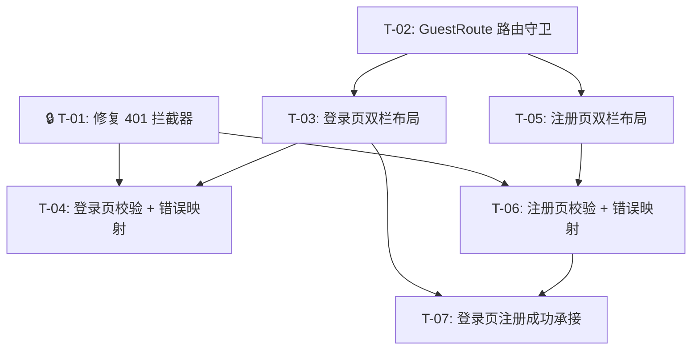

# 登录与注册 — 开发任务计划

## 1. 任务概览

**总任务数**：7 个
**预计总工时**：120 分钟（约 2 小时）
**开发方法**：TDD — 每个任务按 RED → GREEN → REFACTOR 循环执行

**关键标注**：
- 🔒 阻塞任务：被多个任务依赖，建议优先完成
- ⚠️ 风险任务：无（本功能纯前端改动，无高风险点）

### 依赖关系图

### 可并行任务组

| 并行组 | 任务 | 说明 |
|--------|------|------|
| 组 1 | T-01 + T-02 | 401 修复和 GuestRoute 互不依赖 |
| 组 2 | T-03 + T-05 | 登录页和注册页布局互不依赖，都依赖 T-02 |
| 组 3 | T-04 + T-06 | 校验逻辑互不依赖，都依赖 T-01 + 各自布局 |

---

## 2. 开发任务

### 阶段 0：基础设施修复（401 拦截器）

**阶段完成标准**：登录失败时页面不再刷新，错误提示能正常展示。

---

#### Task-01: 修复 401 拦截器 🔒

**通俗解释**：登录失败时不再出现页面闪烁/刷新，错误信息能正常显示在页面上。

**做什么**：修改 `api/client.ts` 响应拦截器，对 `/auth/login` 和 `/auth/register` 请求返回的 401 不做跳转，交由页面层自行处理。

**涉及文件**：`web/src/api/client.ts`

**参考**：技术方案 §5.1 → AC-008, AC-009, AC-010, AC-011

**依赖**：无

**预估工时**：10 分钟

**验证标准**（TDD RED 阶段直接转化为测试用例）：
- [ ] 请求 URL 包含 `/auth/login` 且返回 401 → `Promise.reject(error)` 被正常抛出到调用方，`window.location.href` 不被修改
- [ ] 请求 URL 包含 `/auth/register` 且返回 409 → 同上（409 不走 401 分支，但依然正常抛出）
- [ ] 请求 URL 为 `/invoices` 且返回 401 → token 被清除，`window.location.href` 被设置为 `/login`
- [ ] 请求 URL 为 `/batches` 且返回 401 → 同上，token 被清除并跳转登录页

---

### 阶段 1：路由守卫

**阶段完成标准**：已登录用户在地址栏输入 `/login`，自动跳转到工作台 `/dashboard`。

---

#### Task-02: 添加 GuestRoute 路由守卫

**通俗解释**：已经登录的用户不会再看到登录/注册页面，直接进入工作台。

**做什么**：在 `App.tsx` 中新增 `GuestRoute` 组件（与已有 `PrivateRoute` 相反：有 token → 跳 `/dashboard`），用其包裹 `/login` 和 `/register` 两个路由。

**涉及文件**：`web/src/App.tsx`

**参考**：技术方案 §5.6 → AC-002

**依赖**：无

**预估工时**：10 分钟

**验证标准**（TDD RED 阶段直接转化为测试用例）：
- [ ] localStorage 中有 `easybx_token`，访问 `/login` → `Navigate` 跳转到 `/dashboard`，不渲染 LoginPage
- [ ] localStorage 中有 `easybx_token`，访问 `/register` → `Navigate` 跳转到 `/dashboard`，不渲染 RegisterPage
- [ ] localStorage 中无 `easybx_token`，访问 `/login` → 正常渲染 LoginPage（行为不变）
- [ ] localStorage 中无 `easybx_token`，访问 `/register` → 正常渲染 RegisterPage（行为不变）

---

### 阶段 2：登录页体验

**阶段完成标准**：用户可以打开一个视觉统一的登录页，提交空字段会看到红色提示，提交错误密码会看到精准的错误文案，修改内容后错误消失。

---

#### Task-03: 登录页双栏布局

**通俗解释**：登录页不再是白底居中卡片，变成左侧蓝色品牌区 + 右侧白色表单区的双栏页面，和专业产品一样。

**做什么**：将 LoginPage 从居中卡片布局改为全高双栏布局。左侧 `w-[480px]` 蓝色背景区显示 EasyBX 品牌名和标语，右侧白色区放置原有表单内容。提交中错误提示在用户修改任一字段时清除（`onChange` 中 `setError('')`）。

**涉及文件**：`web/src/pages/LoginPage.tsx`

**参考**：技术方案 §5.8, §5.7 → AC-003, AC-005

**依赖**：T-02（需 GuestRoute 就绪）

**预估工时**：20 分钟

**验证标准**（TDD RED 阶段直接转化为测试用例）：
- [ ] 页面渲染为左右两栏：左侧 `bg-blue-600` 宽度 480px 含标题，右侧 `bg-white` 含表单
- [ ] 左侧品牌区显示"EasyBX"标题和"智能发票报销助手"副标题
- [ ] 右侧表单包含用户名、密码两个 Input 和登录按钮
- [ ] 已有错误提示 → 用户修改用户名或密码 → 错误提示消失
- [ ] 登录按钮为 `type="submit"`，点击或 Enter 触发表单 onSubmit

---

#### Task-04: 登录页前端校验 + 错误映射

**通俗解释**：用户名/密码为空时点登录会被拦截并给出红色提示；密码错误时看到"用户名或密码错误"，密码框被清空且焦点回到密码框；断网时看到"网络连接失败"。

**做什么**：
1. 提交前检查 `username.trim() === ''` 和 `password === ''`，不通过则设置对应 `Input` 的 `error` prop，不发请求
2. `catch(err)` 中按三种类型映射文案：无 `err.response` → 网络错误 / `status 401` → 凭据错误 + 清空密码 + 焦点回密码框 / 其他 → 服务异常

**涉及文件**：`web/src/pages/LoginPage.tsx`

**参考**：技术方案 §5.2, §5.3 → AC-006, AC-008, AC-010, AC-011

**依赖**：T-01, T-03

**预估工时**：25 分钟

**验证标准**（TDD RED 阶段直接转化为测试用例）：
- [ ] 用户名为空，密码填任意值，点击登录 → 不发 `POST /api/auth/login`，用户名 Input 下方显示红色"请输入用户名"
- [ ] 密码为空，用户名填任意值，点击登录 → 不发请求，密码 Input 下方显示红色"请输入密码"
- [ ] 两者都不为空，点击登录 → 正常发起请求
- [ ] 后端返回 401（`INVALID_CREDENTIALS`）→ 显示红色"用户名或密码错误"，密码框内容被清空，焦点在密码输入框上
- [ ] 请求超时或无网络（`err.response` 为 `undefined`）→ 显示红色"网络连接失败，请稍后重试"，按钮恢复可点击
- [ ] 后端返回 500 → 显示红色"服务异常，请稍后重试"，按钮恢复可点击

---

### 阶段 3：注册页体验 + 注册成功衔接

**阶段完成标准**：用户打开注册页填写信息，密码少于 6 位被拦截；用户名重复时收到提示；注册成功后自动跳转登录页，页顶显示绿色成功提示，用户名字段自动填入。

---

#### Task-05: 注册页双栏布局

**通俗解释**：注册页和登录页风格一致——左蓝右白双栏布局。

**做什么**：将 RegisterPage 从居中卡片改为与 LoginPage 相同的全高双栏布局。左侧品牌区内容与登录页完全一致。

**涉及文件**：`web/src/pages/RegisterPage.tsx`

**参考**：技术方案 §5.8 → AC-004

**依赖**：T-02

**预估工时**：15 分钟

**验证标准**（TDD RED 阶段直接转化为测试用例）：
- [ ] 页面为左右双栏布局，左侧蓝色品牌区与登录页一致
- [ ] 右侧表单包含用户名、显示名、密码三个 Input 和注册按钮
- [ ] 按钮为 `type="submit"`
- [ ] 底部有"已有账号？登录"链接指向 `/login`

---

#### Task-06: 注册页前端校验 + 错误映射 + 成功跳转

**通俗解释**：密码太短会被提示；用户名已被注册时看到"用户名已存在"；注册成功后自动跳到登录页。

**做什么**：
1. 提交前校验（空字段 + `password.length < 6`），不通过不发送请求
2. 错误类型映射：`status 409`（`USERNAME_EXISTS`）→"用户名已存在"，表单不清空；网络错误 / 服务异常同登录页
3. 注册成功后 `navigate('/login', { state: { registeredUsername: username } })`

**涉及文件**：`web/src/pages/RegisterPage.tsx`

**参考**：技术方案 §5.2, §5.3, §5.4 → AC-004, AC-007, AC-009, AC-010, AC-011

**依赖**：T-01, T-05

**预估工时**：25 分钟

**验证标准**（TDD RED 阶段直接转化为测试用例）：
- [ ] 密码为 `'12345'`（5 位），点击注册 → 不发请求，密码 Input 下方显示"密码至少需要 6 个字符"
- [ ] 密码为 `'123456'`（6 位），点击注册 → 正常发起请求
- [ ] 后端返回 409（`USERNAME_EXISTS`）→ 显示红色"用户名已存在"，用户名/显示名/密码字段内容不清空
- [ ] 网络异常（`err.response` 为 `undefined`）→ 显示"网络连接失败，请稍后重试"
- [ ] 后端返回 500 → 显示"服务异常，请稍后重试"
- [ ] 注册成功 → `navigate('/login')`，URL 变为 `/login`，`location.state` 包含 `{ registeredUsername: 'zhangsan' }`

---

#### Task-07: 登录页注册成功承接

**通俗解释**：从注册页跳过来后，登录页顶部显示绿色的"注册成功，请登录"提示，用户名已经帮你填好了。

**做什么**：LoginPage 中使用 `useLocation` 读取 `state.registeredUsername`，若存在则：设置 `username` state + 显示绿色成功提示条 + 用 `navigate(location.pathname, { replace: true, state: {} })` 清除 state。

**涉及文件**：`web/src/pages/LoginPage.tsx`

**参考**：技术方案 §5.4 → AC-004

**依赖**：T-03, T-06

**预估工时**：15 分钟

**验证标准**（TDD RED 阶段直接转化为测试用例）：
- [ ] `location.state.registeredUsername = 'zhangsan'` → 页面渲染绿色提示条（`bg-green-50 text-green-700`），文案"注册成功，请登录"
- [ ] 用户名 Input 的 value 为 `'zhangsan'`（已自动填入）
- [ ] state 被清除（`navigate` replace 空 state）→ 刷新页面后不再显示绿色提示
- [ ] 无 `location.state` → 不显示绿色提示，用户名 Input 为空白（行为不变）

---

## 3. AC 覆盖总表

| AC 编号 | 验收标准概述 | 承接任务 | 验证方式 |
|---------|-------------|---------|---------|
| AC-001 | 未登录跳转登录页 | 已有代码 | `PrivateRoute`（Phase 0 已实现），未改动 |
| AC-002 | 已登录跳转工作台 | T-02 | 有 token 时访问 `/login` → 跳 `/dashboard` |
| AC-003 | 正确登录跳工作台 + 按钮禁用 | 已有代码 | `handleSubmit` 逻辑（Phase 1.1 已实现），T-03 保持不改 |
| AC-004 | 注册成功跳登录 + 提示 + 用户名回填 | T-06, T-07 | T-06 传 state → T-07 读取并渲染 |
| AC-005 | Enter 键提交 | 已有代码 | `<form onSubmit>` + `Button type="submit"`（Phase 0 已实现） |
| AC-006 | 空字段拦截 — 登录 | T-04 | 空用户名/密码 → 红色错误，不发请求 |
| AC-007 | 密码过短拦截 — 注册 | T-06 | 5 位密码 → 红色"密码至少需要 6 个字符" |
| AC-008 | 登录凭据错误 | T-01, T-04 | 401 → "用户名或密码错误" + 清空密码 + 焦点回密码框 |
| AC-009 | 注册用户名重复 | T-01, T-06 | 409 → "用户名已存在"，表单不清空 |
| AC-010 | 网络异常 | T-01, T-04, T-06 | 无 `err.response` → "网络连接失败，请稍后重试" |
| AC-011 | 服务端未知错误 | T-01, T-04, T-06 | 500 → "服务异常，请稍后重试" |
| AC-012 | Token 存入 localStorage | 已有代码 | `authStore.setToken`（Phase 1.1 已实现），未改动 |
| AC-013 | 退出登录清除 Token | 已有代码 | `AppLayout.handleLogout`（Phase 0 已实现），未改动 |

---

## 4. 完成定义

- [ ] 所有 7 个任务的验证标准通过手动验收
- [ ] AC-002：在已登录状态下访问 `http://localhost:5180/login` → 自动跳转 `/dashboard`
- [ ] AC-004：注册新用户 → 跳到登录页 → 页顶显示绿色提示 + 用户名自动填入
- [ ] AC-006：登录页不填用户名直接点登录 → 显示"请输入用户名"
- [ ] AC-007：注册页输入 5 位密码 → 显示"密码至少需要 6 个字符"
- [ ] AC-008：输入错误密码 → 显示"用户名或密码错误" + 密码被清空
- [ ] AC-009：用已有用户名注册 → 显示"用户名已存在"
- [ ] 登录页和注册页在 Chrome 120+ 中渲染无布局错位
- [ ] TypeScript 编译 `npx tsc --noEmit` 无错误