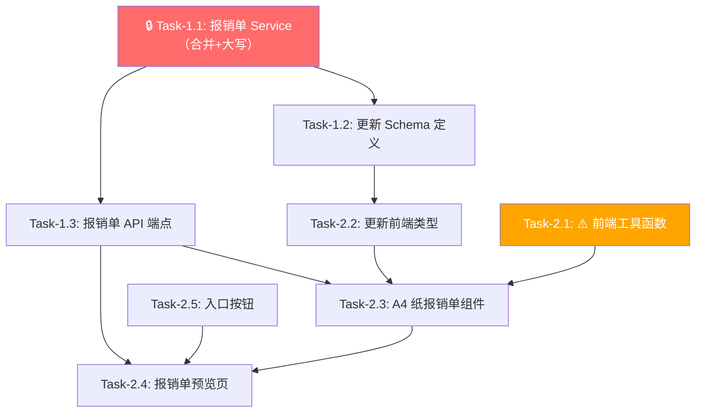

# 费用报销单预览 — 开发任务计划

## 1. 任务概览

**总任务数**：8 个
**预计总工时**：185 分钟（约 3 小时）
**开发方法**：TDD — 每个任务按 RED → GREEN → REFACTOR 循环执行

**关键标注**：
- 🔒 阻塞任务：被多个任务依赖，建议优先完成
- ⚠️ 风险任务：技术难度高，可能需要额外时间

### 依赖关系图

### 可并行任务组

| 并行组 | 任务 | 说明 |
|--------|------|------|
| P1 | Task-1.1 + Task-2.1 | 后端 Service 和前端工具函数无相互依赖，可同时开发 |
| P2 | Task-1.2 + Task-2.5 | Schema 定义和入口按钮互不依赖 |

---

## 2. 开发任务

### 阶段一：后端 — 报销单预览数据 API

**阶段完成标准**：调用 `GET /api/exports/reimbursement-preview/{batch_id}` 能返回正确按类别合并汇总的 JSON 数据（含中文大写金额），空批次返回 400 错误。

---

#### 🔒 Task-1.1: 实现报销单预览 Service 层

**通俗解释**：系统能够把批次里的所有发票按类别（交通费、餐饮费等）分组，计算每个类别的总金额，并生成中文大写的合计金额。

**做什么**：
1. 在 `server/app/services/reimbursement_service.py` 中实现 `get_reimbursement_preview(db, user_id, batch_id)` 函数
2. 查询 `ReimbursementBatch`（校验归属 + 存在性）
3. 查询批次下所有 `BatchInvoice` 行（排除替票行：`is_substitute == False` 或 `substitute_for.isnot(None)`）
4. 对每行确定分组键：发票行取 `Invoice.category`，手动行取 `BatchInvoice.expense_item`
5. 按分组键合并求和，按金额降序排列
6. 实现 `amount_to_chinese(amount: float) -> str` 函数：整数部分逐位转大写 + 单位，角分独立处理

**涉及文件**：`server/app/services/reimbursement_service.py`（新建）

**参考**：技术方案 §5.1、§5.2 → AC-003, AC-006, AC-007, AC-016, AC-017

**依赖**：无

**预估工时**：40 分钟

**验证标准**（TDD RED 阶段直接转化为测试用例）：
- [ ] `amount_to_chinese(468.00)` → `"肆佰陆拾捌元整"`
- [ ] `amount_to_chinese(0.00)` → `"零元整"`
- [ ] `amount_to_chinese(100.50)` → `"壹佰元伍角整"`
- [ ] `amount_to_chinese(0.30)` → `"零元叁角整"`
- [ ] `amount_to_chinese(1000.00)` → `"壹仟元整"`
- [ ] `amount_to_chinese(10001.00)` → `"壹万零壹元整"`
- [ ] `get_reimbursement_preview(db, 1, batch_id)` — 批次有 3 张"交通费"(34+56+78) + 2 张"餐饮费"(100+200) → items 含"交通费"=168.00、"餐饮费"=300.00，total_amount=468.00，total_amount_cn="肆佰陆拾捌元整"
- [ ] 批次有手动台账行"交通费"=50 + 发票行 category="交通费"=100 → 合并为一行"交通费"=150.00
- [ ] 批次不存在 → 抛出 404 错误
- [ ] 批次无任何台账行 → 抛出 400 错误，消息含"批次中没有发票数据"

---

#### Task-1.2: 更新 ReimbursementPreviewResponse Schema

**通俗解释**：调整 API 返回数据的结构，让它包含报销单需要的所有字段（部门、日期、报账人、合并项列表、合计、大写金额）。

**做什么**：
1. 移除旧字段 `period`、`summary`（`ReimbursementItem`）、`attachment_count`
2. 新增字段：`report_date`（`str | None`）、`reporter`（`str`）、`total_amount_cn`（`str`）
3. `ReimbursementItem` 保留 `expense_item: str` 和 `amount: float`

**涉及文件**：`server/app/schemas/export.py`（修改）

**参考**：技术方案 §4 → AC-002, AC-008

**依赖**：Task-1.1（需要知道 Service 返回的数据形）

**预估工时**：10 分钟

**验证标准**（TDD RED 阶段直接转化为测试用例）：
- [ ] `ReimbursementPreviewResponse` 包含字段 `department: str`、`report_date: str | None`、`reporter: str`、`items: list[ReimbursementItem]`、`total_amount: float`、`total_amount_cn: str`
- [ ] `ReimbursementItem` 包含字段 `expense_item: str`、`amount: float`
- [ ] 旧字段 `period`、`attachment_count`、`summary` 不在 Schema 中
- [ ] 用合法 JSON 反序列化不报错

---

#### Task-1.3: 实现 API 端点

**通俗解释**：前端调用 `/api/exports/reimbursement-preview/批次ID` 时，能拿到 Task-1.1 生成的合并报销单数据。

**做什么**：
1. 替换 `server/app/api/exports.py` L60-61 的 stub 代码
2. 注入 `current_user = Depends(get_current_user)` 和 `db = Depends(get_db)`
3. 调用 `reimbursement_service.get_reimbursement_preview(db, current_user.id, batch_id)`
4. 处理异常：404（批次不存在）、400（空批次）

**涉及文件**：`server/app/api/exports.py`（修改）

**参考**：技术方案 §4 → AC-001, AC-014

**依赖**：Task-1.1、Task-1.2

**预估工时**：15 分钟

**验证标准**（TDD RED 阶段直接转化为测试用例）：
- [ ] `GET /api/exports/reimbursement-preview/1`（有效批次，已登录）→ 返回 200，body 包含 `department`、`items`、`total_amount`、`total_amount_cn`
- [ ] `GET /api/exports/reimbursement-preview/99999`（不存在）→ 返回 404，detail.message 含"批次不存在"
- [ ] `GET /api/exports/reimbursement-preview/2`（批次无发票）→ 返回 400，detail.message 含"批次中没有发票数据"
- [ ] 未登录访问 → 返回 401
- [ ] 访问其他用户的批次 → 返回 404（不泄露存在性）

---

### 阶段二：前端 — 报销单预览页面 + 入口

**阶段完成标准**：用户从批次详情页点击「预览报销单」→ 跳转到 A4 纸风格预览页 → 看到按类别合并的费用数据、金额拆分到格位、大写合计、固定 6 行/页续页、报账人自动填充。

---

#### ⚠️ Task-2.1: 新增前端工具函数

**通俗解释**：前端多了两个数学工具：一个把金额拆成"百十万千百十元角分"的单个数字，一个把数字转成"肆佰陆拾捌元整"的中文大写。

**做什么**：
1. 在 `web/src/lib/utils.ts` 中新增 `splitAmountToDigits(amount: number): (string | null)[]`
2. 返回长度为 9 的数组：索引 0=百万位, 1=十万位, 2=万位, 3=千位, 4=百位, 5=十位, 6=元位, 7=角位, 8=分位
3. 前导零返回 `null`，个位及之后始终返回字符串
4. 新增 `amountToChinese(amount: number): string`（用于前端单页合计大写）
5. 与后端逻辑一致：整数部分逐位大写 + 角分

**涉及文件**：`web/src/lib/utils.ts`（修改）

**参考**：技术方案 §5.3 → AC-004, AC-006, AC-007, AC-012, AC-013

**依赖**：无

**预估工时**：20 分钟

**验证标准**（TDD RED 阶段直接转化为测试用例）：
- [ ] `splitAmountToDigits(168.00)` → `[null, null, null, null, "1", "6", "8", "0", "0"]`
- [ ] `splitAmountToDigits(0.00)` → `[null, null, null, null, null, null, "0", "0", "0"]`（个位为 "0"）
- [ ] `splitAmountToDigits(1234567.89)` → `["1", "2", "3", "4", "5", "6", "7", "8", "9"]`
- [ ] `splitAmountToDigits(0.50)` → `[null, null, null, null, null, null, "0", "5", "0"]`
- [ ] `amountToChinese(468.00)` → `"肆佰陆拾捌元整"`
- [ ] `amountToChinese(0.00)` → `"零元整"`
- [ ] `amountToChinese(100.50)` → `"壹佰元伍角整"`

---

#### Task-2.2: 更新前端类型定义

**通俗解释**：前端的数据类型和后端 API 返回的结构保持一致。

**做什么**：
1. 更新 `ReimbursementPreview` 类型：移除 `period`、`attachment_count`、`items[].summary`
2. 新增 `report_date: string | null`、`reporter: string`、`total_amount_cn: string`

**涉及文件**：`web/src/types/export.ts`（修改）

**参考**：技术方案 §4 → 与 Task-1.2 对齐

**依赖**：Task-1.2（需要知道最终 Schema 结构）

**预估工时**：5 分钟

**验证标准**（TDD RED 阶段直接转化为测试用例）：
- [ ] `ReimbursementPreview` 类型包含 `department`、`report_date`、`reporter`、`items`、`total_amount`、`total_amount_cn`
- [ ] `ReimbursementItem` 类型包含 `expense_item`、`amount`
- [ ] TypeScript 编译无类型错误（`npx tsc --noEmit` 通过）

---

#### Task-2.3: 实现 A4 纸报销单表单组件

**通俗解释**：页面上能看到和真实纸质报销单一模一样的表格 —— 标题带双下划线、金额按格位拆分、空列和空签名区都留白。

**做什么**：
1. 创建 `web/src/components/exports/ReimbursementForm.tsx`
2. Props：`department`、`reportDate`、`reporter`、`items`、`pageIndex`（当前页码）
3. 渲染 A4 纸比例容器（`width: 210mm`, `min-height: 297mm`）
4. 标题"费用报销单"居中 + 双下划线
5. 表头行：左边"报销部门：{department}"，右边"{年}年{月}月{日}日" + "单据及附件共＿页"
6. 表格列头：序号 | 报销项目 | 摘要 | 金额(百/十/万/千/百/十/元) | 领导审批
7. 数据区 6 行：有数据填数据行（序号 + 类别名 + 空白摘要 + `splitAmountToDigits` 格位），无数据填空行
8. 合计行 + 金额大写 + 签名区（报销人填 `reporter`，其余留空）
9. "领导审批"右侧跨行区域

**涉及文件**：`web/src/components/exports/ReimbursementForm.tsx`（新建）

**参考**：技术方案 §5.3 → AC-004, AC-005, AC-006, AC-008, AC-009, AC-011, AC-018, AC-019

**依赖**：Task-2.1（需要 `splitAmountToDigits`）、Task-2.2（需要类型）、Task-1.3（需要了解 API 响应结构）

**预估工时**：50 分钟

**验证标准**（TDD RED 阶段直接转化为测试用例）：
- [ ] 传入 department="产教融合", reportDate="2025-12-20", reporter="程瑞", items=[{expense_item:"交通费",amount:168}, {expense_item:"餐饮费",amount:300}] → 表格第 1 行"交通费"金额格位正确拆分（百位1/十位6/元位8），第 2 行"餐饮费"正确拆分，第 3-6 行为空行
- [ ] 合计行金额格位为两个类别之和的正确拆分
- [ ] "金额(大写)："后显示前端 `amountToChinese` 转换结果
- [ ] "报销人："显示"程瑞"，"领导审批""会计主管""复核""出纳"为空白
- [ ] "摘要"列全为空白，"备注"列全为空白
- [ ] "单据及附件共＿页"的页数处为空白
- [ ] "原借款""应退(补)款"处为空白
- [ ] 仅 1 个类别（items 长度 1）→ 第 1 行有数据，第 2-6 行为空行，合计行等于该类别金额
- [ ] 金额 0.00 → 所有格位为空
- [ ] 金额 1234567.89 → 所有 7 个格位均有数字，不溢出

---

#### Task-2.4: 实现报销单预览页面

**通俗解释**：用户能看到完整的一页或多页 A4 纸报销单，类别超过 6 个会自动分页，顶部有返回按钮。

**做什么**：
1. 重写 `web/src/pages/ReimbursementPreviewPage.tsx`
2. 从路由参数获取 `batchId`（`useParams`）
3. `useEffect` 中调用 `exportsApi.getReimbursementPreview(batchId)` 获取数据
4. 加载状态：居中 Spinner
5. 错误处理：显示错误提示 + "返回"按钮
6. 将 `items` 按每页 6 行切片：`pages = chunk(items, 6)`
7. 每页渲染一个 `<ReimbursementForm>`，传入本页 items + 本页合计 + 本页大写
8. 顶部工具栏：左侧"返回批次详情"按钮

**涉及文件**：`web/src/pages/ReimbursementPreviewPage.tsx`（重写）

**参考**：技术方案 §5.4 → AC-001, AC-002, AC-010, AC-015

**依赖**：Task-2.3（需要 `ReimbursementForm` 组件）、Task-1.3（需要 API 就绪）

**预估工时**：30 分钟

**验证标准**（TDD RED 阶段直接转化为测试用例）：
- [ ] 访问 `/batches/1/preview`（批次有 3 个类别）→ 页面渲染 1 页 A4 纸，含 3 行数据 + 3 行空行
- [ ] 访问 `/batches/1/preview`（批次有 8 个类别）→ 页面渲染 2 页 A4 纸，第 1 页 6 行 + 第 2 页 2 行
- [ ] 第 1 页合计为前 6 个类别之和，第 2 页合计为后 2 个类别之和
- [ ] 点击"返回批次详情"→ 跳转回 `/batches/{batchId}`
- [ ] API 返回错误时 → 显示错误信息 + 返回按钮
- [ ] 数据加载中 → 显示居中加载动画
- [ ] 表头"报销部门"和"年月日"正确显示

---

#### Task-2.5: 在批次详情页新增入口按钮

**通俗解释**：批次详情页的工具栏多了一个「预览报销单」按钮，有发票时可点击跳转，没发票时灰色不可点。

**做什么**：
1. 在 `web/src/pages/BatchDetailPage.tsx` 操作按钮区新增"预览报销单"按钮
2. 使用 `useNavigate` 跳转到 `/batches/{batchId}/preview`
3. 按钮禁用条件：`currentBatch.ledger_rows` 长度为 0（无发票）
4. 按钮放在"导出台账"按钮旁边，使用 `FileText` 图标

**涉及文件**：`web/src/pages/BatchDetailPage.tsx`（修改）

**参考**：技术方案 §6 → AC-001, AC-014, AC-020

**依赖**：Task-2.4（需要目标路由已就绪，实际可并行）

**预估工时**：15 分钟

**验证标准**（TDD RED 阶段直接转化为测试用例）：
- [ ] 批次有关联发票（ledger_rows.length > 0）→ "预览报销单"按钮可点击
- [ ] 点击"预览报销单" → 跳转到 `/batches/{batchId}/preview`
- [ ] 批次无关联发票（ledger_rows.length === 0）→ 按钮置灰，hover 不可点击
- [ ] 预览后返回批次详情页 → 台账数据与预览前完全一致（AC-020）

---

## 3. AC 覆盖总表

| AC 编号 | 验收标准概述 | 承接任务 | 验证方式 |
|---------|-------------|---------|---------|
| AC-001 | 从批次详情进入预览 | Task-2.4, Task-2.5 | 点击按钮 → 跳转预览页 → 页面加载 |
| AC-002 | 表头信息自动填充 | Task-1.2, Task-2.4 | 预览页显示正确部门+日期 |
| AC-003 | 按事由合并展示 | Task-1.1 | Service 单元测试：输入 5 张发票 → 输出 2 个合并行 |
| AC-004 | 金额拆分到各格位 | Task-2.1, Task-2.3 | 传入 168.00 → 百位1/十位6/个位8 |
| AC-005 | 空白列保持留空 | Task-2.3 | 摘要列+备注列全部为空 `<td>` |
| AC-006 | 合计行正确计算 | Task-1.1, Task-2.3 | total_amount = 各行金额之和 |
| AC-007 | 金额大写自动生成 | Task-1.1, Task-2.1 | 468.00 → "肆佰陆拾捌元整" |
| AC-008 | 报销人自动填充 | Task-1.2, Task-2.3 | 预览页"报销人："显示批次报账人 |
| AC-009 | 底部其他字段留空 | Task-2.3 | 单据附件/原借款/应退补款均为空白 |
| AC-010 | 续页处理（>6 类别） | Task-2.4 | 8 类别 → 2 页，第 1 页 6 行+第 2 页 2 行 |
| AC-011 | 仅有一个类别 | Task-2.3 | 1 行数据 + 5 行空行 |
| AC-012 | 金额为零时格位为空 | Task-2.1 | splitAmountToDigits(0) → 全 null |
| AC-013 | 大额金额溢出 | Task-2.1 | 1234567.89 → 7 格位均有数字 |
| AC-014 | 空批次不允许预览 | Task-1.3, Task-2.5 | API 400 + 按钮置灰 |
| AC-015 | 各页合计独立 | Task-2.4 | 第 1 页合计=前 6 个之和，第 2 页合计=后 N 个之和 |
| AC-016 | 合并依据为发票类别 | Task-1.1 | category="交通费" + expense_item="交通费" → 合并 |
| AC-017 | 金额=同类发票金额求和 | Task-1.1 | 两张"交通费"(34+56) → 合并后 90.00 |
| AC-018 | 摘要/备注始终留空 | Task-2.3 | 所有数据行摘要+备注为空 |
| AC-019 | 固定字段始终留空 | Task-2.3 | 单据附件/原借款/应退补款/领导审批/会计主管/复核/出纳均为空白 |
| AC-020 | 不影响原始批次数据 | Task-2.5 | API 为 GET，无写操作；返回批次详情页数据不变 |

---

## 4. 完成定义

- [ ] Task-1.1 的 Service 层单元测试全部通过（合并逻辑 + 中文大写）
- [ ] Task-1.2 的 Schema 定义与 API 响应一致
- [ ] Task-1.3 的 API 端点手动用 curl/浏览器验证：正常返回 + 异常返回
- [ ] Task-2.1 的工具函数单元测试通过
- [ ] Task-2.2 的 TypeScript 编译无类型错误
- [ ] Task-2.3 的 A4 表单组件渲染正确（表格结构 + 格位拆分 + 签名区）
- [ ] Task-2.4 的预览页端到端可用（加载 → 显示 → 续页 → 返回）
- [ ] Task-2.5 的入口按钮状态正确（有发票可点 / 无发票置灰）
- [ ] 完整流程验收：创建批次 → 添加发票 → 点击预览报销单 → 验证 A4 报销单显示正确 → 返回批次详情页数据不变
- [ ] 边界验收：1 个类别、8 个类别（续页）、金额 0、大额金额（百万级）
- [ ] 所有 20 条 AC 均有对应任务承接并通过验证